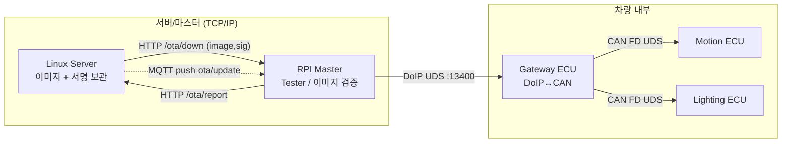

# 00. Project Overview

## 관련 문서

- [Wiki Home](./README.md)
- [Repository Structure](./01_repository_structure.md)
- [System Architecture](./02_system_architecture.md)
- [FOTA Update Flow](./15_fota_update_flow.md)

## 1. 목적

이 프로젝트는 Linux 서버에서 시작해 차량 내부 Target ECU의 펌웨어를 갱신하는 **FOTA(Firmware Over-The-Air) reprogramming** 흐름을, AUTOSAR-like 통신 스택과 TC375 PFlash 뱅크 스왑 기반으로 구현한 **학습용 구현**이다.

다루는 주제:
- DoIP 게이트웨이 라우팅, CAN FD / ISO-TP-like 전송, PDU 라우팅
- UDS(DCM) 진단 서비스 처리
- FOTA 이미지 전송 → flash 기록 → CRC 검증 → activation → application reset → rollback

## 2. 시스템 구성

| 노드 | 역할 | 구현 언어/환경 |
|---|---|---|
| `FOTA_Linux_Server` | 이미지 보관/서명/배포, 업데이트 캠페인 알림 | C (libmicrohttpd, OpenSSL, MQTT) + Flask 대시보드 |
| `FOTA_Master_RPI4` | DoIP Tester, 이미지 다운로드/검증, UDS 시퀀스 구동 | C++ (libcurl, paho-mqtt, OpenSSL) |
| `Ecu_Gateway_TC375_LK` | DoIP ↔ CAN 게이트웨이 라우팅 | C (AUTOSAR-like ComStack, iLLD, LwIP) |
| `Ecu_Motion_TC375_LK` | CAN Target ECU, FOTA 대상 | C (ComStack + Reprogram) |
| `Ecu_Lighting_TC375_LK` | CAN Target ECU, FOTA 대상 | C (Motion과 동일 구조) |

근거:
- 디렉터리: `git ls-files` 최상위 5개 시스템 폴더
- Gateway 초기화: `Test_InitModules()` in `Ecu_Gateway_TC375_LK/Cpu0_Main.c`
- Target 초기화: `Test_InitModules()` in `Ecu_Motion_TC375_LK/Cpu0_Main.c`

## 3. FOTA 전체 개념

## 4. 노드 간 역할 분리

| 질문 | 담당 노드 | 근거 |
|---|---|---|
| FOTA를 누가 개시하는가 | Linux Server가 알림, RPI Master가 실제 수행 | `publish_update_notification()` (`mqtt_handler.c`), `ota_worker_thread()` (`ota_comm.cpp`) |
| 이미지 데이터 보관 | Linux Server (`hex/<addr>/<ver>.hex`) | `iterate_post()` in `server.c` |
| 이미지 전송/검증 | RPI Master | `downloadFile()`, `verifyFirmwareSecurity()` in `ota_comm.cpp`/`ota_security.cpp` |
| Diagnostic tester | RPI Master | `routingActivation()`, `sendUdsPacket()` in `ota_uds_engine.cpp` |
| Gateway 역할 | DoIP ↔ CanTp 변환/포워딩 | `DoIP.c`, `PduR.c` in Gateway |
| Target ECU 역할 | UDS 처리 + flash 기록 + 뱅크 스왑 | `Dcm.c`, `FotaHandler.c` in Motion/Lighting |

> 주의: Gateway는 **자체 진단(local DCM)을 수행하지 않는다**. `DoIP.c`의 주석과 `DoIP_RxPduConfig`가 Motion/Lighting 대상 라우팅만 등록한다. 자세히는 [DoIP Gateway Routing](./10_doip_gateway_routing.md) 참고.

## 5. 현재 구현 범위 (요약)

| 영역 | 상태 | 비고 |
|---|---|---|
| DoIP Routing Activation / Diagnostic Message | Implemented | `DoIP.c` |
| DoIP Diagnostic ACK/NACK 전송 | Not active | 코드상 주석 처리 |
| CAN FD / CanTp 멀티프레임 | Implemented | 64B payload |
| UDS 0x10/0x11/0x22/0x31/0x34/0x36/0x37/0x3E | Implemented | `Dcm.c` (Motion/Lighting) |
| Flash erase/program (PFlash) + CRC32 verify | Implemented | `Sota_UpdateCore.c` |
| Bank swap (UCB_SWAP) / rollback | Implemented | `Sota_SwapDiag.c` |
| 서명 검증 (ECDSA/SHA256, Master 측) | Implemented | `ota_security.cpp` |
| Target 측 서명 검증 | Not Implemented | Target은 CRC32만 검증 |

## 6. 미구현 / 확인 필요 범위

- Gateway 자체 진단 라우팅 (local DCM): 미구현 (`확인 필요` = 향후 정책)
- DoIP ACK/NACK: 주석 처리됨
- Target에서 서명/해시 검증: 미구현 (CRC32만)
- 서버 `.hex` vs Master `.bin` 파일 포맷 정합성: `확인 필요`

자세한 목록은 [Open Issues](./22_open_issues.md).

## 다음에 읽을 문서

- [Repository Structure](./01_repository_structure.md)
- [System Architecture](./02_system_architecture.md)

## 이 문서에서 남은 확인 필요 사항

| 항목 | 내용 | 확인 방법 |
|---|---|---|
| 서버 이미지 포맷 | 서버는 `.hex` 저장, Master는 `.bin` 사용 | `server.c` 업로드 경로와 `ota_comm.cpp` 다운로드 파일명 비교 |
| Target 서명 검증 | Target ECU에서 서명 검증 여부 | `Dcm.c`/`FotaHandler.c`에 서명 관련 코드 부재 확인 |
