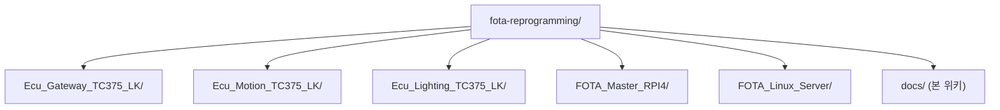
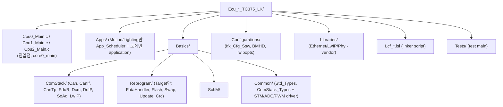

# 01. Repository Structure

## 관련 문서

- [Wiki Home](./README.md)
- [Project Overview](./00_project_overview.md)
- [System Architecture](./02_system_architecture.md)
- [Communication Stack Management](./09_communication_stack_management.md)

## 1. 목적

저장소의 최상위 구조와 각 폴더의 책임, vendor/generated/test 코드 구분을 정리한다.

## 2. 범위

`git ls-files` 기준 실제 추적 파일 구조. 빌드 산출물(`Debug/`, `*.elf`, `*.map`)과 iLLD/LwIP vendor 내부는 deprioritize한다.

## 3. 최상위 구조

## 4. TC375 ECU 공통 폴더 구조

세 ECU(Gateway/Motion/Lighting)는 동일한 골격을 가진다.

근거:
- `git ls-files 'Ecu_Gateway_TC375_LK/**'` (ComStack 하위 Can/CanIf/CanTp/Dcm/DoIP/LwIP/PduR/SoAd)
- **변경**: Motion/Lighting의 `Apps/`는 더 이상 빈 폴더가 아니며 `App_Scheduler.c/.h`와 도메인 application(Motion `accel`, Lighting `App_Lamp`)을 포함한다. Gateway `Apps/`는 여전히 추적 파일 없음. 근거: 커밋 `8231dc7 add: App` (`git show --stat`).
- `Basics/Common/`에 STM tick(`Driver_Stm.c/.h`), VADC(`adc.c/.h`), GTM PWM(`pwm.c/.h`) 드라이버가 추가됨 (Motion/Lighting).

## 5. 주요 파일

| 구분 | 파일 | 역할 | 근거 |
|---|---|---|---|
| 진입점 | `Cpu0_Main.c` (각 ECU) | `core0_main()` init + main loop | `core0_main()` |
| App scheduler | `Apps/App_Scheduler.c` (Motion/Lighting) | STM 1ms 기반 slot 디스패치 | `App_Scheduler_Run()` |
| Motion app | `Apps/accel.c` | joystick→throttle motor 제어 | `setThrottle()` |
| Lighting app | `Apps/App_Lamp.c` | 버튼/센서→밝기 PWM 제어 | `lamp10mstask()` |
| Tick/HW driver | `Basics/Common/{Driver_Stm,adc,pwm}.c` (Motion/Lighting) | STM compare IRQ, VADC, GTM PWM | `STM_Int0Handler()`, `PWM_setDutyCycle()` |
| Gateway 통신 | `Basics/ComStack/DoIP/DoIP.c` | DoIP 파싱/라우팅 | `DoIP_TpRxIndication()` |
| Gateway 통신 | `Basics/ComStack/SoAd/SoAd.c` | LwIP TCP socket adapter | `tcp_listen`, `DoIP_TpRxIndication` 호출 |
| 공통 통신 | `Basics/ComStack/{Can,CanIf,CanTp,PduR}/*.c` | CAN 스택 | 각 모듈 |
| Target 진단 | `Basics/ComStack/Dcm/Dcm.c` | UDS 서비스 처리 | `Dcm_DispatchService()` |
| Target FOTA | `Basics/Reprogram/FotaHandler.c` | FOTA 컨텍스트 어댑터 | `FOTA_StartDownload()` 등 |
| Target FOTA | `Basics/Reprogram/Update/Sota_UpdateCore.c` | erase/program/verify | `SotaUpdate_Begin/WriteChunk/FinalizeAndVerify` |
| Target FOTA | `Basics/Reprogram/Swap/Sota_SwapDiag.c` | UCB_SWAP / 뱅크 진단 | `SotaSwap_GetCurrentMode()` |
| Target FOTA | `Basics/Reprogram/Flash/Sota_FlashTc37x.c` | PFlash erase/program 헬퍼 | `SotaFlash_EraseSector/ProgramPage32` |
| RPI Master | `FOTA_Master_RPI4/ota_uds_engine.cpp` | DoIP/UDS 시퀀스 | `startOtaTransfer()` |
| RPI Master | `FOTA_Master_RPI4/ota_comm.cpp` | 다운로드/MQTT/상태머신 | `runOtaService()` |
| RPI Master | `FOTA_Master_RPI4/ota_security.cpp` | 서명 검증 | `verifyFirmwareSecurity()` |
| RPI Master | `FOTA_Master_RPI4/lcd/` | LCD UI 스레드 | `lcd_thread()` |
| Server | `FOTA_Linux_Server/src/server.c` | HTTP 라우팅 | `answer_to_connection()` |
| Server | `FOTA_Linux_Server/src/ota.c` | 버전 비교/응답 JSON | `build_check_response_json()` |
| Server | `FOTA_Linux_Server/src/crypto.c` | SHA256 / 서명 생성 | `generate_sig_file()` |
| Server | `FOTA_Linux_Server/dashboard/app.py` | Flask 대시보드 | - |

## 6. vendor / generated / build output 구분

| 분류 | 경로 예 | 문서화 우선순위 |
|---|---|---|
| Vendor iLLD | `Libraries/iLLD/**`, `0_Src/BaseSw/**` | 낮음 (근거로만 인용) |
| Vendor LwIP | `Libraries/Ethernet/lwip/**` | 낮음 (TCP 동작 근거로 인용) |
| Linker/Startup | `Lcf_*.lsl`, `Configurations/Ifx_Cfg_Ssw*` | 중간 (boot/BMHD 근거) |
| 빌드 산출물 | `Debug/`, `*.elf`, `*.map`, `*.o` | 제외 |
| IDE metadata | `.metadata/`, `*.launch`, `.project` | 제외 |

## 7. test / mock / debug 코드 구분

| 파일 | 분류 | 비고 |
|---|---|---|
| `Cpu0_Main.c` (Gateway) | test-style production entry | 함수명이 `Test_InitModules`, `Test_MainFunctions`지만 실제 런타임 진입점 (Gateway는 여전히 cooperative loop) |
| `Cpu0_Main.c` (Motion/Lighting) | production entry | `Test_MainFunctions()` 제거됨 → `App_Scheduler_Init()`/`App_Scheduler_Run()` 호출. `Test_InitModules()`는 init용으로 잔존 |
| `Ecu_Gateway_TC375_LK/Tests/Cpu0_Main_Gateway_MockFotaMaster.c` | mock/test main | Mock FOTA Master 시나리오 — 실제 빌드 진입점과 분리, production architecture로 단정하지 말 것 |
| `Ecu_Gateway_TC375_LK/Tests/Cpu0_Main_Target_Gw.c` | test main | 대체 시나리오 |
| `Test_DoIPResponseReceived` (전역) | test flag | `Cpu0_Main.c` / `DoIP.c`, `DEBUG_DOIP_ENABLE` 시 사용 |

> `Cpu0_Main.c`의 `Test_` 접두사는 함수명일 뿐이며, 이것이 실제 main loop이다. 반면 `Tests/` 폴더의 파일들은 대체 진입점(mock 포함)이므로 production 흐름으로 혼동하지 않는다.

## 8. 최근 코드 변경 반영 사항

| 변경 영역 | 반영 내용 | 코드 근거 |
|---|---|---|
| `Apps/` 폴더 | (Motion/Lighting) 빈 폴더 → `App_Scheduler` + 도메인 application 추가 | 커밋 `8231dc7`, `Apps/*.c/.h` |
| `Basics/Common/` | STM/ADC/PWM 드라이버 추가 | `Driver_Stm.c`, `adc.c`, `pwm.c` |
| 진입점 | Motion/Lighting `Cpu0_Main.c`에서 `Test_MainFunctions()` 제거 | `Cpu0_Main.c` diff |

## 다음에 읽을 문서

- [System Architecture](./02_system_architecture.md)
- [Communication Stack Management](./09_communication_stack_management.md)
- [Application Change Log](./23_application_change_log.md)

## 이 문서에서 남은 확인 필요 사항

| 항목 | 내용 | 확인 방법 |
|---|---|---|
| 빌드 진입점 | 실제 빌드에 `Cpu0_Main.c`와 `Tests/*` 중 무엇이 포함되는지 | `.cproject`/빌드 설정의 source exclude 확인 |
| Gateway `Apps/` | 여전히 비어 있음 (Gateway는 application slot 미도입) | Gateway `Cpu0_Main.c` 확인 |
