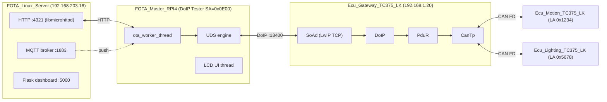
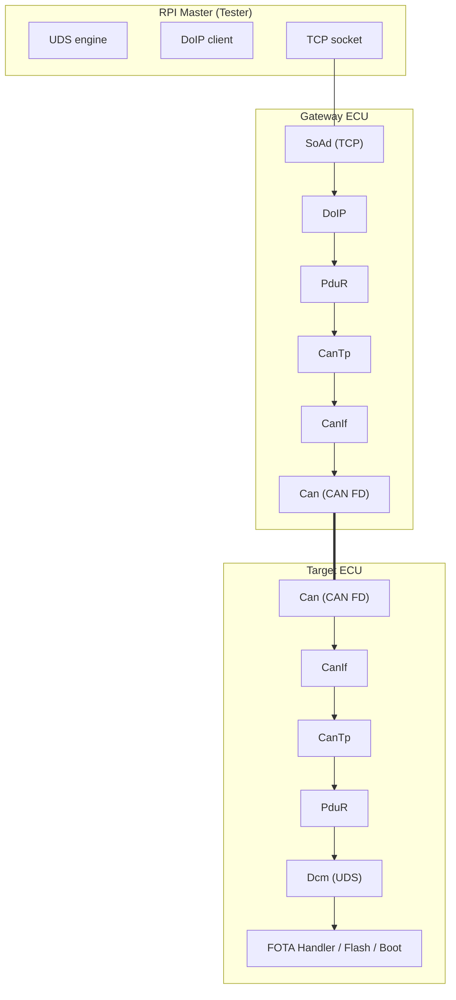
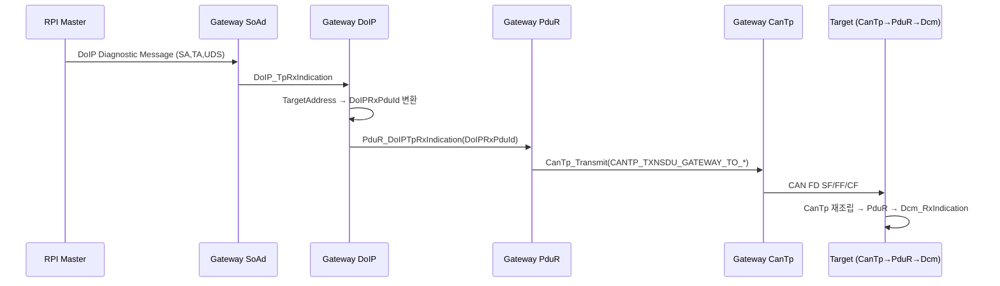
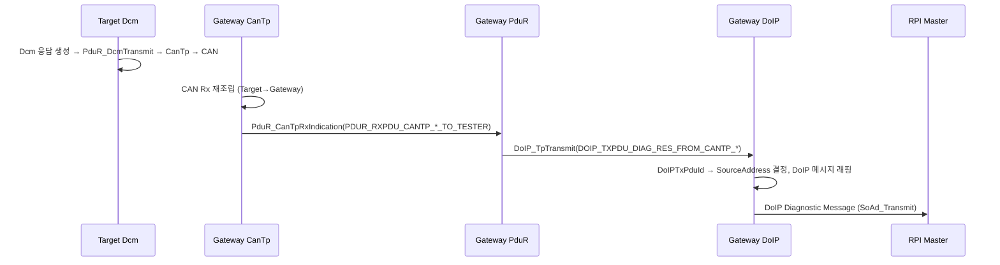
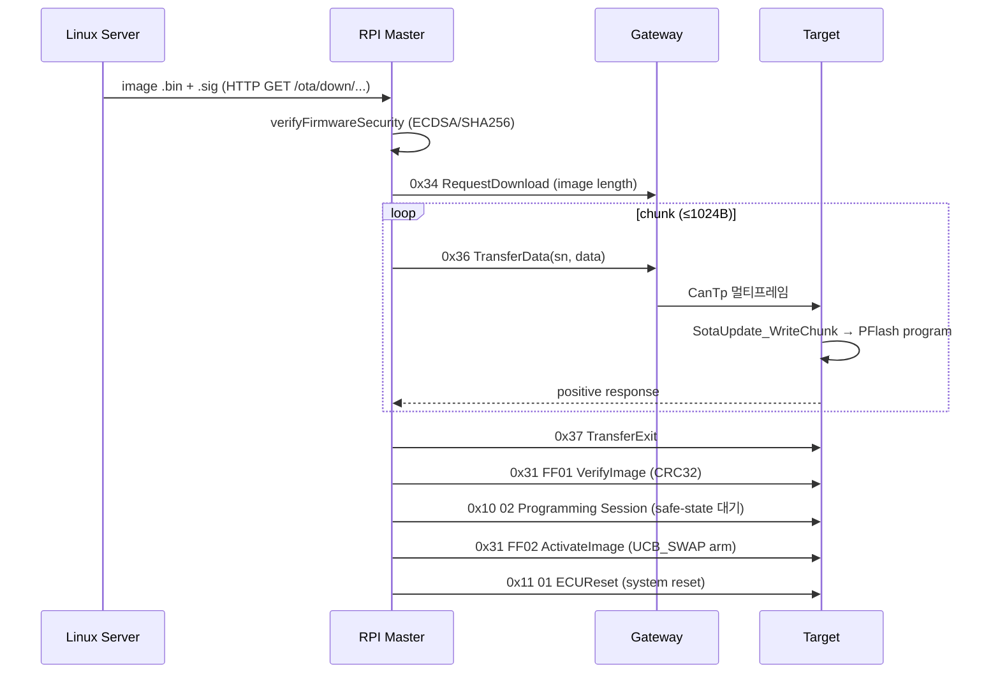

# 02. System Architecture

## 관련 문서

- [Wiki Home](./README.md)
- [Project Overview](./00_project_overview.md)
- [Gateway ECU Architecture](./03_gateway_ecu_architecture.md)
- [DoIP Gateway Routing](./10_doip_gateway_routing.md)
- [FOTA Update Flow](./15_fota_update_flow.md)

## 1. 목적

5개 노드가 어떻게 연결되고, 진단 요청/응답과 FOTA 이미지가 어떤 네트워크/계층을 통해 흐르는지 시스템 레벨로 설명한다.

## 2. 범위

노드 간 네트워크 구간, 프로토콜 계층, diagnostic request/response/FOTA 경로의 큰 그림. 함수 수준 세부는 각 주제 문서로 위임한다.

## 3. 요약

- 서버↔마스터는 **TCP/IP (HTTP + MQTT)**, 마스터↔게이트웨이는 **DoIP/Ethernet(:13400)**, 게이트웨이↔타깃은 **CAN FD + CanTp**.
- Gateway는 DoIP logical address를 내부 PDU ID로 변환하고, PduR는 PDU ID 기반으로 CanTp 경로를 선택한다.
- Target ECU만 Dcm/FOTA/Flash를 수행한다.

## 4. 시스템 Context Diagram



## 5. Layered Architecture (계층 구조)



근거:
- Gateway 계층 init 순서: `Test_InitModules()` in `Ecu_Gateway_TC375_LK/Cpu0_Main.c` (Can→CanIf→CanTp→PduR→LwIP→DoIP→SoAd→Dcm)
- Target 계층 init 순서: `Test_InitModules()` in `Ecu_Motion_TC375_LK/Cpu0_Main.c` (Can→CanIf→CanTp→PduR→Dcm→FOTA)

## 6. Diagnostic Request 경로 (overview)



## 7. Diagnostic Response 경로 (overview)



근거:
- `PduR_RoutingPathConfig[]` in `Ecu_Gateway_TC375_LK/Basics/ComStack/PduR/PduR_Cfg.c`
- `DoIP_TpTransmit()` in `Ecu_Gateway_TC375_LK/Basics/ComStack/DoIP/DoIP.c`

## 8. FOTA Image 경로 (overview)



근거:
- `startOtaTransfer()` in `FOTA_Master_RPI4/ota_uds_engine.cpp`
- Target 측 처리: `Dcm.c` 서비스 핸들러 + `FotaHandler.c`

## 9. Gateway와 Target 책임 분리

| 책임 | Gateway ECU | Target ECU (Motion/Lighting) |
|---|---|---|
| DoIP TCP 수신/Routing Activation | O | X |
| logical address → PDU ID 변환 | O (`DoIP.c`) | X |
| PduR 라우팅 | O (DoIP↔CanTp) | O (CanTp↔Dcm) |
| UDS 서비스 처리(Dcm) | X (local 진단 없음) | O |
| Flash erase/program/verify | X | O |
| Bank swap / reset | X | O |

> Gateway의 `Cpu0_Main.c`는 `Dcm_Init()`/`Dcm_MainFunction()`을 호출하지만, Gateway PduR 라우팅 테이블에는 Dcm 경로가 없다(`PduR_Cfg.c`의 4개 route 모두 DoIP↔CanTp). 따라서 Gateway Dcm은 현재 실질적으로 사용되지 않는다 — `확인 필요`. 자세히 [Diagnostic Gateway Management](./08_diagnostic_gateway_management.md).

## 10. Mermaid Diagram: 네트워크 구간 요약


## 11. 코드 근거

```text
근거:
- 계층 init: Test_InitModules() in Ecu_Gateway_TC375_LK/Cpu0_Main.c, Ecu_Motion_TC375_LK/Cpu0_Main.c
- DoIP 포트: SOAD_TCP_PORT_DOIP (13400U) in SoAd_Cfg.h
- 라우팅 테이블: PduR_RoutingPathConfig[] in PduR_Cfg.c (Gateway)
- DoIP 주소 변환: DoIP_FindRxPduConfigByTargetAddress(), DoIP_FindTxPduConfig() in DoIP.c
```

## 12. 추정 사항

- 서버→마스터 이미지가 차량 외부(클라우드/LAN)에서 전달된다는 표현은 IP 대역(192.168.203.x vs 192.168.1.x)으로 추정. 실제 물리 토폴로지는 `확인 필요`.

## 13. 확인 필요 사항

- Gateway local Dcm 사용 여부 (라우팅 미등록)
- DoIP ACK/NACK 비활성 정책

## 다음에 읽을 문서

- [Gateway ECU Architecture](./03_gateway_ecu_architecture.md)
- [DoIP Gateway Routing](./10_doip_gateway_routing.md)

## 이 문서에서 남은 확인 필요 사항

| 항목 | 내용 | 확인 방법 |
|---|---|---|
| 물리 네트워크 | 서버/마스터/게이트웨이 물리 연결 토폴로지 | 실제 배선/스위치 구성 확인 |
| Gateway Dcm | 게이트웨이 자체 진단 활성 여부 | `PduR_Cfg.c`에 Dcm route 추가 여부 추적 |
