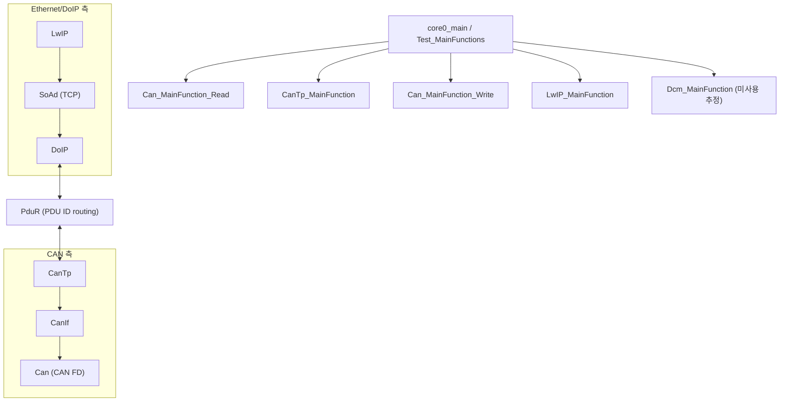
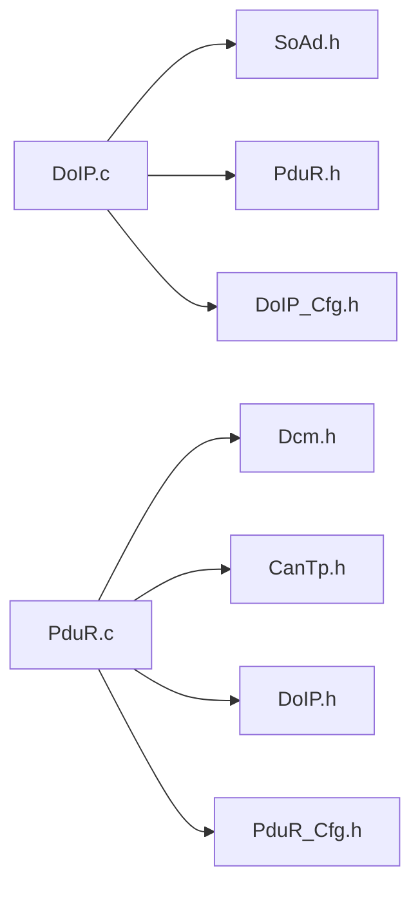
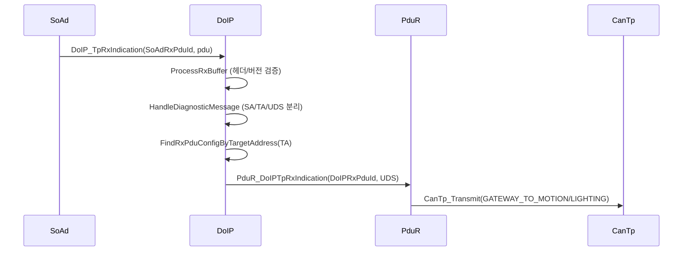
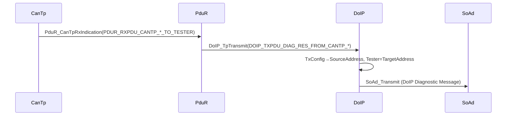
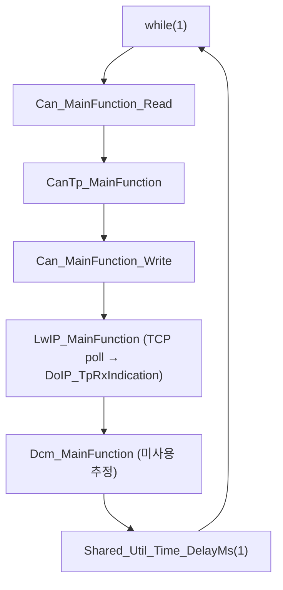

# 03. Gateway ECU Architecture

## 관련 문서

- [Wiki Home](./README.md)
- [System Architecture](./02_system_architecture.md)
- [DoIP Gateway Routing](./10_doip_gateway_routing.md)
- [PduR Routing](./13_pdur_routing.md)
- [CanTp Transport](./12_cantp_transport.md)

## 1. 목적

`Ecu_Gateway_TC375_LK`가 DoIP/Ethernet 측 Tester와 CAN 측 Target ECU 사이에서 어떻게 진단 메시지를 중계하는지 모듈/흐름 수준으로 설명한다.

## 2. 범위

Gateway의 DoIP 수신, Routing Activation, Diagnostic Message 파싱, logical address→PDU ID 변환, PduR route 결정, CanTp 포워딩, Target 응답 수신, DoIP 응답 래핑, main loop. Target ECU 동작은 [Motion ECU Architecture](./04_motion_ecu_architecture.md)로 위임한다.

## 3. 요약

Gateway는 **순수 진단 라우터**다. UDS 의미(SID/세션)를 해석하지 않고, DoIP↔CanTp 사이에서 PDU를 양방향 중계한다. 자체 진단(local Dcm)은 라우팅 테이블에 없다.

## 4. 주요 구성 요소



근거:
- main loop: `Test_MainFunctions()` in `Ecu_Gateway_TC375_LK/Cpu0_Main.c`
- init: `Test_InitModules()` (Can→CanIf→CanTp→PduR→LwIP→DoIP→SoAd→Dcm)

## 5. 주요 파일

| 구분 | 파일 | 역할 | 근거 |
|---|---|---|---|
| 진입점 | `Cpu0_Main.c` | init + main loop | `core0_main()` |
| DoIP | `Basics/ComStack/DoIP/DoIP.c` | DoIP 메시지 파싱/라우팅 | `DoIP_HandleDiagnosticMessage()` |
| DoIP cfg | `Basics/ComStack/DoIP/DoIP_Cfg.c` | logical address↔PDU ID 매핑 | `DoIP_RxPduConfig[]`, `DoIP_TxPduConfig[]` |
| SoAd | `Basics/ComStack/SoAd/SoAd.c` | LwIP TCP socket adapter | `tcp_listen`, `SoAd_Transmit` |
| PduR | `Basics/ComStack/PduR/PduR.c` | PDU ID 라우팅 | `PduR_DoIPTpRxIndication()` |
| PduR cfg | `Basics/ComStack/PduR/PduR_Cfg.c` | 4개 route 테이블 | `PduR_RoutingPathConfig[]` |
| CanTp | `Basics/ComStack/CanTp/CanTp.c` | 세그멘테이션/재조립 | `CanTp_Transmit`, `CanTp_MainFunction` |
| Can | `Basics/ComStack/Can/Can.c` | CAN FD 드라이버 | `Can_MainFunction_Read/Write` |

## 6. 주요 API

| API | 위치 | 역할 | 호출 방향 | 근거 |
|---|---|---|---|---|
| `DoIP_TpRxIndication()` | DoIP.c | SoAd→DoIP 수신 진입 | SoAd가 호출 | `SoAd.c:428` |
| `DoIP_HandleDiagnosticMessage()` | DoIP.c | TA→DoIPRxPduId 변환 후 PduR 전달 | 내부 | `PduR_DoIPTpRxIndication()` 호출 |
| `PduR_DoIPTpRxIndication()` | PduR.c | DoIPRxPduId → CanTp Tx | DoIP→PduR | route 0/1 |
| `PduR_CanTpRxIndication()` | PduR.c | CanTp Rx → DoIP Tx | CanTp→PduR | route 2/3 |
| `DoIP_TpTransmit()` | DoIP.c | UDS 응답을 DoIP로 래핑 후 SoAd 송신 | PduR→DoIP | `SoAd_Transmit()` |

## 7. 주요 struct / enum / macro

| 이름 | 종류 | 위치 | 의미 |
|---|---|---|---|
| `DoIP_RuntimeType` | struct | DoIP.c | DoIP 상태/Rx·Tx 버퍼/Tester·Entity 주소 |
| `DoIP_StateType` | enum | DoIP.c | `INITIALIZED` / `ROUTING_ACTIVE` |
| `PduR_RoutingPathConfigType` | struct | PduR_Cfg.h | source/dest module·PduId·event |
| `DOIP_LOGICAL_ADDRESS_ECU` | macro | DoIP_Cfg.h | Gateway entity 0x0F00 |
| `DOIP_LOGICAL_ADDRESS_TARGET_MOTION/LIGHTING` | macro | DoIP_Cfg.h | 0x1234 / 0x5678 |

## 8. 정적 의존성



- `PduR.c`는 `Dcm.h`/`CanTp.h`/`DoIP.h`를 include하지만, Gateway 라우팅 테이블은 DoIP↔CanTp만 사용한다(Dcm route 미등록).

## 9. 런타임 흐름

### 9.1 DoIP Rx → CanTp Tx (Tester→Target)

```text
실제 호출 흐름:
SoAd (tcp_recv) 
→ DoIP_TpRxIndication()
→ DoIP_ProcessRxBuffer()
→ DoIP_HandleDiagnosticMessage()
→ DoIP_FindRxPduConfigByTargetAddress(TargetAddress)
→ PduR_DoIPTpRxIndication(DoIPRxPduId)
→ PduR_RouteRxIndication() [DestModule=CANTP]
→ CanTp_Transmit(CANTP_TXNSDU_GATEWAY_TO_MOTION/LIGHTING)
```



### 9.2 CanTp Rx → DoIP Tx (Target→Tester)

```text
실제 호출 흐름:
Can_MainFunction_Read → CanIf → CanTp 재조립
→ PduR_CanTpRxIndication(PDUR_RXPDU_CANTP_*_TO_TESTER)
→ PduR_RouteRxIndication() [DestModule=DOIPTP]
→ DoIP_TpTransmit(DOIP_TXPDU_DIAG_RES_FROM_CANTP_*)
→ DoIP_SendMessage(DIAG_MESSAGE)
→ SoAd_Transmit(SoAdTxPduId)
```



### 9.3 Gateway main loop



> 주의: PduR는 **DoIP logical address를 직접 해석하지 않는다**. DoIP 계층이 TargetAddress를 `DoIPRxPduId`로 변환한 뒤, PduR는 PDU ID와 route 테이블만으로 CanTp 경로를 선택한다.

## 10. test / mock / debug 경로 구분

| 항목 | 분류 | 비고 |
|---|---|---|
| `Tests/Cpu0_Main_Gateway_MockFotaMaster.c` | mock main | Gateway 내부에서 FOTA Master를 흉내내는 시나리오. production 흐름 아님 |
| `Tests/Cpu0_Main_Target_Gw.c` | test main | 대체 시나리오 |
| `Test_DoIPResponseReceived` | test flag | `DEBUG_DOIP_ENABLE==1`일 때 `DoIP_SendMessage()`에서 set |

## 11. 코드 근거

```text
근거:
- DoIP_TpRxIndication(), DoIP_HandleDiagnosticMessage() in DoIP.c
- DoIP_RxPduConfig[], DoIP_TxPduConfig[] in DoIP_Cfg.c
- PduR_RoutingPathConfig[] in PduR_Cfg.c
- Test_MainFunctions(), Test_InitModules() in Cpu0_Main.c
- SoAd.c:428 DoIP_TpRxIndication 호출
```

## 12. 추정 사항

- Gateway `Dcm_Init()`/`Dcm_MainFunction()` 호출은 있으나 라우팅 미등록 → Gateway local 진단 미사용 `추정`.

## 13. 확인 필요 사항

- Gateway가 DoIP NACK/ACK를 보내지 않는 정책이 의도된 것인지.
- 다중 Tester 연결 시 `DoIP_Runtime`의 단일 connection 가정.

## 다음에 읽을 문서

- [DoIP Gateway Routing](./10_doip_gateway_routing.md)
- [PduR Routing](./13_pdur_routing.md)
- [Motion ECU Architecture](./04_motion_ecu_architecture.md)

## 이 문서에서 남은 확인 필요 사항

| 항목 | 내용 | 확인 방법 |
|---|---|---|
| Gateway Dcm | 실제로 호출되는 진단 서비스가 있는지 | `PduR_Cfg.c` route에 Dcm 추가 여부 |
| 다중 연결 | 동시 TCP 연결 처리 | `SoAd.c`의 `ConnectionPcb` 단일성 확인 |
