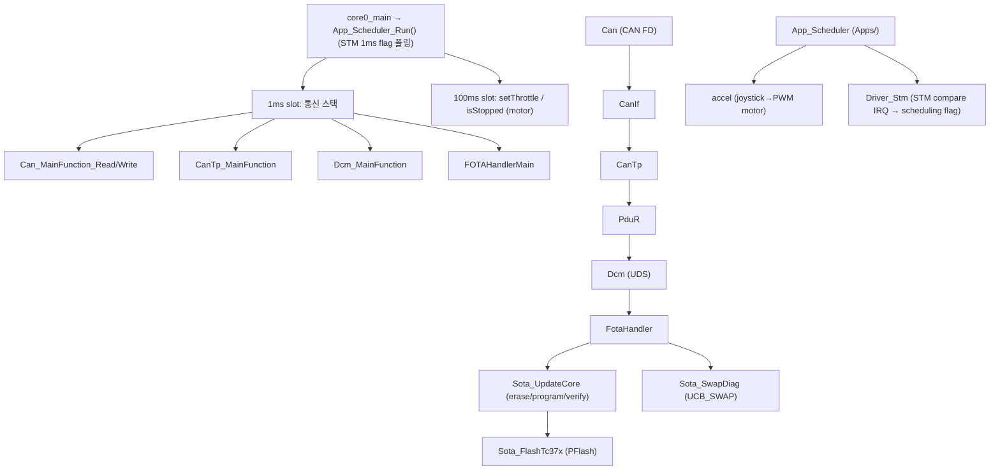
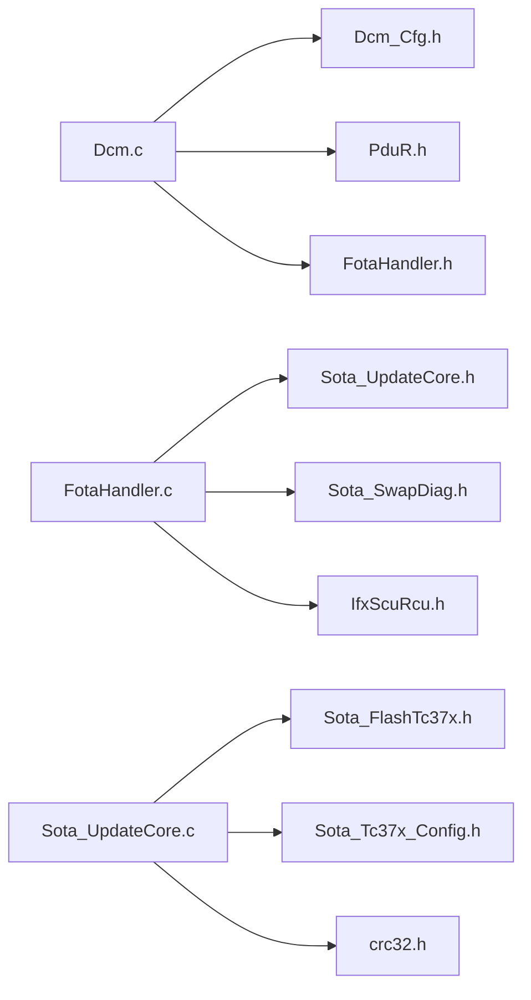
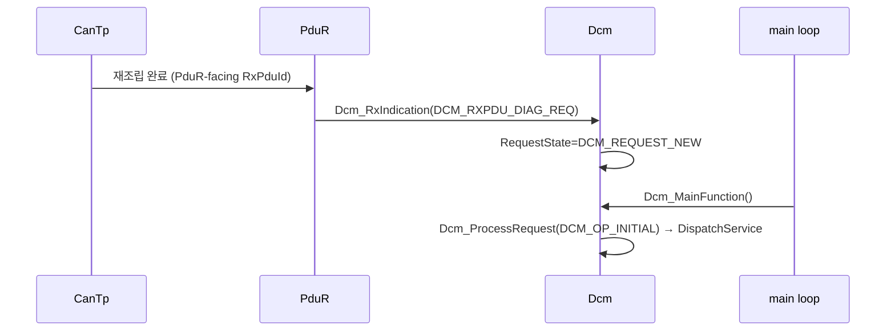
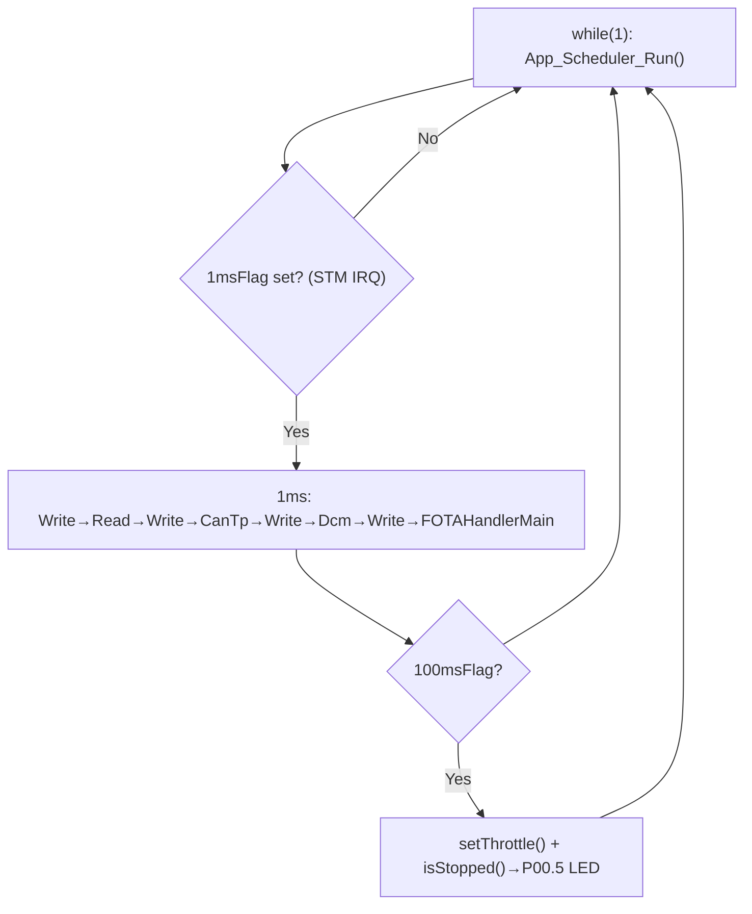

# 04. Motion ECU Architecture

## 관련 문서

- [Wiki Home](./README.md)
- [Gateway ECU Architecture](./03_gateway_ecu_architecture.md)
- [Lighting ECU Architecture](./05_lighting_ecu_architecture.md)
- [DCM Diagnostic Services](./14_dcm_diagnostic_services.md)
- [FOTA Update Flow](./15_fota_update_flow.md)

## 1. 목적

`Ecu_Motion_TC375_LK`가 CAN Target ECU로서 UDS 요청을 받아 진단/FOTA를 처리하고 PFlash 뱅크 스왑까지 수행하는 구조를 설명한다.

## 2. 범위

CAN/CanIf/CanTp/PduR/Dcm 연결, Dcm service dispatch, FOTA Handler, flash programming, reset/boot/bank swap, main loop, Gateway와의 통신 경로, Lighting과의 공통/차이점.

## 3. 요약

Motion ECU는 **UDS responder + FOTA target**이며, 최근 변경으로 **STM 1ms 기반 application scheduler와 motor 제어 application(`Apps/`)이 추가**되었다. Gateway로부터 CAN FD로 UDS 요청을 받아 `Dcm`이 처리하고, FOTA 관련 서비스는 `FotaHandler`→`Sota*` 코어로 위임해 inactive PFlash bank에 기록·검증·스왑한다. 통신 스택 처리와 application(throttle 제어)은 모두 `App_Scheduler`의 slot에서 구동된다.

## 4. 주요 구성 요소



근거:
- `Test_InitModules()` + `App_Scheduler_Init()` in `Ecu_Motion_TC375_LK/Cpu0_Main.c` (Can→CanIf→CanTp→PduR→Dcm→`FOTA_ProvisionInitialOnce`→scheduler init)
- `App_Scheduler_Run()` slot 구조 in `Apps/App_Scheduler.c`; `STM_Int0Handler()` in `Basics/Common/Driver_Stm.c`

## 5. 주요 파일

| 구분 | 파일 | 역할 | 근거 |
|---|---|---|---|
| 진입점 | `Cpu0_Main.c` | init + main loop (`App_Scheduler_Run`) | `core0_main()` |
| App scheduler | `Apps/App_Scheduler.c/.h` | 1/10/100/1000ms slot 디스패치 | `App_Scheduler_Init()`/`App_Scheduler_Run()` |
| App (motor) | `Apps/accel.c/.h` | joystick 입력→throttle→PWM motor 제어 | `setThrottle()`/`isStopped()`/`motor_init()` |
| Tick source | `Basics/Common/Driver_Stm.c/.h` | STM compare IRQ로 scheduling flag 생성 | `STM_Int0Handler()`, `stSchedulingInfo` |
| HW driver | `Basics/Common/adc.c/.h`, `pwm.c/.h` | VADC(joystick/전류), GTM PWM | `Joystick_read_level()`, `PWM_setDutyCycle()` |
| 진단 | `Basics/ComStack/Dcm/Dcm.c` | UDS dispatch + FOTA 상태머신 | `Dcm_DispatchService()` |
| 진단 cfg | `Basics/ComStack/Dcm/Dcm_Cfg.h` | SID/NRC/세션/RID/DID 정의 | 매크로 |
| FOTA 어댑터 | `Basics/Reprogram/FotaHandler.c` | 다운로드/전송/검증/활성/롤백/리셋 | `FOTA_*()` |
| FOTA 코어 | `Basics/Reprogram/Update/Sota_UpdateCore.c` | erase/page program/CRC verify | `SotaUpdate_*()` |
| 뱅크 | `Basics/Reprogram/Swap/Sota_SwapDiag.c` | UCB_SWAP/OTP provisioning | `SotaProvision_*()` |
| Flash | `Basics/Reprogram/Flash/Sota_FlashTc37x.c` | PFlash erase/program 헬퍼 | `SotaFlash_*()` |
| 레이아웃 | `Basics/Reprogram/Sota_Tc37x_Config.c/.h` | PF0/PF1 주소/active 뱅크 | `SotaTc37x_GetInactiveBank*()` |
| CRC | `Basics/Reprogram/Crc/crc32.c` | CRC32 | `crc32()` |

## 6. 주요 API

| API | 위치 | 역할 | 호출 방향 | 근거 |
|---|---|---|---|---|
| `Dcm_RxIndication()` | Dcm.c | PduR→Dcm UDS 수신 | PduR 호출 | RxBuffer 저장, state=NEW |
| `Dcm_MainFunction()` | Dcm.c | pending 요청 처리 | main loop | `Dcm_ProcessRequest()` |
| `Dcm_DispatchService()` | Dcm.c | SID 분기 | 내부 | service handler |
| `FOTA_StartDownload()` | FotaHandler.c | 0x34 → erase | Dcm 호출 | `SotaUpdate_Begin()` |
| `FOTA_ProcessTransferDataWrite()` | FotaHandler.c | 0x36 chunk 등록 | Dcm 호출 | chunk state machine |
| `FOTAHandlerMain()` | FotaHandler.c | chunk → flash program | main loop | `SotaUpdate_WriteChunk()` |
| `FOTA_RequestTransferExit()` | FotaHandler.c | 0x37/verify | Dcm 호출 | `SotaUpdate_FinalizeAndVerify()` |
| `FOTA_ActivateImage()` | FotaHandler.c | swap arm | Dcm 호출 | `SotaProvision_ProgramNextSwapEntry()` |
| `FOTA_PerformSystemReset()` | FotaHandler.c | system reset | Dcm(0x11) 호출 | `IfxScuRcu_performReset(system)` |

## 7. 주요 struct / enum / macro

| 이름 | 종류 | 위치 | 의미 |
|---|---|---|---|
| `Dcm_RuntimeType` | struct | Dcm.c | 세션/FotaState/요청상태/Rx·Tx 버퍼/BSC |
| `Dcm_FotaStateType` | enum | Dcm.h | FOTA 상태머신 (IDLE..ACTIVATED/ROLLBACK_*) |
| `FotaHandlerContextType` | struct | FotaHandler.c | chunk buffer/imageLength/플래그 |
| `FotaChunkStateType` | enum | FotaHandler.h | IDLE/RECEIVED/PROCESSING/DONE/ERROR |
| `SotaUpdateContext_t` | struct | Sota_UpdateCore.c | inactiveBase/pageBuffer/progress |
| `DCM_RID_VERIFY/ACTIVATE/ROLLBACK_IMAGE` | macro | Dcm_Cfg.h | 0xFF01/0xFF02/0xFF03 (프로젝트 임의값) |

## 8. 정적 의존성



## 9. 런타임 흐름

### 9.1 UDS 요청 수신

```text
실제 호출 흐름:
Can_MainFunction_Read → CanIf → CanTp 재조립
→ PduR_CanTpRxIndication → Dcm_RxIndication(DCM_RXPDU_DIAG_REQ)
→ (RequestState=NEW, RxBuffer 저장)
→ Dcm_MainFunction → Dcm_ProcessRequest(DCM_OP_INITIAL)
→ Dcm_DispatchService(SID)
```



### 9.2 UDS 응답 송신

```text
실제 호출 흐름:
Dcm_SendPositiveResponse/NegativeResponse
→ Dcm_SendResponse → PduR_DcmTransmit(DCM_TXPDU_DIAG_RES)
→ CanTp_Transmit → CanIf → Can_MainFunction_Write
```

### 9.3 Motion main loop (STM scheduler)



> 변경 전에는 `while(1)` 안에서 `Test_MainFunctions()`를 직접 호출하고 `Shared_Util_Time_DelayMs(1)`로 주기를 맞췄다. 현재는 STM compare interrupt(`STM_Int0Handler`)가 1ms마다 flag를 세우고 `App_Scheduler_Run()`이 이를 폴링한다. 근거: `core0_main()` diff in `Cpu0_Main.c`, `App_Scheduler.c`, `Driver_Stm.c`.

> FOTA의 실제 flash 기록은 `Dcm`이 아니라 **1ms slot의 `FOTAHandlerMain()`**에서 수행된다. Dcm은 chunk를 등록하고 `DCM_WRITE_PENDING`을 반환하여 다음 cycle에서 처리되게 한다. 책임 분리는 [DCM Diagnostic Services](./14_dcm_diagnostic_services.md) 참고.

## 10. Gateway와의 통신 경로

| 방향 | CAN ID | 매크로 | 근거 |
|---|---|---|---|
| Gateway→Motion (요청) | `0x501` | `CAN_ID_REMOTE_TO_LOCAL` = `CAN_ID_MOTION` | `Can_Cfg.h`, `CanIf_Cfg.c` |
| Motion→Gateway (응답) | `0x500` | `CAN_ID_LOCAL_TO_REMOTE` = `CAN_ID_GATEWAY_MOTION` | 동일 |

CAN FD, controller 0 / node 0, payload 64B. 근거: `Can_ControllerConfig[]`, `CAN_MAX_DATA_PAYLOAD (64U)` in `Can_Cfg.c/.h`.

## 11. Lighting ECU와의 공통점 / 차이점

| 항목 | 공통 여부 | 비고 |
|---|---|---|
| `Dcm.c`, `FotaHandler.c`, `CanTp_Cfg.c` | **동일** | 진단/FOTA 코어는 여전히 동일 |
| `Apps/App_Scheduler.c` | 골격 동일, slot 다름 | 1ms 통신 slot 동일, application slot 다름 |
| `Apps/` application | **차이** | Motion=`accel`(motor, 100ms slot), Lighting=`App_Lamp`(lamp, 10ms slot) |
| `Cpu0_Main.c` | 차이 | UART 배너 `[Motion]` vs `[Lighting]`, 둘 다 `Current Version: A` 출력 |
| `Can_Cfg.h` | 차이 | CAN ID 0x500/0x501 vs 0x600/0x601 |

> **변경 주의**: 초기 위키는 Motion/Lighting을 "바이트 단위 동일"로 기술했으나, App layer 추가 후에는 application 로직이 서로 다르다. Motion은 motor(throttle), Lighting은 lamp(밝기 PWM)를 제어한다. 통신/진단/FOTA 코어(`Dcm`, `FotaHandler`, `CanTp`)는 여전히 동일하다.

근거: `Apps/accel.c`(Motion) vs `Apps/App_Lamp.c`(Lighting), `App_Scheduler_Run_100ms()`(Motion) vs `App_Scheduler_Run_10ms()`(Lighting).

## 12. 코드 근거

```text
근거:
- Dcm_RxIndication(), Dcm_MainFunction(), Dcm_DispatchService() in Dcm.c
- FOTA_StartDownload(), FOTAHandlerMain(), FOTA_ActivateImage() in FotaHandler.c
- SotaUpdate_Begin/WriteChunk/FinalizeAndVerify in Sota_UpdateCore.c
- Test_MainFunctions() in Cpu0_Main.c
```

## 13. 추정 / 확인 필요 사항

- RequestDownload의 memoryAddress를 Target이 무시하고 inactive bank만 사용 `추정` (Dcm은 `[3..6]` 주소를 파싱하나 FOTA_StartDownload에 전달하지 않음).
- `Cpu1_Main.c`/`Cpu2_Main.c`의 역할 `확인 필요`.
- `accel.c`의 motor 제어가 FOTA/진단 동작과 자원(타이밍, PWM/ADC, core0 부하)을 공유할 때 1ms slot 통신 지연에 미치는 영향 `확인 필요`.

## 최근 코드 변경 반영 사항

| 변경 영역 | 반영 내용 | 코드 근거 |
|---|---|---|
| main loop | `Test_MainFunctions()`+`DelayMs(1)` → `App_Scheduler` (STM 1ms IRQ) | `core0_main()` in `Cpu0_Main.c`, `App_Scheduler_Run()` in `Apps/App_Scheduler.c` |
| 신규 application | joystick→throttle motor 제어(100ms slot) | `setThrottle()`/`isStopped()`/`motor_init()` in `Apps/accel.c` |
| 신규 driver | STM tick, VADC, GTM PWM | `Driver_Stm.c`, `adc.c`, `pwm.c` in `Basics/Common/` |
| 부팅 로그 | `[Motion ECU] Current Version: A` 추가 | `core0_main()` diff |
| 0x11 reset | 응답 후 `Shared_Util_Time_DelayMs(1000)` 추가 후 reset | `Dcm_HandleEcuReset()` diff in `Dcm.c` |
| Motion≠Lighting | application 로직 분기(이전 "동일" 기술 정정) | `accel.c` vs `App_Lamp.c` |

## 다음에 읽을 문서

- [DCM Diagnostic Services](./14_dcm_diagnostic_services.md)
- [FOTA Update Flow](./15_fota_update_flow.md)
- [Lighting ECU Architecture](./05_lighting_ecu_architecture.md)
- [Application Change Log](./23_application_change_log.md)

## 이 문서에서 남은 확인 필요 사항

| 항목 | 내용 | 확인 방법 |
|---|---|---|
| 멀티코어 | Cpu1/Cpu2 main의 역할 | `Cpu1_Main.c`, `Cpu2_Main.c` 확인 |
| download 주소 | memoryAddress 사용 여부 | `Dcm_HandleRequestDownload` → `FOTA_StartDownload` 인자 추적 |
