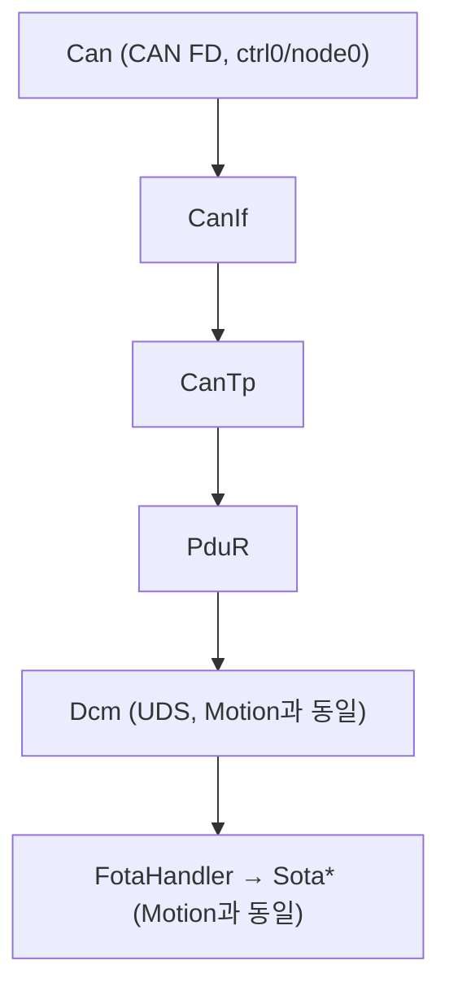
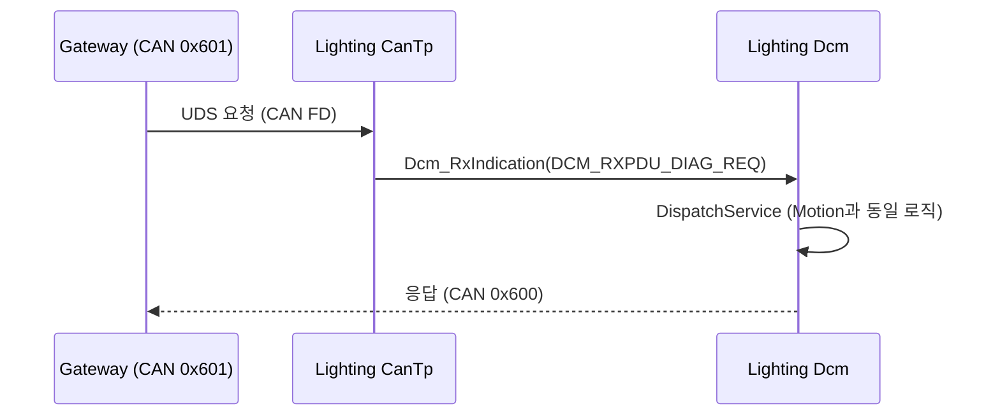
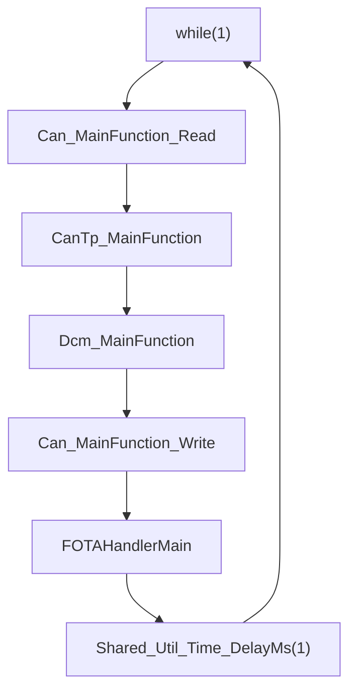

# 05. Lighting ECU Architecture

## 관련 문서

- [Wiki Home](./README.md)
- [Motion ECU Architecture](./04_motion_ecu_architecture.md)
- [DCM Diagnostic Services](./14_dcm_diagnostic_services.md)
- [PduR Routing](./13_pdur_routing.md)

## 1. 목적

`Ecu_Lighting_TC375_LK`의 구조를 Motion ECU와 비교하여 설명하고, 실제 구현 차이와 확인이 필요한 부분을 표시한다.

## 2. 범위

Lighting ECU의 역할, Motion과의 동일성 여부, 통신 경로, FOTA target 여부.

## 3. 요약

Lighting ECU는 **Motion ECU와 동일한 Target 펌웨어 구조**를 가진 또 하나의 CAN Target이다. 진단/FOTA 처리 코드(`Dcm.c`, `FotaHandler.c`)는 Motion과 바이트 단위로 동일하며, **CAN ID와 UART 배너만 다르다**.

## 4. Motion과의 동일성 (코드 근거)

| 파일 | Motion vs Lighting | 근거 |
|---|---|---|
| `Basics/ComStack/Dcm/Dcm.c` | 동일 | `diff` 차이 없음 |
| `Basics/Reprogram/FotaHandler.c` | 동일 | `diff` 차이 없음 |
| `Basics/ComStack/CanTp/CanTp_Cfg.c` | 동일 | `diff` 차이 없음 |
| `Cpu0_Main.c` | 차이 1줄 | 배너 `[Lighting] Target DCM Responder Start` |
| `Basics/ComStack/Can/Can_Cfg.h` | 차이 | CAN ID 매크로 |

```text
근거 (diff 결과):
- Cpu0_Main.c:62  UART_Printf("[Lighting] Target DCM Responder Start\r\n");
- Can_Cfg.h:31-35 CAN_ID_GATEWAY_LIGHTING (0x600), CAN_ID_LIGHTING (0x601),
                  CAN_ID_LOCAL_TO_REMOTE = CAN_ID_GATEWAY_LIGHTING,
                  CAN_ID_REMOTE_TO_LOCAL = CAN_ID_LIGHTING
```

## 5. 모듈 아키텍처



> Motion과 동일 구조이므로 상세 모듈/흐름은 [Motion ECU Architecture](./04_motion_ecu_architecture.md)를 그대로 참조한다.

## 6. Gateway와의 통신 경로

| 방향 | CAN ID | 매크로 | 근거 |
|---|---|---|---|
| Gateway→Lighting (요청) | `0x601` | `CAN_ID_REMOTE_TO_LOCAL` = `CAN_ID_LIGHTING` | `Can_Cfg.h`, `CanIf_Cfg.c` |
| Lighting→Gateway (응답) | `0x600` | `CAN_ID_LOCAL_TO_REMOTE` = `CAN_ID_GATEWAY_LIGHTING` | 동일 |

Gateway 측에서 Lighting은 DoIP logical address `0x5678`(`DOIP_LOGICAL_ADDRESS_TARGET_LIGHTING`)로 식별되어 `DOIP_RXPDU_DIAG_REQ_TO_CANTP_LIGHTING` → `CANTP_TXNSDU_GATEWAY_TO_LIGHTING`로 라우팅된다. 근거: `DoIP_RxPduConfig[]`, `PduR_RoutingPathConfig[]` (Gateway).

## 7. Lighting diagnostic flow



## 8. Lighting main loop



Motion과 동일한 main loop. 근거: `Test_MainFunctions()` in `Ecu_Lighting_TC375_LK/Cpu0_Main.c`.

## 9. FOTA target 역할

Lighting은 Motion과 동일하게 FOTA target이다. 0x34/0x36/0x37/0x31(FF01/FF02/FF03)/0x11 시퀀스를 동일하게 처리하고, 동일한 TC375 PFlash 뱅크 스왑 로직을 사용한다.

## 10. 코드 근거

```text
근거:
- diff Ecu_Motion_TC375_LK Ecu_Lighting_TC375_LK: Dcm.c/FotaHandler.c/CanTp_Cfg.c 동일
- Can_Cfg.h CAN_ID_LIGHTING (0x601), CAN_ID_GATEWAY_LIGHTING (0x600)
- DoIP_Cfg.h DOIP_LOGICAL_ADDRESS_TARGET_LIGHTING (0x5678)
```

## 11. 추정 사항

- Lighting은 Motion의 복제본으로 별도 애플리케이션 로직(조명 제어 등)이 코드에 없음 → 현재는 진단/FOTA 데모용 Target `추정`.

## 12. 확인 필요 사항

- Lighting 고유의 application logic(실제 조명 제어)이 `Cpu1_Main.c`/`Cpu2_Main.c` 등에 있는지 `확인 필요`.
- Motion/Lighting이 동일 PFlash 레이아웃·뱅크 스왑 정책을 공유하는지 (현재 코드상 동일) — 하드웨어 보드별 차이 `확인 필요`.

## 다음에 읽을 문서

- [Motion ECU Architecture](./04_motion_ecu_architecture.md)
- [PduR Routing](./13_pdur_routing.md)

## 이 문서에서 남은 확인 필요 사항

| 항목 | 내용 | 확인 방법 |
|---|---|---|
| 조명 제어 로직 | Lighting 고유 application 존재 여부 | `Cpu1_Main.c`/`Cpu2_Main.c`, `Apps/` 확인 |
| 보드 차이 | Motion/Lighting 하드웨어 차이 | 실제 보드/핀맵 확인 |
