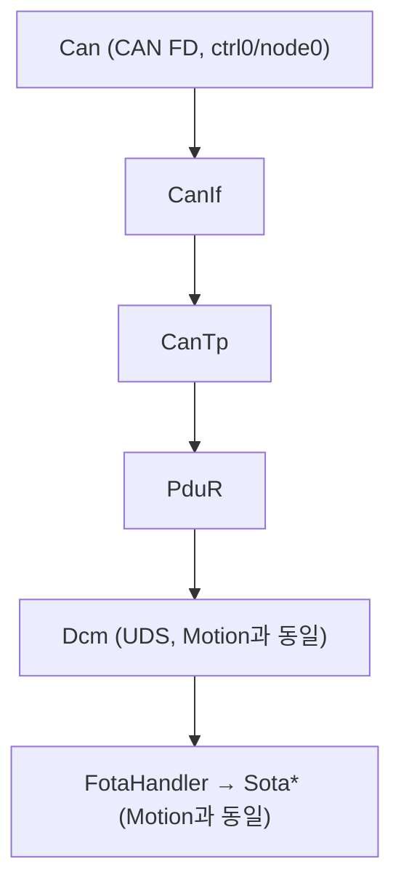
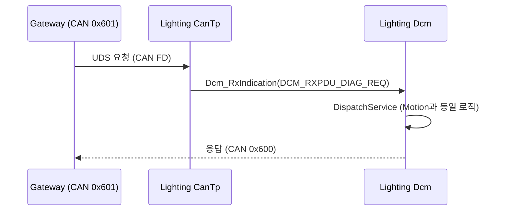
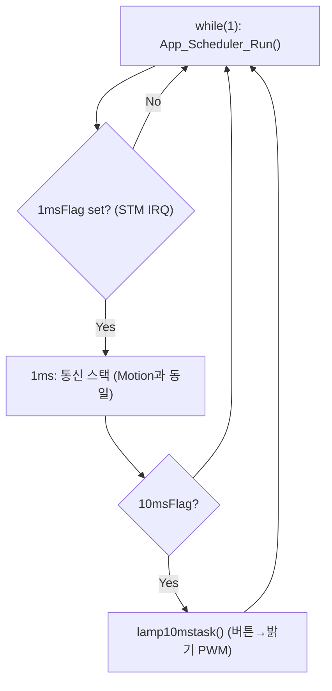

# 05. Lighting ECU Architecture

## 관련 문서

- [Wiki Home](./README.md)
- [Motion ECU Architecture](./04_motion_ecu_architecture.md)
- [DCM Diagnostic Services](./14_dcm_diagnostic_services.md)
- [PduR Routing](./13_pdur_routing.md)

## 1. 목적

`Ecu_Lighting_TC375_LK`의 구조를 Motion ECU와 비교하여 설명하고, 실제 구현 차이와 확인이 필요한 부분을 표시한다.

## 2. 범위

Lighting ECU의 역할, Motion과의 동일성 여부, 통신 경로, FOTA target 여부.

## 3. 요약

Lighting ECU는 Motion ECU와 **통신/진단/FOTA 코어가 동일한** 또 하나의 CAN Target이다. 진단/FOTA 처리 코드(`Dcm.c`, `FotaHandler.c`)는 Motion과 동일하다. 단, **최근 App layer 추가 후에는 application 로직이 서로 다르다** — Lighting은 lamp(조명) 밝기 제어 application(`Apps/App_Lamp.c`)을 가진다. CAN ID, UART 배너, application slot이 Motion과 다르다.

> **변경 주의**: 초기 위키는 Lighting을 "Motion의 바이트 단위 복제본, 고유 application 없음"으로 기술했다. App layer 추가 후 이 기술은 정정된다. Lighting은 자체 조명 제어 application을 가진다. 근거: `Apps/App_Lamp.c`, `App_Scheduler_Run_10ms()` in `Apps/App_Scheduler.c`.

## 4. Motion과의 동일성 / 차이 (코드 근거)

| 파일 | Motion vs Lighting | 근거 |
|---|---|---|
| `Basics/ComStack/Dcm/Dcm.c` | 동일 | 진단/FOTA 코어 공통 |
| `Basics/Reprogram/FotaHandler.c` | 동일 | 공통 |
| `Basics/ComStack/CanTp/CanTp_Cfg.c` | 동일 | 공통 |
| `Apps/App_Scheduler.c` | 골격 동일, slot 다름 | 1ms 통신 slot 동일 |
| `Apps/` application | **차이** | Lighting=`App_Lamp`(lamp, 10ms slot), Motion=`accel`(motor, 100ms slot) |
| `Basics/Common/adc.c/.h` | **차이** | Lighting=조도 VADC(`init_VADC_Group3_Ch1`), Motion=joystick/전류 VADC |
| `Cpu0_Main.c` | 차이 | 배너 `[Lighting] Target DCM Responder Start` + `Current Version: A` |
| `Basics/ComStack/Can/Can_Cfg.h` | 차이 | CAN ID 매크로 |

```text
근거:
- Cpu0_Main.c  UART_Printf("[Lighting ECU] Current Version: A\r\n"); UART_Printf("[Lighting] Target DCM Responder Start\r\n");
- App_Lamp.c   lampinit()/lamp10mstask() (버튼 P02.0/P02.1 → 밝기 PWM_setDutyCycle)
- Can_Cfg.h    CAN_ID_GATEWAY_LIGHTING (0x600), CAN_ID_LIGHTING (0x601),
               CAN_ID_LOCAL_TO_REMOTE = CAN_ID_GATEWAY_LIGHTING,
               CAN_ID_REMOTE_TO_LOCAL = CAN_ID_LIGHTING
```

## 5. 모듈 아키텍처



> Motion과 동일 구조이므로 상세 모듈/흐름은 [Motion ECU Architecture](./04_motion_ecu_architecture.md)를 그대로 참조한다.

## 6. Gateway와의 통신 경로

| 방향 | CAN ID | 매크로 | 근거 |
|---|---|---|---|
| Gateway→Lighting (요청) | `0x601` | `CAN_ID_REMOTE_TO_LOCAL` = `CAN_ID_LIGHTING` | `Can_Cfg.h`, `CanIf_Cfg.c` |
| Lighting→Gateway (응답) | `0x600` | `CAN_ID_LOCAL_TO_REMOTE` = `CAN_ID_GATEWAY_LIGHTING` | 동일 |

Gateway 측에서 Lighting은 DoIP logical address `0x5678`(`DOIP_LOGICAL_ADDRESS_TARGET_LIGHTING`)로 식별되어 `DOIP_RXPDU_DIAG_REQ_TO_CANTP_LIGHTING` → `CANTP_TXNSDU_GATEWAY_TO_LIGHTING`로 라우팅된다. 근거: `DoIP_RxPduConfig[]`, `PduR_RoutingPathConfig[]` (Gateway).

## 7. Lighting diagnostic flow



## 8. Lighting main loop (STM scheduler)



> 변경 전에는 `Test_MainFunctions()`+`Shared_Util_Time_DelayMs(1)` cooperative loop였다. 현재는 Motion과 동일한 STM 1ms 인터럽트 scheduler 골격을 쓰되, **application은 10ms slot의 `lamp10mstask()`**이다(Motion은 100ms throttle). 근거: `core0_main()`/`App_Scheduler_Run()` in `Ecu_Lighting_TC375_LK`, `lamp10mstask()` in `Apps/App_Lamp.c`.

## 8.1 Lighting application (lamp) 동작

```text
실제 호출 흐름 (10ms slot):
App_Scheduler_Run_10ms()
→ lamp10mstask()
  → (기본 버튼 모드) P02.0 low → onoff=1, P02.1 low → onoff=0
  → onoff에 따라 brightness ±60 (0~3000 clamp)
  → PWM_setDutyCycle(brightness)
```

- `AUTOMODE` 매크로가 정의되면 조도 센서(`read_EVADC_Values31`) 기반 자동 점등으로 동작하나, 현재 코드에서는 주석 처리되어 **버튼 모드**가 활성. 근거: `App_Lamp.c` `//#define AUTOMODE`.

## 9. FOTA target 역할

Lighting은 Motion과 동일하게 FOTA target이다. 0x34/0x36/0x37/0x31(FF01/FF02/FF03)/0x11 시퀀스를 동일하게 처리하고, 동일한 TC375 PFlash 뱅크 스왑 로직을 사용한다.

## 10. 코드 근거

```text
근거:
- diff Ecu_Motion_TC375_LK Ecu_Lighting_TC375_LK: Dcm.c/FotaHandler.c/CanTp_Cfg.c 동일
- Can_Cfg.h CAN_ID_LIGHTING (0x601), CAN_ID_GATEWAY_LIGHTING (0x600)
- DoIP_Cfg.h DOIP_LOGICAL_ADDRESS_TARGET_LIGHTING (0x5678)
```

## 11. 추정 사항

- Lighting은 진단/FOTA 코어는 Motion과 동일하되 application은 조명(lamp) 제어 전용 `추정` (다른 차량 도메인을 같은 펌웨어 골격으로 데모).
- `AUTOMODE`(조도 센서 자동 점등)는 코드에 존재하나 비활성, 현재 동작은 버튼 기반 `추정`.

## 12. 확인 필요 사항

- Lighting application(`App_Lamp`)이 실제로 어떤 LED/조명 채널을 구동하는지(핀맵 `P10.1`, PWM TOUT104) — 보드별 배선 `확인 필요`.
- Motion/Lighting이 동일 PFlash 레이아웃·뱅크 스왑 정책을 공유하는지 (현재 코드상 동일) — 하드웨어 보드별 차이 `확인 필요`.
- application slot 처리 시간이 1ms 통신 slot 타이밍에 주는 영향 `확인 필요`.

## 13. 최근 코드 변경 반영 사항

| 변경 영역 | 반영 내용 | 코드 근거 |
|---|---|---|
| main loop | cooperative loop → STM 1ms scheduler | `core0_main()`/`App_Scheduler_Run()` |
| 신규 application | lamp 밝기 제어(10ms slot, 버튼/PWM) | `lamp10mstask()`/`lampinit()` in `Apps/App_Lamp.c` |
| 신규 driver | STM tick, 조도 VADC, GTM PWM | `Driver_Stm.c`, `adc.c`(`init_VADC_Group3_Ch1`), `pwm.c` |
| 부팅 로그 | `[Lighting ECU] Current Version: A` 추가 | `core0_main()` diff |
| 0x11 reset | 응답 후 `Shared_Util_Time_DelayMs(1000)` 추가 | `Dcm_HandleEcuReset()` diff |
| 기술 정정 | "Motion 바이트 단위 동일/application 없음" → application 분기 | `App_Lamp.c` vs `accel.c` |

## 다음에 읽을 문서

- [Motion ECU Architecture](./04_motion_ecu_architecture.md)
- [PduR Routing](./13_pdur_routing.md)
- [Application Change Log](./23_application_change_log.md)

## 이 문서에서 남은 확인 필요 사항

| 항목 | 내용 | 확인 방법 |
|---|---|---|
| 조명 채널 | App_Lamp가 구동하는 실제 출력/핀맵 | 보드/핀맵 + `lampinit()` `P10.1`/PWM TOUT104 |
| 보드 차이 | Motion/Lighting 하드웨어 차이 | 실제 보드/핀맵 확인 |
