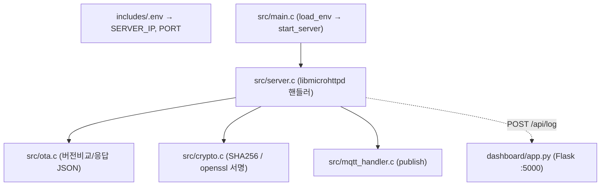
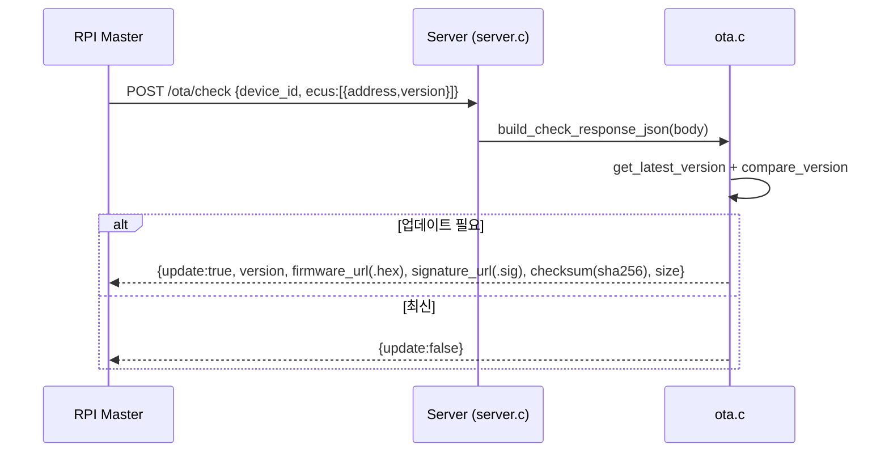
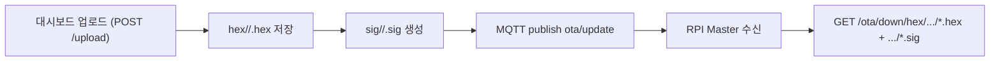

# 06. Linux Server Architecture

## 관련 문서

- [Wiki Home](./README.md)
- [System Architecture](./02_system_architecture.md)
- [RPI FOTA Master Architecture](./07_rpi_fota_master_architecture.md)
- [FOTA Update Flow](./15_fota_update_flow.md)

## 1. 목적

`FOTA_Linux_Server`가 펌웨어 이미지를 업로드받아 보관·서명하고, ECU 버전 체크 응답과 MQTT 업데이트 알림을 제공하는 동작을 설명한다.

## 2. 범위

HTTP 서버 라우팅, 이미지/서명 보관, 버전 관리, MQTT 알림, 대시보드 포워딩. RPI Master 측 동작은 [RPI FOTA Master Architecture](./07_rpi_fota_master_architecture.md)로 위임한다.

## 3. 요약

서버는 **libmicrohttpd 기반 HTTP 서버**(`PORT`는 `includes/.env`에서 로드)로 동작하며, 업로드된 `.hex`를 `hex/<addr>/<ver>.hex`에 저장하고 `openssl dgst -sha256 -sign`으로 `.sig`를 생성한다. 버전 체크 요청에 대해 업데이트 필요 여부 JSON을 반환하고, 업로드 시 MQTT로 알림을 publish한다.

## 4. 주요 구성 요소



근거:
- `load_env()`, `start_server()` in `src/main.c`
- `answer_to_connection()` in `src/server.c`

## 5. HTTP 엔드포인트

| Method | URL | 역할 | 근거 |
|---|---|---|---|
| POST | `/ota/check` | ECU 버전 체크 → 업데이트 응답 JSON | `build_check_response_json()` (ota.c) |
| POST | `/ota/report` | 업데이트 결과 보고 수신 → 대시보드 포워딩 | `forward_report_to_dashboard()` |
| POST | `/upload` | 대시보드에서 HEX 업로드 → 서명 생성 + MQTT publish | `iterate_post()`, `generate_sig_file()`, `publish_update_notification()` |
| GET | `/ota/down/<path>` | HEX/SIG 파일 다운로드 | `fopen(url+10)` |
| GET | `/ota/key/public.pem` | 공개키 제공 | `fopen("keys/public.pem")` |

## 6. 이미지/서명 보관 구조

```text
hex/<address>/<version>.hex     업로드된 펌웨어
hex/<address>/version.list      버전 목록 (마지막 줄이 최신)
sig/<address>/<version>.sig     서명 파일 (openssl dgst -sha256 -sign keys/private.pem)
keys/private.pem, keys/public.pem  서명 키 쌍
```

근거:
- 저장 경로: `iterate_post()`, `/upload` 핸들러 in `server.c`
- 서명 생성: `generate_sig_file()` in `crypto.c` (`openssl dgst -sha256 -sign keys/private.pem`)
- 최신 버전: `get_latest_version()` in `ota.c` (version.list 마지막 비어있지 않은 줄)

## 7. 버전 체크 응답 (`/ota/check`)



근거: `build_check_response_json()`, `compare_version()` in `ota.c`. checksum은 `.hex`의 SHA256 hex 문자열(`calculate_sha256`).

## 8. MQTT 업데이트 알림 (`/upload` 후)

```text
실제 호출 흐름:
/upload 핸들러
→ generate_sig_file(hex_path, sig_path)
→ version.list append
→ publish_update_notification(address, version)
→ MQTTClient_publishMessage(TOPIC="ota/update", QoS=1)
```

payload: `{address, version, firmware_url(.hex), signature_url(.sig), checksum}`. 근거: `publish_update_notification()` in `mqtt_handler.c`, `MQTT_TOPIC "ota/update"` in `mqtt_handler.h`.

## 9. server → master 이미지 흐름



## 10. 대시보드 (Flask)

`dashboard/app.py`는 Flask 앱(:5000)으로, `/api/log`로 서버가 포워딩한 report를 받는다. 근거: `forward_report_to_dashboard()` in `server.c`가 `127.0.0.1:5000`의 `POST /api/log`로 전송.

## 11. 코드 근거

```text
근거:
- answer_to_connection(), iterate_post(), forward_report_to_dashboard() in server.c
- build_check_response_json(), get_latest_version(), compare_version() in ota.c
- calculate_sha256(), generate_sig_file() in crypto.c
- publish_update_notification() in mqtt_handler.c
- MQTT_ADDRESS "tcp://localhost:1883", MQTT_TOPIC "ota/update" in mqtt_handler.h
```

## 12. 추정 / 확인 필요 사항

- 서버는 펌웨어를 `.hex` 경로로 보관/배포하지만, RPI Master는 동일 URL을 받아 `.bin`으로 저장해 순수 바이너리로 플래싱한다. 실제 업로드 파일이 binary인지 Intel HEX인지 **확인 필요** (파일 확장자와 내용 불일치 가능성). → [Open Issues](./22_open_issues.md)
- 서명 알고리즘은 `keys/private.pem`의 키 종류에 따라 RSA 또는 ECDSA가 됨. Master는 `EVP_DigestVerify`로 검증하므로 키 종류에 무관 — 실제 키 타입 `확인 필요`.
- MQTT broker는 서버 측 `tcp://localhost:1883`로 publish하지만 Master는 `tcp://192.168.203.16:1883`로 subscribe → 동일 broker 가정 `추정`.
- `MQTT_ADDRESS`/`SERVER_IP`/`PORT`가 `.env`와 매크로로 이원화되어 있음 `확인 필요`.

## 다음에 읽을 문서

- [RPI FOTA Master Architecture](./07_rpi_fota_master_architecture.md)
- [FOTA Update Flow](./15_fota_update_flow.md)

## 이 문서에서 남은 확인 필요 사항

| 항목 | 내용 | 확인 방법 |
|---|---|---|
| 파일 포맷 | `.hex` 내용이 binary인지 Intel HEX인지 | 실제 업로드 파일 헤더 확인 |
| 서명 키 타입 | private.pem이 RSA/ECDSA 중 무엇인지 | `openssl pkey -in keys/private.pem -text` |
| broker 위치 | 서버 publish(localhost) vs master subscribe(203.16) 동일 broker | 배포 구성 확인 |
