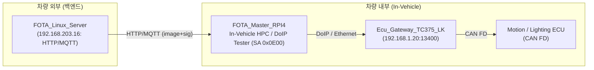
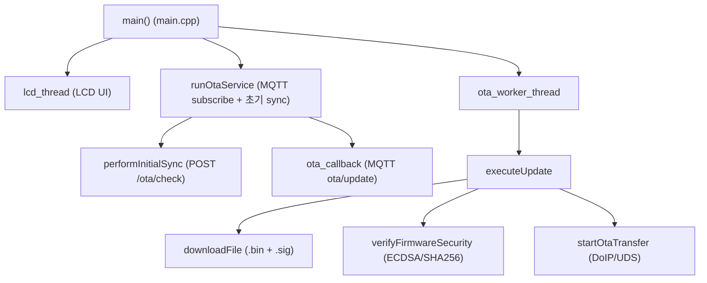
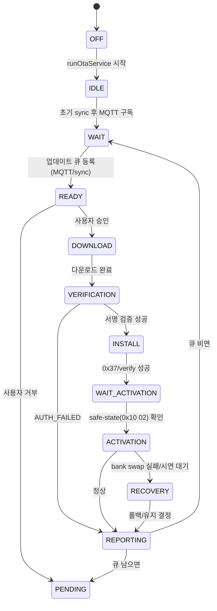
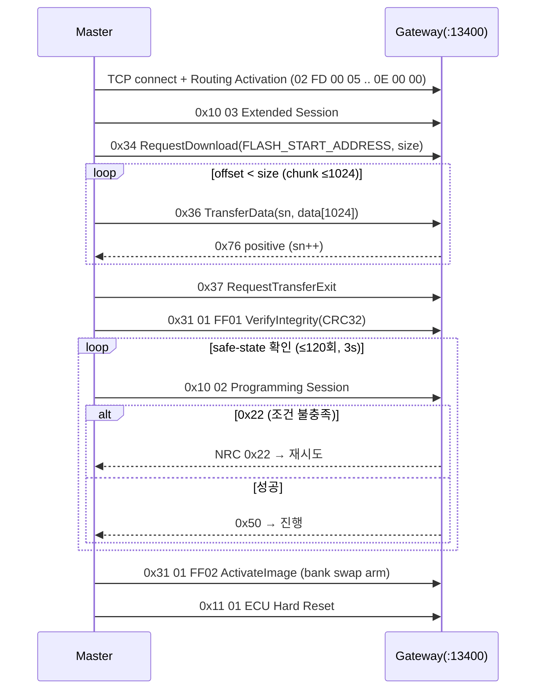
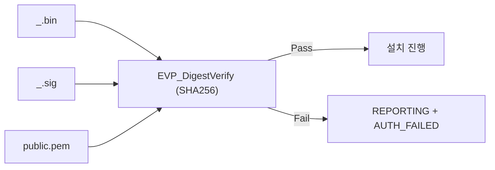

# 07. RPI FOTA Master Architecture

## 관련 문서

- [Wiki Home](./README.md)
- [Linux Server Architecture](./06_linux_server_architecture.md)
- [DoIP Gateway Routing](./10_doip_gateway_routing.md)
- [FOTA Update Flow](./15_fota_update_flow.md)
- [Error Handling and Recovery](./18_error_handling_and_recovery.md)

## 1. 목적

`FOTA_Master_RPI4`가 서버로부터 이미지를 받아 검증하고, DoIP Tester로서 Gateway에 UDS 시퀀스를 보내 FOTA를 수행하는 동작을 설명한다.

## 2. 범위

서버 연동(HTTP/MQTT), 이미지/서명 검증, DoIP Routing Activation, UDS 요청 생성, 이미지 chunk 전송, 응답 수신, timeout/retry, 상태머신, LCD UI.

## 0. 배치(deployment) 포지셔닝

`FOTA_Master_RPI4`(Raspberry Pi 4 기반)는 **차량 내부에 탑재된 High Performance Computer(In-Vehicle HPC)** 역할을 한다. 즉 외부 클라우드/백엔드가 아니라 **차량 안에서 동작하는 FOTA master 겸 DoIP tester**다.



- 근거(코드상 정황): 서버는 `192.168.203.x`(HTTP `:4321` / MQTT `:1883`)로 외부 백엔드, Gateway는 `192.168.1.20:13400`로 차량 내부 in-vehicle network에 위치 — `CHECK_URL`/`MQTT_ADDRESS` vs `GATEWAY_IP` in `ota_comm.cpp`. HPC가 차량 내부에 있다는 **배치 자체는 프로젝트 배치 기준(사용자 제공)**이며 코드만으로 단정되지 않음 `추정`.
- 따라서 HPC는 외부 백엔드(서버)와 차량 내부 진단 도메인(Gateway/ECU)을 잇는 **차량 측 게이트키퍼/테스터**다. 서버=원격 이미지 저장/배포, HPC=차량 내 다운로드·검증·DoIP 진단 주체로 역할이 구분된다.

## 3. 요약

RPI Master는 **차량 내부 HPC이자 DoIP Tester**다. `ota_worker_thread`가 업데이트 큐를 소비해 `executeUpdate()`로 다운로드→서명검증→설치를 수행하고, `startOtaTransfer()`가 Gateway(`192.168.1.20:13400`)에 UDS 시퀀스를 보낸다. Tester SA는 `0x0E00`.

## 4. 주요 구성 요소 / 스레드



근거:
- `main()` in `main.cpp` (pthread: `lcd_thread`, `ota_worker_thread`, then `runOtaService()`)
- `runOtaService()`, `ota_worker_thread()`, `executeUpdate()` in `ota_comm.cpp`

## 5. 주요 파일

| 구분 | 파일 | 역할 | 근거 |
|---|---|---|---|
| 진입 | `main.cpp` | 스레드 생성 + 서비스 시작 | `main()` |
| 통신/큐 | `ota_comm.cpp` | HTTP/MQTT, 다운로드, 상태머신 | `runOtaService()` |
| UDS | `ota_uds_engine.cpp` | DoIP/UDS 시퀀스 | `startOtaTransfer()` |
| 보안 | `ota_security.cpp` | 서명 검증 | `verifyFirmwareSecurity()` |
| 상태 | `lcd/includes/state.h` | STATE enum | - |
| 구조체 | `lcd/includes/struct.h` | `UpdateItem` | - |
| UI | `lcd/*.c` | LCD/I2C/모니터 | `lcd_thread()` |
| 버전 | `ecu_versions.json` | 로컬 ECU 버전 | `loadLocalVersions()` |
| 키 | `public.pem` | 서명 검증 공개키 | `LOCAL_PUBLIC_KEY_PATH` |

## 6. 주요 상수 / 엔드포인트

| 이름 | 값 | 위치 |
|---|---|---|
| `DOIP_PORT` | `13400` | ota_uds_engine.cpp |
| `RPI_SA` | `0x0E00` | ota_uds_engine.cpp |
| `FLASH_START_ADDRESS` | `0x80000000` | ota_uds_engine.cpp (RequestDownload memoryAddress) |
| `GATEWAY_IP` | `192.168.1.20` | ota_comm.cpp |
| `CHECK_URL` | `http://192.168.203.16:4321/ota/check` | ota_comm.cpp |
| `REPORT_URL` | `http://192.168.203.16:4321/ota/report` | ota_comm.cpp |
| `MQTT_ADDRESS` | `tcp://192.168.203.16:1883` | ota_comm.cpp |
| `TOPIC` | `ota/update` | ota_comm.cpp |
| `DEVICE_ID` | `0001` | ota_comm.cpp |

## 7. 상태 머신 (STATE)



근거: `state.h` enum + `current_state` 전이 (`ota_comm.cpp`, `ota_uds_engine.cpp`).

## 8. FOTA 실행 시퀀스 (startOtaTransfer)



근거: `startOtaTransfer()`, `routingActivation()`, `requestDownload()`, `requestBankSwap()`, `requestEcuReset()` in `ota_uds_engine.cpp`.

## 9. DoIP 패킷 구성 (Master 측)

```text
sendUdsPacket():
[0..1] 02 FD            (protocol version / inverse)
[2..3] 80 01            (payload type = Diagnostic Message)
[4..7] 00 00 00 len     (payload length = UDS len + 4)
[8..9] RPI_SA (0x0E00)  (SourceAddress)
[10..11] targetAddr     (0x1234 / 0x5678)
[12..]  SID + payload   (UDS)
```

근거: `sendUdsPacket()` in `ota_uds_engine.cpp`. 응답 파싱은 `checkUdsResponse()`가 `02 FD 80 01` 헤더를 스캔해 SID 위치(offset+12)에서 검사.

## 10. 보안 검증



근거: `verifyFirmwareSecurity()` in `ota_security.cpp` (`PEM_read_PUBKEY`, `EVP_DigestVerifyInit(SHA256)`, `EVP_DigestVerifyFinal`). 로그에 "ECDSA Verification"으로 표기.

## 11. timeout / retry / error handling

| 항목 | 동작 | 근거 |
|---|---|---|
| socket recv | `SO_RCVTIMEO 3s`, `recv_with_retry`(최대 20회, 2s) | `startOtaTransfer`, `recv_with_retry` |
| 다운로드 | 실패 시 5s 후 이어받기(`CURLOPT_RESUME_FROM_LARGE`) | `downloadFile()` |
| safe-state | `0x10 02`에 NRC 0x22면 3s 후 재시도(최대 120회) | `startOtaTransfer` |
| NRC 0x78 | response pending으로 간주(return 0x78) | `checkUdsResponse()` |
| 다운그레이드 | 같거나 낮은 버전이면 큐에서 폐기 | `isDowngradeOrSame()` |
| bank swap 실패 | RECOVERY 상태 → 사용자 롤백 선택 | `startOtaTransfer` |

## 12. 코드 근거

```text
근거:
- main() in main.cpp
- runOtaService(), ota_worker_thread(), executeUpdate(), downloadFile() in ota_comm.cpp
- startOtaTransfer(), sendUdsPacket(), checkUdsResponse(), routingActivation() in ota_uds_engine.cpp
- verifyFirmwareSecurity() in ota_security.cpp
- STATE enum in lcd/includes/state.h
```

## 13. 추정 / 확인 필요 사항

- `FLASH_START_ADDRESS=0x80000000`은 RequestDownload에 실려가지만 Target은 inactive bank를 자체 계산하므로 무시될 가능성 `추정`.
- Master의 CRC32(`calculateChunkCRC32`, poly 0xEDB88320)와 Target `crc32.c`의 다항식 일치 여부 `확인 필요`.
- `0x10 02` 재시도를 "safe-state 확인"으로 사용하나, Target Dcm은 `DCM_FOTA_STATE_VERIFIED` 조건만 검사(차량 속도/기어 미확인) → 의미상 차이 `확인 필요`.

## 14. 최근 문서 반영 사항

| 변경 영역 | 반영 내용 | 근거 |
|---|---|---|
| 배치 포지셔닝 | RPI Master를 **차량 내부 High Performance Computer(In-Vehicle HPC)**로 명시 (서버=외부 백엔드, HPC=차량 측 FOTA master/DoIP tester) | 프로젝트 배치 기준(사용자 제공) + 네트워크 분리 정황(`ota_comm.cpp`) |

> 이번 업데이트에서 RPI Master의 **소스 코드 변경은 없다**. 위 항목은 배치(deployment) 관점의 문서 명확화이다. App layer 변경은 Target ECU(Motion/Lighting)에 한정된다 — [Application Change Log](./23_application_change_log.md).

## 다음에 읽을 문서

- [DoIP Gateway Routing](./10_doip_gateway_routing.md)
- [FOTA Update Flow](./15_fota_update_flow.md)
- [Application Change Log](./23_application_change_log.md)

## 이 문서에서 남은 확인 필요 사항

| 항목 | 내용 | 확인 방법 |
|---|---|---|
| CRC 정합성 | Master CRC32 vs Target crc32.c 다항식 | 양측 알고리즘 비교 |
| safe-state | 0x10 02의 실제 조건(차량 상태) | Target `Dcm_HandleDiagnosticSessionControl` 조건 확인 |
| memoryAddress | 0x80000000 사용 여부 | Target download 핸들러 추적 |
