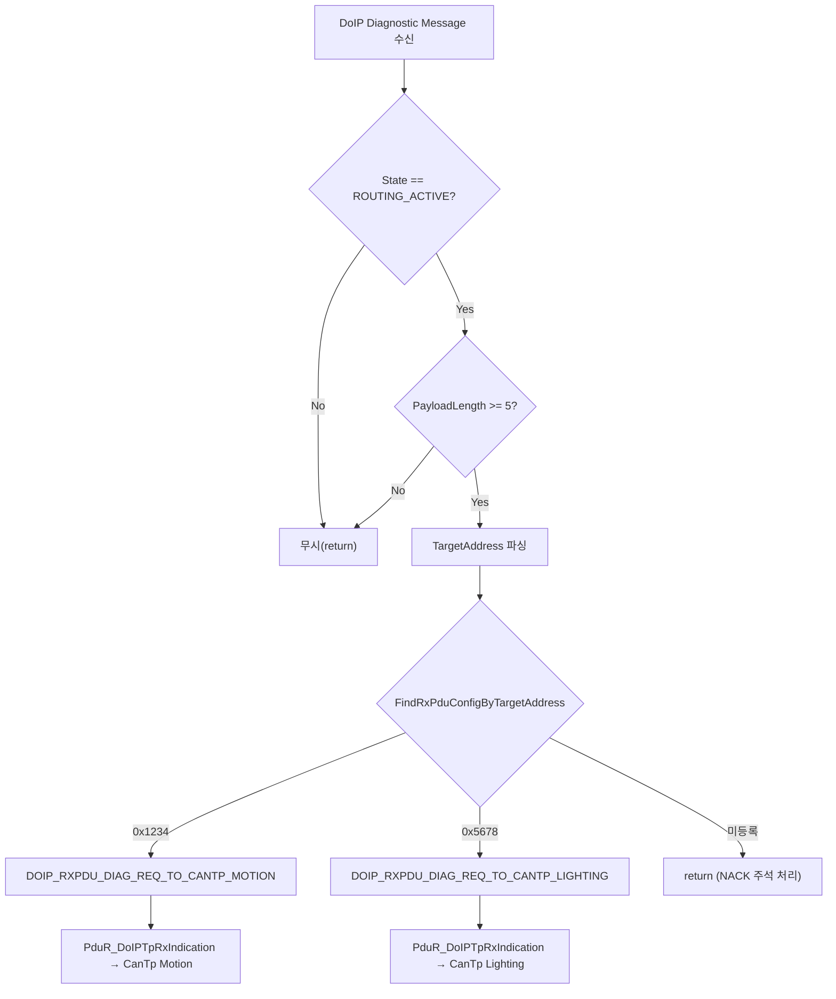
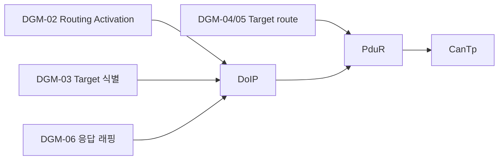

# 08. Diagnostic Gateway Management

## 관련 문서

- [Wiki Home](./README.md)
- [Gateway ECU Architecture](./03_gateway_ecu_architecture.md)
- [DoIP Gateway Routing](./10_doip_gateway_routing.md)
- [PduR Routing](./13_pdur_routing.md)
- [Requirements Traceability](./21_requirements_traceability.md)

## 1. 목적

Gateway가 진단 메시지를 어떻게 식별·라우팅하는지를 요구사항-구현 연결 관점으로 정리한다.

## 2. 범위

Routing Activation, DoIP Diagnostic Message 처리, target logical address 식별, internal route 변환, Motion/Lighting route, unknown target 처리, Gateway local 진단 정책. 시스템 요구사항은 외부 관찰 가능 동작 중심으로 기술한다.

## 3. 요약

Gateway는 DoIP TCP 페이로드를 수신해 Routing Activation을 처리하고, Diagnostic Message의 TargetAddress로 Motion/Lighting을 식별하여 CAN(CanTp) 경로로 포워딩한다. **Gateway 자체 진단은 지원하지 않는다.**

## 4. 요구사항-모듈 연결 표

| ID | Type | Requirement | Related Module | Evidence | Status | Notes |
|---|---|---|---|---|---|---|
| DGM-01 | Functional | Gateway는 DoIP TCP 페이로드 수신 시 DoIP 처리 계층으로 전달해야 한다 | SoAd→DoIP | `DoIP_TpRxIndication()` (DoIP.c), `SoAd.c:428` | Implemented | |
| DGM-02 | Functional | Gateway는 Routing Activation 요청에 응답해야 한다 | DoIP | `DoIP_HandleRoutingActivation()` → `DoIP_SendRoutingActivationResponse(SUCCESS)` | Implemented | 항상 SUCCESS(0x10) |
| DGM-03 | Functional | Gateway는 Diagnostic Message의 TargetAddress로 대상 ECU를 식별해야 한다 | DoIP | `DoIP_FindRxPduConfigByTargetAddress()` | Implemented | 0x1234/0x5678 |
| DGM-04 | Functional | Motion 대상 요청은 Motion CAN 경로로 전달해야 한다 | DoIP→PduR→CanTp | route `DOIP_TO_CANTP_TESTER_TO_MOTION` | Implemented | |
| DGM-05 | Functional | Lighting 대상 요청은 Lighting CAN 경로로 전달해야 한다 | DoIP→PduR→CanTp | route `DOIP_TO_CANTP_TESTER_TO_LIGHTING` | Implemented | |
| DGM-06 | Functional | Target 응답은 DoIP로 래핑되어 Tester에게 전달되어야 한다 | CanTp→PduR→DoIP | route `CANTP_TO_DOIP_*_TO_TESTER`, `DoIP_TpTransmit()` | Implemented | |
| DGM-07 | Functional | 미등록 TargetAddress 요청은 라우팅되지 않아야 한다 | DoIP | `DoIP_HandleDiagnosticMessage()` (RxConfig==NULL → return) | Implemented | NACK은 주석 처리 |
| DGM-08 | Policy | Gateway는 자체 진단(local DCM)을 수행하지 않는다 | DoIP/PduR | `DoIP_RxPduConfig`에 ECU 주소 미등록, PduR Dcm route 없음 | Implemented | `확인 필요`(향후 정책) |
| DGM-09 | Functional | 잘못된 DoIP 헤더는 Generic NACK로 거절해야 한다 | DoIP | `DoIP_SendGenericNack(INVALID_HEADER)` | Implemented | header/version 불일치 시 |

## 5. target routing decision flow



근거: `DoIP_HandleDiagnosticMessage()` in `DoIP.c`, `DoIP_RxPduConfig[]` in `DoIP_Cfg.c`.

## 6. requirement → module diagram



## 7. Gateway local diagnostic policy

현재 코드는 Gateway 자신을 대상으로 하는 진단을 처리하지 않는다.

- `DoIP_HandleDiagnosticMessage()` 주석: "현재 프로젝트에서는 Gateway 자체 진단을 지원하지 않는다 ... 오직 DoIP_RxPduConfig에 등록된 Target ECU 주소만 지원한다."
- `DoIP_RxPduConfig[]`에는 `DOIP_LOGICAL_ADDRESS_ECU(0x0F00)` 항목이 없다.
- Gateway `Cpu0_Main.c`는 `Dcm_Init`/`Dcm_MainFunction`을 호출하지만 PduR 라우팅에 Dcm 경로가 없어 실질 미사용 `추정`.

## 8. 코드 근거

```text
근거:
- DoIP_HandleRoutingActivation(), DoIP_HandleDiagnosticMessage() in DoIP.c
- DoIP_FindRxPduConfigByTargetAddress() in DoIP.c
- DoIP_RxPduConfig[], DoIP_TxPduConfig[] in DoIP_Cfg.c
- PduR_RoutingPathConfig[] in PduR_Cfg.c
```

## 9. 추정 / 확인 필요 사항

- Routing Activation은 요청 코드/인증을 검사하지 않고 항상 SUCCESS 응답 `확인 필요`.
- Unknown target에 대한 NACK 미전송(주석)이 의도된 정책인지 `확인 필요`.

## 다음에 읽을 문서

- [DoIP Gateway Routing](./10_doip_gateway_routing.md)
- [Communication Stack Management](./09_communication_stack_management.md)

## 이 문서에서 남은 확인 필요 사항

| 항목 | 내용 | 확인 방법 |
|---|---|---|
| Routing Activation 검증 | activation type/auth 검사 없음 | `DoIP_HandleRoutingActivation()` |
| local 진단 | Gateway 자체 진단 활성 계획 | 작성자 정책 확인 |
