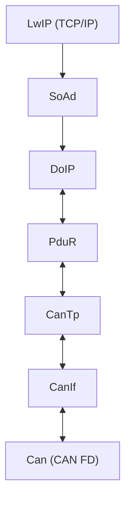
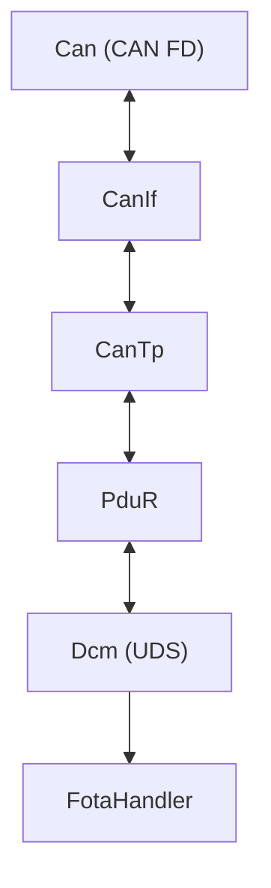
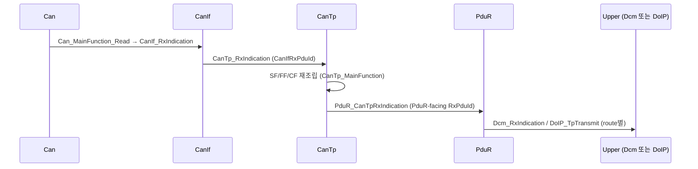
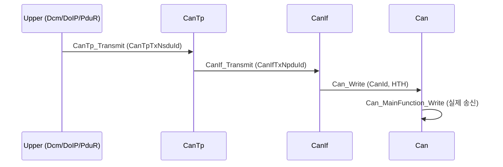
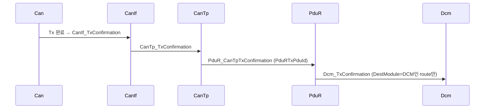

# 09. Communication Stack Management

## 관련 문서

- [Wiki Home](./README.md)
- [System Architecture](./02_system_architecture.md)
- [CAN Stack](./11_can_stack.md)
- [CanTp Transport](./12_cantp_transport.md)
- [PduR Routing](./13_pdur_routing.md)
- [DoIP Gateway Routing](./10_doip_gateway_routing.md)

## 1. 목적

Gateway와 Target ECU의 AUTOSAR-like 통신 스택 계층 구성, Rx indication / Tx request / Tx confirmation 경로, periodic main function을 정리한다.

## 2. 범위

Can/CanIf/CanTp/PduR/Dcm/DoIP/SoAd 계층의 관계와 호출 방향. 각 모듈 세부는 전용 문서로 위임한다.

## 3. 요약

두 종류의 스택이 있다. **Gateway 스택**(Ethernet/DoIP + CAN, Dcm 미사용)과 **Target 스택**(CAN + Dcm + FOTA). 공통 하위 계층은 Can/CanIf/CanTp/PduR이다.

## 4. Gateway communication stack



근거 init 순서: `Test_InitModules()` in `Ecu_Gateway_TC375_LK/Cpu0_Main.c`.

## 5. Target communication stack



근거 init 순서: `Test_InitModules()` in `Ecu_Motion_TC375_LK/Cpu0_Main.c`.

## 6. 계층별 책임 표

| Module | Responsibility | Main Files | Key APIs | State | Notes |
|---|---|---|---|---|---|
| Can | CAN FD 송수신, HW object | `Can.c/.h`, `Can_Cfg.c` | `Can_MainFunction_Read/Write`, `Can_Write` | controller mode | ctrl0/node0 |
| CanIf | CAN ID↔PDU ID 매핑 | `CanIf.c`, `CanIf_Cfg.c` | `CanIf_Transmit`, `CanIf_RxIndication` | - | HTH/HRH |
| CanTp | ISO-TP-like 세그멘테이션/재조립 | `CanTp.c`, `CanTp_Cfg.c` | `CanTp_Transmit`, `CanTp_MainFunction` | Rx/Tx state | SF/FF/CF/FC |
| PduR | PDU ID 라우팅 | `PduR.c`, `PduR_Cfg.c` | `PduR_*RxIndication`, `PduR_*Transmit` | route table | PDU ID 기반 |
| Dcm | UDS 처리 (Target만) | `Dcm.c`, `Dcm_Cfg.h` | `Dcm_RxIndication`, `Dcm_MainFunction` | session/FOTA state | |
| DoIP | DoIP 파싱 (Gateway만) | `DoIP.c`, `DoIP_Cfg.c` | `DoIP_TpRxIndication`, `DoIP_TpTransmit` | INITIALIZED/ROUTING_ACTIVE | |
| SoAd | TCP socket adapter (Gateway만) | `SoAd.c`, `SoAd_Cfg.c` | `SoAd_Transmit`, `tcp_recv` cb | listen/conn pcb | LwIP |

## 7. Rx indication 경로



## 8. Tx request 경로



## 9. Tx confirmation 경로



> Gateway에서는 Tx confirmation의 최종 목적지가 DCM이 아닐 수 있다. `PduR_RouteTxConfirmation()`은 `DestModule==DCM`일 때만 `Dcm_TxConfirmation()`을 호출하고, CANTP/DOIPTP는 무시한다. 근거: `PduR_RouteTxConfirmation()` in `PduR.c`.

## 10. periodic main function

| 노드 | main loop 호출 | 근거 |
|---|---|---|
| Gateway | `Can_MainFunction_Read`, `CanTp_MainFunction`, `Can_MainFunction_Write`, `LwIP_MainFunction`, `Dcm_MainFunction` | `Cpu0_Main.c` |
| Target | `Can_MainFunction_Read`, `CanTp_MainFunction`, `Dcm_MainFunction`, `Can_MainFunction_Write`, `FOTAHandlerMain` | `Cpu0_Main.c` |

자세한 스케줄링은 [Runtime Main Loops](./19_runtime_main_loops.md).

## 11. 코드 근거

```text
근거:
- Test_InitModules(), Test_MainFunctions() in 각 Cpu0_Main.c
- PduR_CanTpRxIndication(), PduR_CanTpTxConfirmation(), PduR_RouteTxConfirmation() in PduR.c
- CanTp_Transmit(), CanTp_MainFunction() in CanTp.c
```

## 12. 추정 / 확인 필요 사항

- Gateway가 `Dcm`을 init/main 하지만 라우팅 미등록 → 통신 스택상 Dcm은 dead path `추정`.
- Tx confirmation이 DoIP/CanTp 방향으로 상위 전파되지 않음(무시) → 재전송/타임아웃 정책 `확인 필요`.

## 다음에 읽을 문서

- [CAN Stack](./11_can_stack.md)
- [CanTp Transport](./12_cantp_transport.md)
- [PduR Routing](./13_pdur_routing.md)

## 이 문서에서 남은 확인 필요 사항

| 항목 | 내용 | 확인 방법 |
|---|---|---|
| Tx confirmation 전파 | DoIP/CanTp confirmation 미전파의 영향 | `PduR_RouteTxConfirmation()` 분기 확인 |
| 스택 분리 | Gateway에서 Dcm 빌드 포함 여부 | 빌드 소스 목록 확인 |
