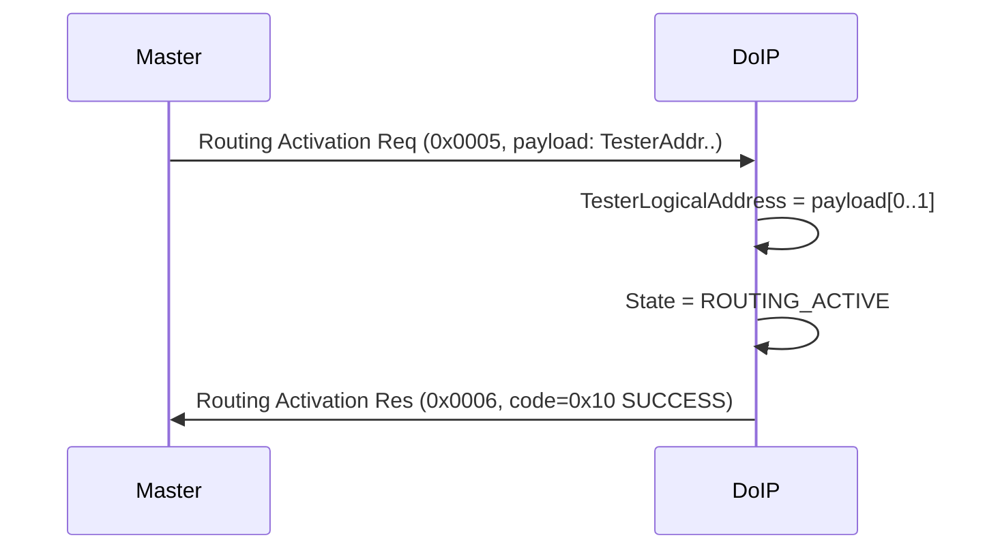
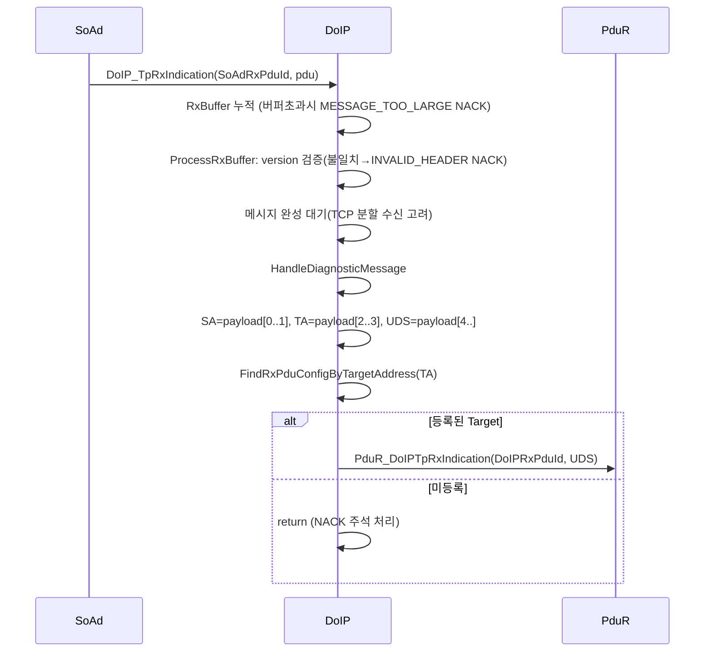
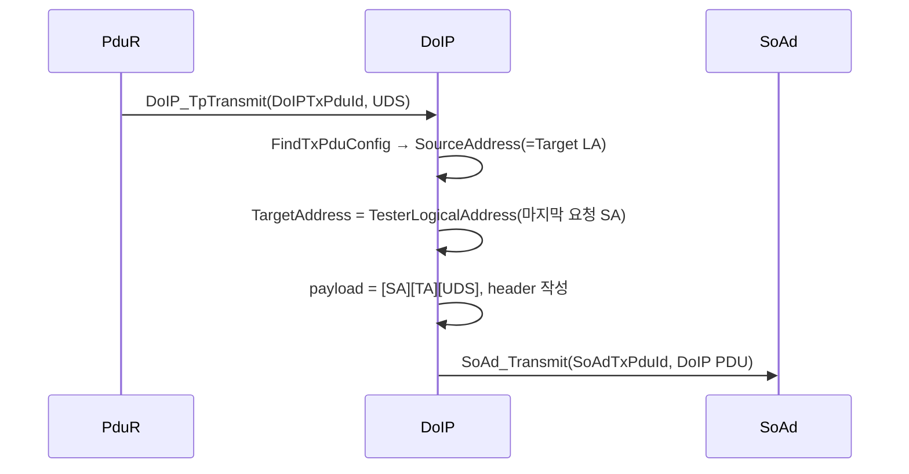
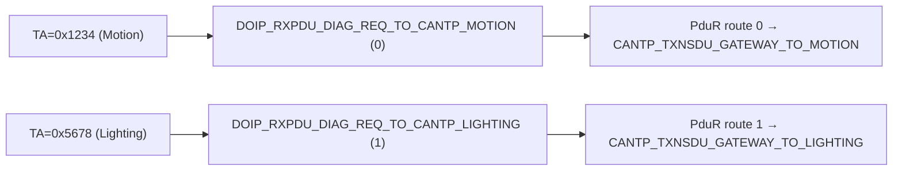
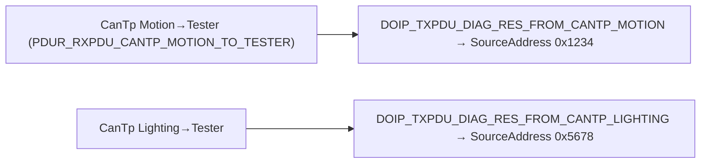
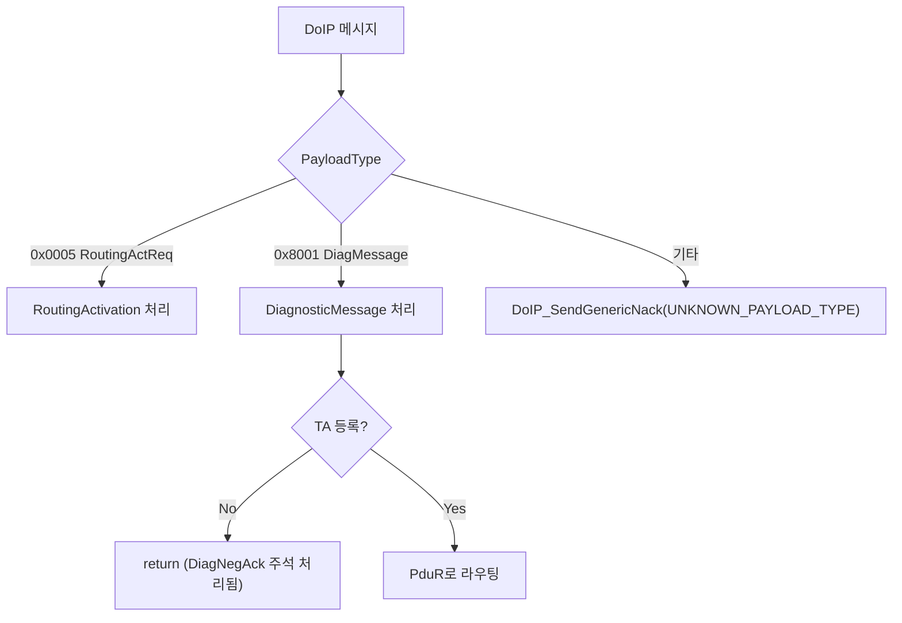

# 10. DoIP Gateway Routing

## 관련 문서

- [Wiki Home](./README.md)
- [Gateway ECU Architecture](./03_gateway_ecu_architecture.md)
- [Diagnostic Gateway Management](./08_diagnostic_gateway_management.md)
- [PduR Routing](./13_pdur_routing.md)
- [CanTp Transport](./12_cantp_transport.md)

## 1. 목적

Gateway의 DoIP 계층이 TCP 페이로드를 파싱하고, logical address를 내부 PDU ID로 변환하며, PduR로 라우팅을 위임하는 과정을 가장 상세히 설명한다.

## 2. 범위

DoIP TCP 수신, Routing Activation, Diagnostic Message 파싱, SourceAddress/TargetAddress/UDS 분리, TargetAddress→PDU ID 매핑, 응답 래핑, unknown target/unsupported payload, NACK 지원 여부. ISO 13400 기반 **필요 기능 중심 DoIP-like 구현**이며 완전 준수는 아니다.

## 3. 요약

DoIP는 protocol version `0x02/0xFD`, 8바이트 헤더를 사용한다. **DoIP가 logical address를 PDU ID로 변환**하고, **PduR는 PDU ID 기반으로만 라우팅**한다. PduR는 logical address를 직접 해석하지 않는다.

## 4. 주요 상수 (DoIP_Cfg.h)

| 이름 | 값 | 의미 |
|---|---|---|
| `DOIP_PROTOCOL_VERSION` / inverse | `0x02` / `0xFD` | 프로토콜 버전 |
| `DOIP_HEADER_LENGTH` | `8` | version(1)+inv(1)+type(2)+len(4) |
| `DOIP_LOGICAL_ADDRESS_ECU` | `0x0F00` | Gateway entity |
| `DOIP_LOGICAL_ADDRESS_TESTER` | `0x0E00` | Tester 기본값 |
| `DOIP_LOGICAL_ADDRESS_TARGET_MOTION` | `0x1234` | Motion |
| `DOIP_LOGICAL_ADDRESS_TARGET_LIGHTING` | `0x5678` | Lighting |
| payload types | `0x0000`/`0x0005`/`0x0006`/`0x8001`/`0x8002`/`0x8003` | NACK/RoutingActReq/Res/DiagMsg/PosAck/NegAck |
| `DOIP_ROUTING_ACTIVATION_RES_SUCCESS` | `0x10` | 성공 응답 코드 |

## 5. 주요 API

| API | 위치 | 역할 | 근거 |
|---|---|---|---|
| `DoIP_TpRxIndication()` | DoIP.c | SoAd→DoIP, RxBuffer 누적 후 처리 | SoAd 호출 |
| `DoIP_ProcessRxBuffer()` | DoIP.c | TCP 스트림에서 DoIP 메시지 경계 분리 | header/version 검증 |
| `DoIP_HandleRoutingActivation()` | DoIP.c | Tester 주소 저장, state=ROUTING_ACTIVE | success 응답 |
| `DoIP_HandleDiagnosticMessage()` | DoIP.c | SA/TA/UDS 분리, TA→PDU ID | `PduR_DoIPTpRxIndication` |
| `DoIP_TpTransmit()` | DoIP.c | UDS 응답 DoIP 래핑 | `SoAd_Transmit` |
| `DoIP_FindRxPduConfigByTargetAddress()` | DoIP.c | TA→DoIPRxPduId | `DoIP_RxPduConfig[]` |
| `DoIP_FindTxPduConfig()` | DoIP.c | DoIPTxPduId→SourceAddress | `DoIP_TxPduConfig[]` |

## 6. Routing Activation 시퀀스



근거: `DoIP_HandleRoutingActivation()` (PayloadLength<3이면 INVALID_HEADER NACK, 아니면 항상 SUCCESS).

## 7. DoIP Diagnostic Rx 시퀀스



근거: `DoIP_TpRxIndication()`, `DoIP_ProcessRxBuffer()`, `DoIP_HandleDiagnosticMessage()` in `DoIP.c`.

## 8. DoIP Diagnostic Tx 시퀀스



> Tx 조건: `State == ROUTING_ACTIVE`가 아니면 `E_NOT_OK`. 근거: `DoIP_TpTransmit()`.

## 9. TargetAddress → 내부 PDU ID 흐름



역방향(Tx):



근거: `DoIP_RxPduConfig[]`, `DoIP_TxPduConfig[]` in `DoIP_Cfg.c`; `PduR_RoutingPathConfig[]` in `PduR_Cfg.c`.

## 10. unsupported / unknown target 흐름



## 11. DoIP ACK/NACK 지원 여부

| 메시지 | 구현 | 활성 | 근거 |
|---|---|---|---|
| Generic NACK | O | 활성 | header/version 오류, payload 미지원, too large 시 전송 |
| Routing Activation Res | O | 활성 | 항상 SUCCESS |
| Diagnostic Positive ACK (0x8002) | 함수 존재 | **비활성(주석)** | `DoIP_SendDiagnosticPositiveAck()` 호출부 주석 |
| Diagnostic Negative ACK (0x8003) | 함수 존재 | **비활성(주석)** | unknown target/invalid length 시 호출부 주석 |

근거: `DoIP_HandleDiagnosticMessage()`의 `// (void)DoIP_SendDiagnostic*Ack(...)` 주석.

## 12. 코드 근거

```text
근거:
- DoIP_TpRxIndication(), DoIP_ProcessRxBuffer() in DoIP.c
- DoIP_HandleRoutingActivation(), DoIP_HandleDiagnosticMessage() in DoIP.c
- DoIP_TpTransmit(), DoIP_SendMessage() in DoIP.c
- DoIP_RxPduConfig[], DoIP_TxPduConfig[], DoIP_Config in DoIP_Cfg.c
- DOIP_* 매크로 in DoIP_Cfg.h
```

## 13. 추정 / 확인 필요 사항

- DoIP ACK/NACK 비활성은 의도된 단순화 `추정`.
- Routing Activation이 activation type/auth를 검사하지 않음 → ISO 13400 대비 단순화 `확인 필요`.
- 단일 `DoIP_Runtime` 구조로 다중 Tester/소켓 동시 지원 불가 `확인 필요`.

## 다음에 읽을 문서

- [PduR Routing](./13_pdur_routing.md)
- [CanTp Transport](./12_cantp_transport.md)

## 이 문서에서 남은 확인 필요 사항

| 항목 | 내용 | 확인 방법 |
|---|---|---|
| ACK/NACK 정책 | Diagnostic ACK/NACK 활성화 계획 | 주석 해제 의도 확인 |
| 다중 연결 | 동시 소켓 처리 | `SoAd.c` connection pcb 단일성 |
