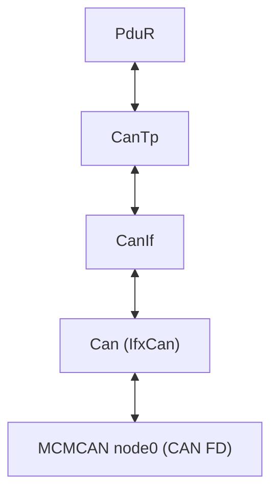
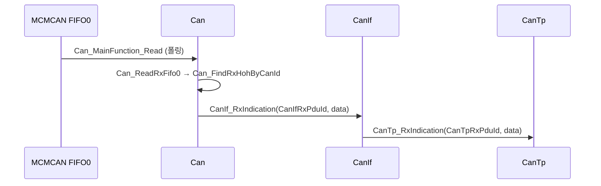
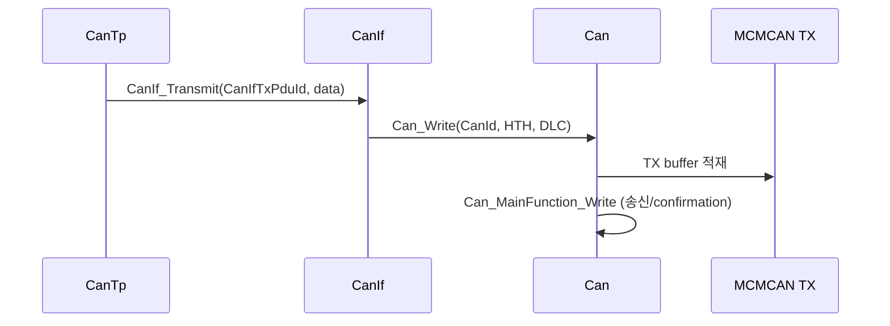
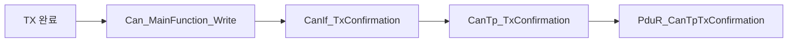
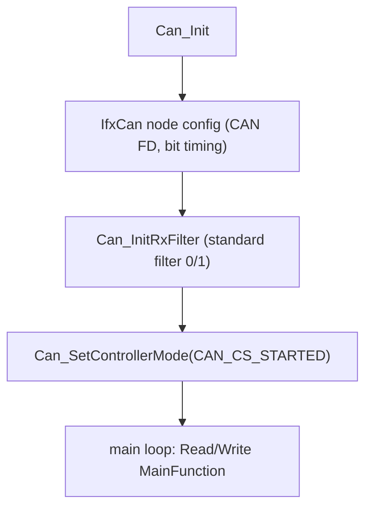

# 11. CAN Stack

## 관련 문서

- [Wiki Home](./README.md)
- [Communication Stack Management](./09_communication_stack_management.md)
- [CanTp Transport](./12_cantp_transport.md)
- [PduR Routing](./13_pdur_routing.md)
- [Debugging Notes](./20_debugging_notes.md)

## 1. 목적

Can Driver / CanIf / CanTp / PduR로 이어지는 CAN 스택의 구성과 CAN FD 송수신 경로를 설명한다.

## 2. 범위

Can Driver(iLLD IfxCan 기반), CanIf 매핑, CanTp 연결, CAN FD 64B payload, CAN ID 매핑, HTH/HRH, hardware object, Tx/Rx/Tx confirmation 경로, controller state. CanTp 세그멘테이션 세부는 [CanTp Transport](./12_cantp_transport.md).

## 3. 요약

CAN 드라이버는 **controller 0 / node 0**, **CAN FD 64바이트 payload**로 동작한다. HW object 3개(TX 1 + RX FIFO0 2)로 구성되며, CanIf가 CAN ID↔PDU ID를 매핑한다. iLLD `IfxCan` API를 사용한다.

## 4. CAN stack 계층



근거: `Can_Init()` (IfxCan node config) in `Can.c`, init 순서 `Cpu0_Main.c`.

## 5. CAN 컨트롤러 / HW object 구성

| 항목 | 값 | 근거 |
|---|---|---|
| Controller | `CAN_CONTROLLER_0`, node 0 | `Can_ControllerConfig[]` in `Can_Cfg.c` |
| CAN FD | `CanFdEnabled = TRUE` | 동일 |
| Payload | `CAN_MAX_DATA_PAYLOAD = 64U` | `Can_Cfg.h` |
| HOH count | 3 (`CAN_HOH_COUNT`) | `Can_Cfg.h` |
| TX object | `CAN_HOH_LOCAL_TO_REMOTE_TX` (buffer 0) | `Can_HardwareObjectConfig[]` |
| RX object 0 | `CAN_HOH_MOTION_TO_GATEWAY_RX` (FIFO0, filter0) | 동일 |
| RX object 1 | `CAN_HOH_LIGHTING_TO_GATEWAY_RX` (FIFO0, filter1) | 동일 |
| Standard filter | 2 (`CAN_STANDARD_FILTER_COUNT`) | `Can_Cfg.h` |

## 6. CAN ID ↔ PDU ID 매핑 (Gateway 기준)

| 방향 | CAN ID | HTH/HRH | CanIf PDU | CanTp PDU |
|---|---|---|---|---|
| GW→Motion (Tx) | `0x501` (`CAN_ID_MOTION`) | `CAN_HTH_LOCAL_TO_REMOTE` | `CANIF_TXPDU_GATEWAY_TO_MOTION` | `CANTP_TXNPDU_GATEWAY_TO_MOTION` |
| Motion→GW (Rx) | `0x500` (`CAN_ID_GATEWAY_MOTION`) | `CAN_HRH_MOTION_TO_GATEWAY` | `CANIF_RXPDU_MOTION_TO_GATEWAY` | `CANTP_RXNPDU_MOTION_TO_GATEWAY` |
| GW→Lighting (Tx) | `0x601` (`CAN_ID_LIGHTING`) | `CAN_HTH_LOCAL_TO_REMOTE` | `CANIF_TXPDU_GATEWAY_TO_LIGHTING` | `CANTP_TXNPDU_GATEWAY_TO_LIGHTING` |
| Lighting→GW (Rx) | `0x600` (`CAN_ID_GATEWAY_LIGHTING`) | `CAN_HRH_LIGHTING_TO_GATEWAY` | `CANIF_RXPDU_LIGHTING_TO_GATEWAY` | `CANTP_RXNPDU_LIGHTING_TO_GATEWAY` |

근거: `CanIf_TxPduConfig[]`, `CanIf_RxPduConfig[]` in `CanIf_Cfg.c`; `Can_Cfg.h`.

> Target ECU 측에서는 같은 CAN ID 쌍을 `CAN_ID_LOCAL_TO_REMOTE`(응답)/`CAN_ID_REMOTE_TO_LOCAL`(요청)로 표현한다. 즉 Gateway의 Tx CAN ID가 Target의 Rx가 된다.

## 7. 주요 API

| API | 위치 | 역할 | 근거 |
|---|---|---|---|
| `Can_Init()` | Can.c | node/filter 초기화 (IfxCan) | `Can_InitRxFilter()` |
| `Can_SetControllerMode()` | Can.c | START/STOP | `CAN_CS_STARTED` |
| `Can_Write()` | Can.c | TX buffer로 전송 요청 | DLC 변환 |
| `Can_MainFunction_Read()` | Can.c | RX FIFO0 폴링 → CanIf_RxIndication | `Can_ReadRxFifo0()` |
| `Can_MainFunction_Write()` | Can.c | TX pending 처리/confirmation | - |
| `Can_FindRxHohByCanId()` | Can.c | 수신 CAN ID→HRH | filter 매칭 |

## 8. CAN Rx 시퀀스



## 9. CAN Tx 시퀀스



## 10. Tx confirmation 전파



## 11. CAN 초기화 / 점검 흐름 (디버깅 관점)



CAN0 Node0 레지스터(CCCR INIT/CCE/FDOE/BRSE 등) 점검은 [Debugging Notes](./20_debugging_notes.md)에서 다룬다. (현재 드라이버는 iLLD `IfxCan` API로 추상화되어 직접 CCCR을 다루지 않음 `추정`.)

## 12. 코드 근거

```text
근거:
- Can_Init(), Can_MainFunction_Read/Write(), Can_Write() in Can.c
- Can_ControllerConfig[], Can_HardwareObjectConfig[] in Can_Cfg.c
- CAN_MAX_DATA_PAYLOAD(64U), CAN_ID_* in Can_Cfg.h
- CanIf_TxPduConfig[], CanIf_RxPduConfig[] in CanIf_Cfg.c
```

## 13. 추정 / 확인 필요 사항

- bit timing/BRS 구체값은 iLLD config에 위임 `확인 필요`.
- RX는 인터럽트가 아닌 `Can_MainFunction_Read` 폴링 방식 `추정`.
- 단일 controller(node0)만 사용, 다중 CAN 채널 미사용.

## 다음에 읽을 문서

- [CanTp Transport](./12_cantp_transport.md)
- [PduR Routing](./13_pdur_routing.md)

## 이 문서에서 남은 확인 필요 사항

| 항목 | 내용 | 확인 방법 |
|---|---|---|
| bit timing | nominal/data BRS 설정값 | `Can_Init()` IfxCan node config |
| RX 방식 | 폴링 vs 인터럽트 | `Can_MainFunction_Read` 호출 빈도/ISR 유무 |
