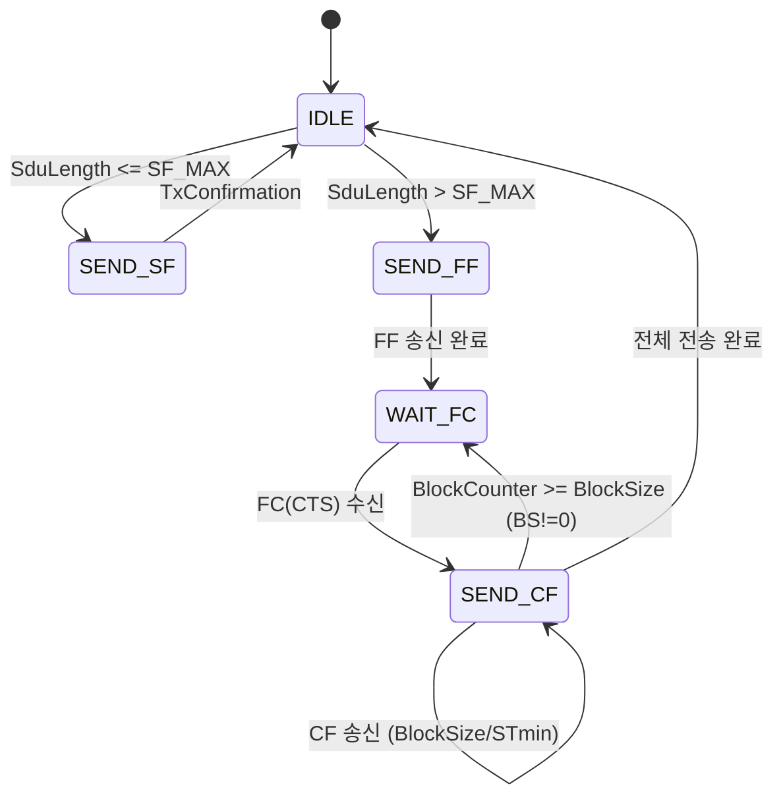
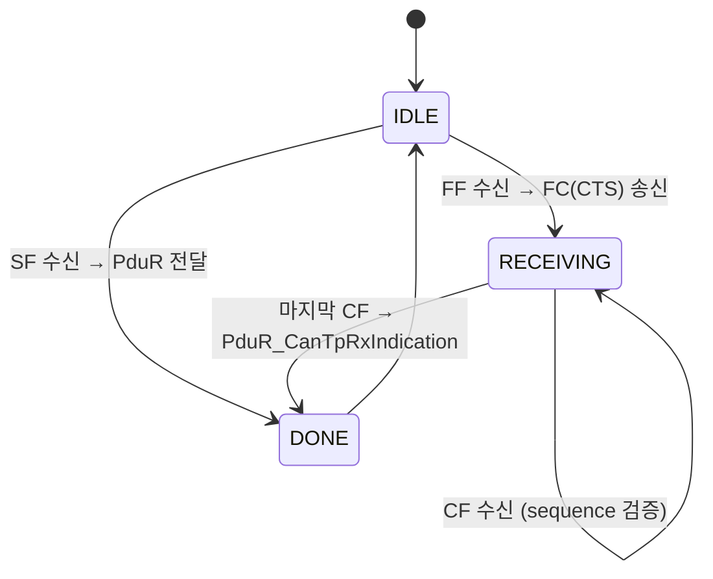
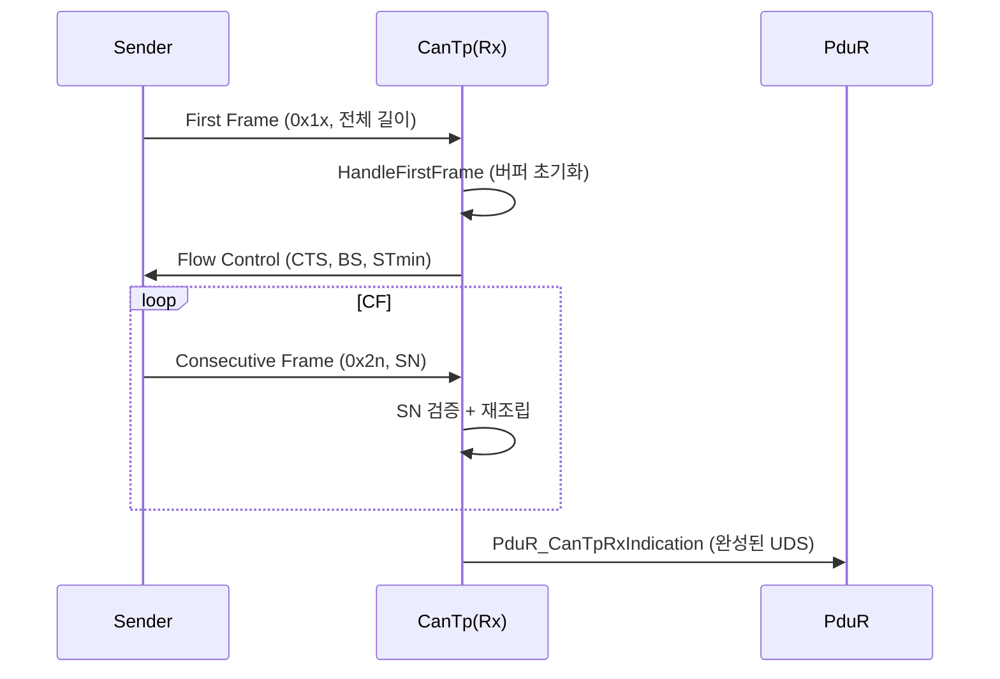
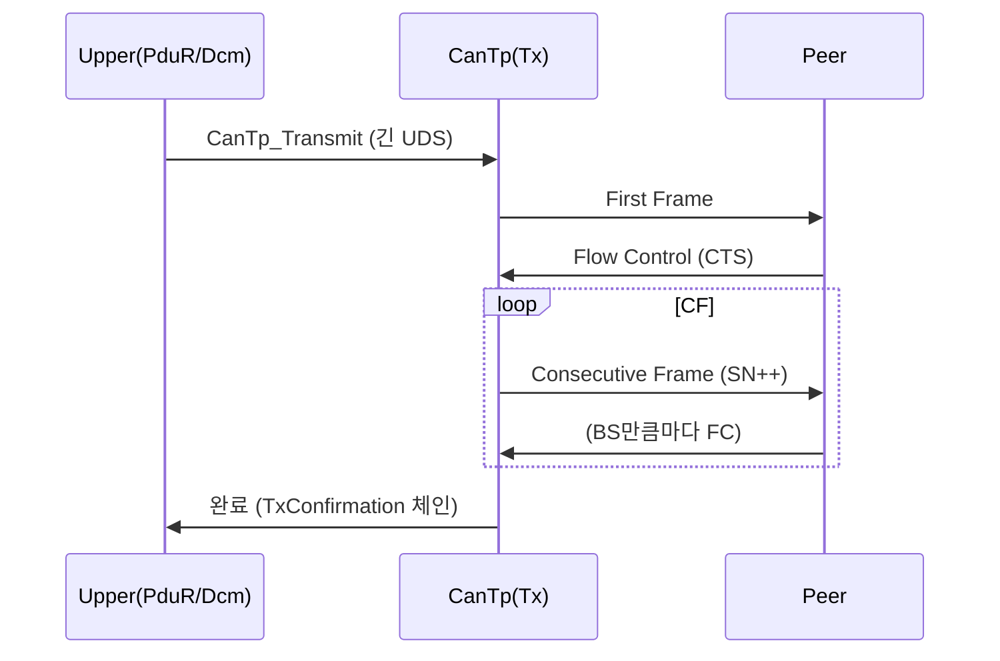

# 12. CanTp Transport

## 관련 문서

- [Wiki Home](./README.md)
- [CAN Stack](./11_can_stack.md)
- [PduR Routing](./13_pdur_routing.md)
- [Communication Stack Management](./09_communication_stack_management.md)

## 1. 목적

CanTp가 UDS payload를 CAN FD 프레임으로 세그멘테이션/재조립하는 ISO-TP-like 동작을 설명한다.

## 2. 범위

N-SDU/N-PDU 개념, Single/First/Consecutive Frame, Flow Control, block size, STmin, sequence number, reassembly/segmentation buffer, Rx/Tx 상태머신, CanIf/PduR 연동. **ISO 15765(ISO-TP) 기반 단순화 구현**이다.

## 3. 요약

CanTp는 PCI 타입(SF/FF/CF/FC)으로 프레임을 구분한다. SF는 단일 프레임, FF+CF는 멀티프레임(FC로 흐름 제어). Rx 버퍼 2048B, 기본 BlockSize=0, STmin=0.

## 4. 주요 상수 / PCI

| 이름 | 값 | 의미 |
|---|---|---|
| `CANTP_PCI_TYPE_SF` | `0x00` | Single Frame |
| `CANTP_PCI_TYPE_FF` | `0x10` | First Frame |
| `CANTP_PCI_TYPE_CF` | `0x20` | Consecutive Frame |
| `CANTP_PCI_TYPE_FC` | `0x30` | Flow Control |
| `CANTP_PCI_TYPE_MASK` | `0xF0` | PCI nibble 마스크 |
| `CANTP_FC_STATUS_CTS/WAIT/OVERFLOW` | `0x00/0x01/0x02` | FlowStatus |
| `CANTP_SF_MAX_PAYLOAD_LENGTH` | `CAN_FRAME_LENGTH - PCI` | SF 최대 데이터 |
| `CANTP_RX_BUFFER_SIZE` | `2048` | 재조립 버퍼 |
| `CANTP_DEFAULT_BLOCK_SIZE` | `0` | BS (무제한) |
| `CANTP_DEFAULT_STMIN` | `0` | 최소 간격 |

근거: `CanTp_Cfg.h`.

## 5. N-SDU / N-PDU 구성 (Gateway)

| 구분 | ID | 연결 | 근거 |
|---|---|---|---|
| Tx N-SDU | `CANTP_TXNSDU_GATEWAY_TO_MOTION/LIGHTING` | → `CanIfTxNpduId`, `PduRTxPduId`, `ExpectedRxNsduId` | `CanTp_TxNsduConfig[]` |
| Rx N-SDU | `CANTP_RXNSDU_MOTION/LIGHTING_TO_GATEWAY` | → `CanIfRxNpduId`, FC용 `CanIfTxFcPduId`, `PduRRxPduId` | `CanTp_RxNsduConfig[]` |

`CanTp_RxNsduConfig`는 `RxBufferSize`, `BlockSize`, `STmin`을 포함한다. 근거: `CanTp_Cfg.c`.

## 6. 주요 API / 내부 함수

| 함수 | 역할 | 근거 |
|---|---|---|
| `CanTp_Transmit()` | SDU 길이로 SF/FF 분기 후 송신 시작 | `CanTp.c:179` |
| `CanTp_RxIndication()` | PCI 타입 판별 → Handle* 호출 | `CanTp.c:280` |
| `CanTp_SendSingleFrame/FirstFrame/NextConsecutiveFrame/SendFlowControl()` | Tx 프레임 생성 | `CanTp.c` |
| `CanTp_HandleSingleFrame/FirstFrame/ConsecutiveFrame/FlowControl()` | Rx 처리 | `CanTp.c` |
| `CanTp_MainFunction()` | 상태머신 진행(CF 송신 등) | `CanTp.c` |
| `CanTp_TxConfirmation()` | 다음 CF/BlockSize 처리 | `CanTp.c:355` |

## 7. CanTp Tx 상태 머신



근거: `CanTp_TxRuntimeType`, `CANTP_TX_STATE_SEND_CF` 등 enum in `CanTp.c`; `CanTp_TxConfirmation()`의 BlockSize/BlockCounter 처리.

## 8. CanTp Rx 상태 머신



근거: `CanTp_HandleFirstFrame()`(FC 송신), `CanTp_HandleConsecutiveFrame()`(재조립), `CanTp_RxIndication()`.

## 9. 멀티프레임 Rx 시퀀스



## 10. 멀티프레임 Tx 시퀀스



## 11. 코드 근거

```text
근거:
- CanTp_Transmit(), CanTp_RxIndication(), CanTp_TxConfirmation(), CanTp_MainFunction() in CanTp.c
- CanTp_Send*/CanTp_Handle* in CanTp.c
- CANTP_PCI_TYPE_SF/FF/CF/FC, CANTP_FC_STATUS_* in CanTp_Cfg.h
- CanTp_TxNsduConfig[], CanTp_RxNsduConfig[] in CanTp_Cfg.c
```

## 12. 추정 / 확인 필요 사항

- BlockSize=0, STmin=0 → 흐름 제어상 즉시 연속 전송 `추정`.
- N_As/N_Bs/N_Cr 등 타임아웃 타이머의 구체 구현 `확인 필요` (config 매크로에서 별도 timeout 미관측).
- CAN FD 프레임 길이 기반 SF/CF 최대 payload는 `CANTP_CAN_FRAME_LENGTH` 매크로에 의존 `확인 필요`.

## 다음에 읽을 문서

- [PduR Routing](./13_pdur_routing.md)
- [DCM Diagnostic Services](./14_dcm_diagnostic_services.md)

## 이 문서에서 남은 확인 필요 사항

| 항목 | 내용 | 확인 방법 |
|---|---|---|
| 타임아웃 | N_As/N_Bs/N_Cr 처리 | `CanTp.c` 타이머/카운터 추적 |
| 프레임 길이 | `CANTP_CAN_FRAME_LENGTH` 값 | `CanTp_Cfg.h` 정의 확인 |
