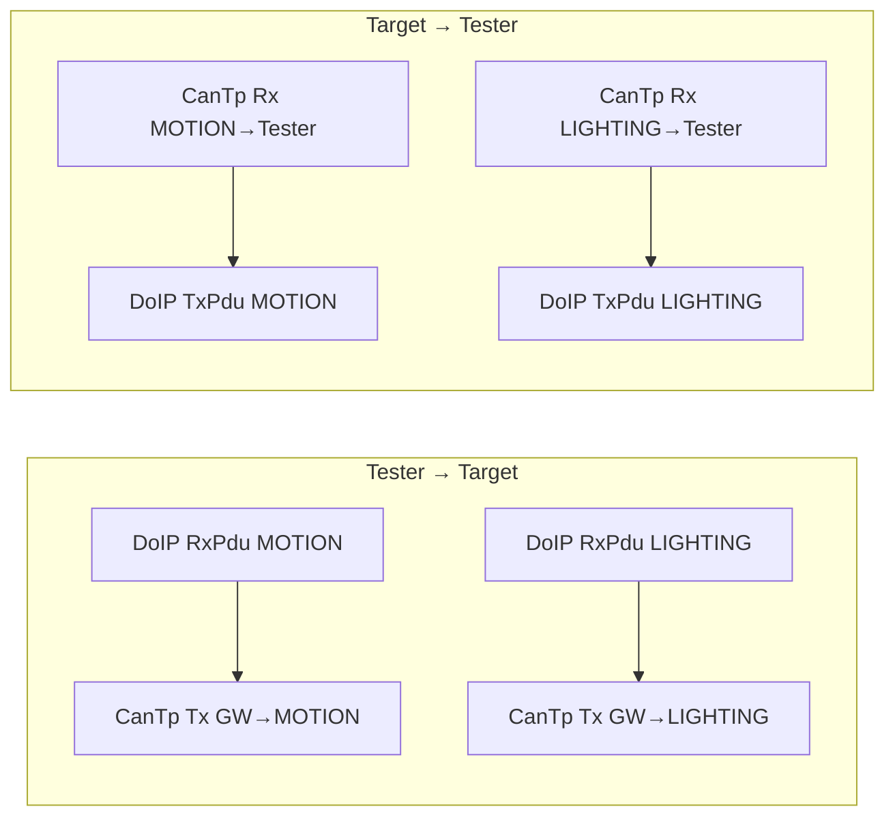
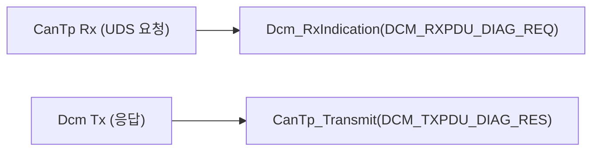
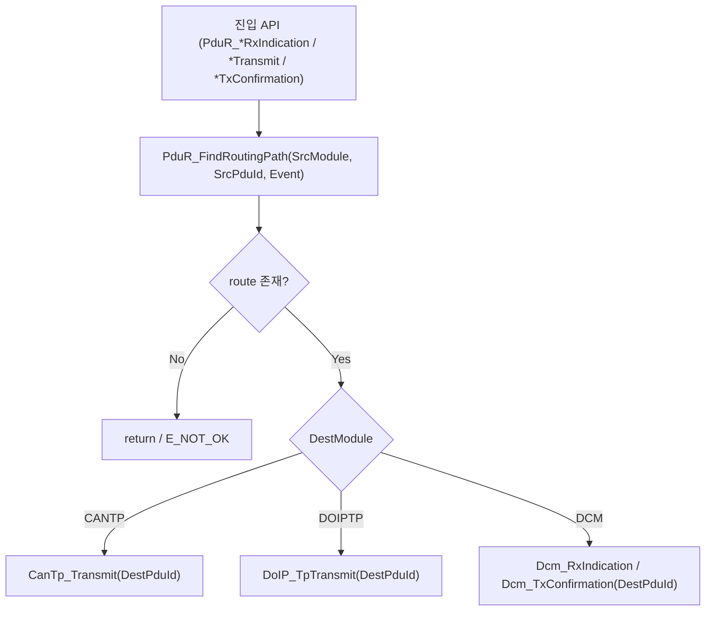
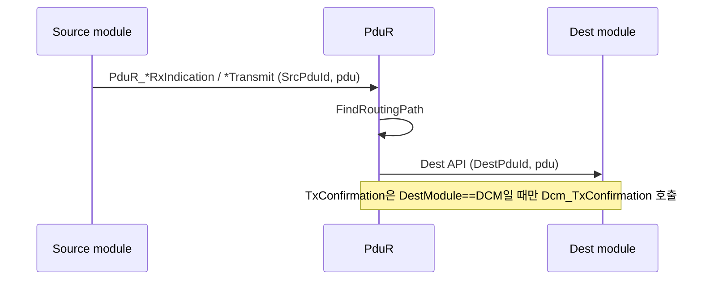

# 13. PduR Routing

## 관련 문서

- [Wiki Home](./README.md)
- [DoIP Gateway Routing](./10_doip_gateway_routing.md)
- [CanTp Transport](./12_cantp_transport.md)
- [DCM Diagnostic Services](./14_dcm_diagnostic_services.md)

## 1. 목적

PduR가 **PDU ID 기반**으로 source module과 destination module 사이의 경로를 선택하는 방식을 설명한다.

## 2. 범위

SourceModule/SourcePduId/RoutingEvent → DestModule/DestPduId 매핑, Gateway/Target route table, Rx indication / Transmit / Tx confirmation 경로. **PduR는 DoIP logical address를 직접 해석하지 않는다.**

## 3. 요약

PduR는 `(SourceModule, SourcePduId, RoutingEvent)` 3-튜플로 route를 검색해 목적 모듈로 PDU를 전달한다. Gateway는 DoIP↔CanTp 4개 route, Target은 CanTp↔Dcm route를 갖는다.

## 4. 라우팅 키 / 타입

| 타입 | 값 | 위치 |
|---|---|---|
| `PduR_ModuleType` | `DCM` / `CANTP` / `DOIPTP` | `PduR_Cfg.h` |
| `PduR_EventType` | `TRANSMIT` / `RX_INDICATION` / `TX_CONFIRMATION` | `PduR_Cfg.h` |
| `PduR_RoutingPathConfigType` | `{PathId, SrcModule, SrcPduId, DestModule, DestPduId, Event}` | `PduR_Cfg.h` |

검색 함수 `PduR_FindRoutingPath(SourceModule, SourcePduId, RoutingEvent)`는 일치하는 첫 route를 반환한다. 근거: `PduR.c`.

## 5. Gateway route map

| Path | Source | SrcPduId | Dest | DestPduId | Event |
|---|---|---|---|---|---|
| 0 | DOIPTP | `DOIP_RXPDU_DIAG_REQ_TO_CANTP_MOTION` | CANTP | `CANTP_TXNSDU_GATEWAY_TO_MOTION` | RX_INDICATION |
| 1 | DOIPTP | `DOIP_RXPDU_DIAG_REQ_TO_CANTP_LIGHTING` | CANTP | `CANTP_TXNSDU_GATEWAY_TO_LIGHTING` | RX_INDICATION |
| 2 | CANTP | `PDUR_RXPDU_CANTP_MOTION_TO_TESTER` | DOIPTP | `DOIP_TXPDU_DIAG_RES_FROM_CANTP_MOTION` | RX_INDICATION |
| 3 | CANTP | `PDUR_RXPDU_CANTP_LIGHTING_TO_TESTER` | DOIPTP | `DOIP_TXPDU_DIAG_RES_FROM_CANTP_LIGHTING` | RX_INDICATION |

근거: `PduR_RoutingPathConfig[]` in `Ecu_Gateway_TC375_LK/.../PduR_Cfg.c`.



## 6. Target route map

Target ECU의 PduR는 CanTp↔Dcm을 연결한다.



- 수신: `PduR_CanTpRxIndication()` → DestModule=DCM → `Dcm_RxIndication()`
- 송신: `PduR_DcmTransmit()` → DestModule=CANTP → `CanTp_Transmit()`
- 확인: `PduR_CanTpTxConfirmation()` → DestModule=DCM → `Dcm_TxConfirmation()`

근거: `Dcm_SendResponse()` → `PduR_DcmTransmit(DCM_TXPDU_DIAG_RES)` in `Dcm.c`; `PduR_RouteRxIndication()` DCM 분기 in `PduR.c`.

## 7. 라우팅 판단 흐름



근거: `PduR_RouteRxIndication()`, `PduR_RouteTransmit()`, `PduR_RouteTxConfirmation()` in `PduR.c`.

## 8. Rx / Tx / Confirmation 시퀀스



## 9. logical address 미해석 원칙

```text
DoIP 계층: TargetAddress(0x1234/0x5678) → DoIPRxPduId(0/1)
PduR 계층: DoIPRxPduId(PDU ID) → route 검색 → CanTp Tx PDU
```

- PduR는 `0x1234` 같은 logical address를 절대 보지 않는다. DoIP가 이미 PDU ID로 변환한 뒤 넘긴다.
- 근거: `PduR_Cfg.c` 주석 "DoIP는 ... TargetAddress를 보고 DoIPRxPduId를 선택한다. PduR은 DoIPRxPduId를 기준으로 CanTpTxNsduId로 변환한다."

## 10. 코드 근거

```text
근거:
- PduR_FindRoutingPath(), PduR_RouteRxIndication(), PduR_RouteTransmit(), PduR_RouteTxConfirmation() in PduR.c
- PduR_DcmTransmit(), PduR_DoIPTpRxIndication(), PduR_CanTpRxIndication() in PduR.c
- PduR_RoutingPathConfig[] in PduR_Cfg.c (Gateway)
- PduR_ModuleType, PduR_EventType, PduR_RoutingPathConfigType in PduR_Cfg.h
```

## 11. 추정 / 확인 필요 사항

- Gateway route는 모두 `RX_INDICATION` 이벤트로 정의됨. `TRANSMIT`/`TX_CONFIRMATION` 이벤트 route는 Gateway 테이블에 없음 → Tx confirmation 상위 전파 제한 `확인 필요`.
- `PduR_DcmTransmit()`는 `TRANSMIT` 이벤트 route를 찾지만 Gateway 테이블엔 없어 Gateway에서는 사실상 미사용 `추정`.
- Target PduR_Cfg는 Motion/Lighting 각각의 route 테이블 별도 확인 필요 (본 문서는 Gateway 테이블 근거 중심).

## 다음에 읽을 문서

- [DCM Diagnostic Services](./14_dcm_diagnostic_services.md)
- [DoIP Gateway Routing](./10_doip_gateway_routing.md)

## 이 문서에서 남은 확인 필요 사항

| 항목 | 내용 | 확인 방법 |
|---|---|---|
| Target route table | Motion/Lighting `PduR_Cfg.c` 내용 | 해당 파일 확인 |
| TX confirmation | DoIP/CanTp 방향 confirmation route 부재 영향 | route event 분포 확인 |
