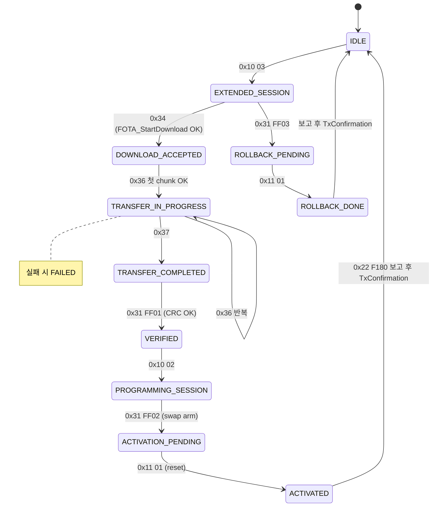
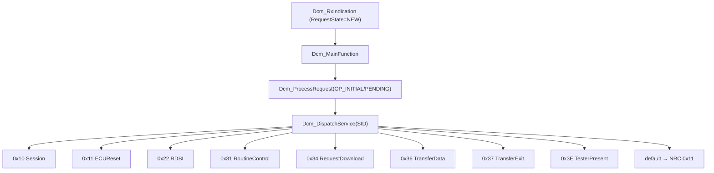
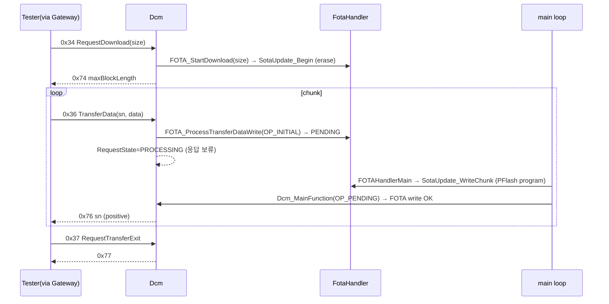
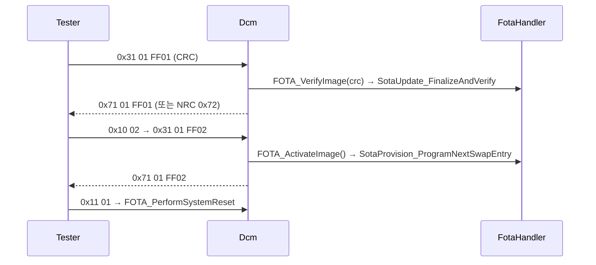
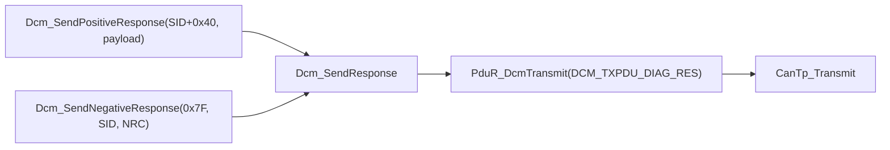

# 14. DCM Diagnostic Services

## 관련 문서

- [Wiki Home](./README.md)
- [Motion ECU Architecture](./04_motion_ecu_architecture.md)
- [FOTA Update Flow](./15_fota_update_flow.md)
- [PduR Routing](./13_pdur_routing.md)
- [Flash Programming](./16_flash_programming.md)

## 1. 목적

Target ECU(Motion/Lighting)의 `Dcm`이 UDS 서비스를 어떻게 dispatch·처리하고 FOTA 상태를 관리하는지 설명한다.

## 2. 범위

Dcm Rx/Tx 경로, service dispatch, 세션 상태, RequestDownload/TransferData/TransferExit/RoutineControl/ECUReset/TesterPresent/RDBI, positive/negative response, NRC, pending request, FotaState, FOTA Handler 연계. Motion/Lighting `Dcm.c`는 동일.

## 3. 요약

`Dcm_RxIndication()`이 요청을 버퍼에 저장하고, main loop의 `Dcm_MainFunction()`이 `Dcm_DispatchService()`로 SID별 핸들러를 호출한다. FOTA 관련 서비스는 내부 `Dcm_FotaStateType` 상태머신으로 순서를 강제한다. TransferData는 비동기 pending(`DCM_OP_INITIAL`/`DCM_OP_PENDING`) 처리를 한다.

## 4. 지원 UDS 서비스 표

| SID | Service | Handler | Preconditions | Positive Response | NRC / Error | Evidence |
|---|---|---|---|---|---|---|
| 0x10 | DiagnosticSessionControl | `Dcm_HandleDiagnosticSessionControl` | Programming(0x02)은 VERIFIED 이후 | `0x50 sess P2..` | 0x13 길이, 0x12 subfn, 0x22 조건 | `Dcm.c` |
| 0x11 | ECUReset | `Dcm_HandleEcuReset` | subfn=0x01 hardReset만 | `0x51 0x01` | 0x13, 0x12 | reset 전 응답 후 `FOTA_PerformSystemReset()` |
| 0x22 | ReadDataByIdentifier | `Dcm_HandleReadDataByIdentifier` | DID=0xF180 | `0x62 F1 80 [State][Result]` | 0x13, 0x31 | FOTA 상태 보고 |
| 0x31 | RoutineControl | `Dcm_HandleRoutineControl` | startRoutine(0x01) | `0x71 01 [RID]` | 0x13,0x12,0x31 | RID FF01/FF02/FF03 |
| 0x34 | RequestDownload | `Dcm_HandleRequestDownload` | EXTENDED 세션 + 다운로드 시작 상태 | `0x74 0x30 [maxBlock(3)]` | 0x13,0x22,0x24,0x31 | 11바이트 고정 |
| 0x36 | TransferData | `Dcm_HandleTransferData` | DOWNLOAD_ACCEPTED/IN_PROGRESS, BSC 일치 | `0x76 [BSC]` | 0x13,0x31,0x24,0x72 | pending 처리 |
| 0x37 | RequestTransferExit | `Dcm_HandleRequestTransferExit` | TRANSFER_IN_PROGRESS | `0x77` | 0x13,0x24 | |
| 0x3E | TesterPresent | `Dcm_HandleTesterPresent` | subfn=0x00 | `0x7E 0x00` | 0x13,0x12 | |

근거: `Dcm_DispatchService()` + 각 핸들러 in `Dcm.c`; SID/NRC 매크로 in `Dcm_Cfg.h`.

## 5. RoutineControl RID

| RID | 의미 | 전제 상태 | FOTA 호출 | 근거 |
|---|---|---|---|---|
| `0xFF01` VERIFY_IMAGE | 이미지 검증 | TRANSFER_COMPLETED | `FOTA_VerifyImage(crc)` | 요청 8바이트, CRC32 |
| `0xFF02` ACTIVATE_IMAGE | 활성화(swap arm) | PROGRAMMING_SESSION | `FOTA_ActivateImage()` | 요청 4바이트 |
| `0xFF03` ROLLBACK_IMAGE | 롤백 예약 | EXTENDED/IDLE/ROLLBACK_DONE | `FOTA_RollbackImage()` | 요청 4바이트, EXTENDED 필요 |

> 주의: RID는 표준/사내 RID가 아니라 **프로젝트 테스트용 임의값**이다. 근거: `Dcm_Cfg.h` 주석.

## 6. FOTA 상태 머신 (Dcm_FotaStateType)



근거: `Dcm_HandleRequestDownload/TransferData/RequestTransferExit/RoutineControl/EcuReset`, `Dcm_HandleReadDataByIdentifier`(보고), `Dcm_TxConfirmation`(IDLE 전이) in `Dcm.c`.

## 7. Service dispatch 흐름



## 8. UDS download 시퀀스 (0x34/0x36/0x37)



근거: `Dcm_HandleTransferData()`(`DCM_WRITE_PENDING`→`RequestState=DCM_REQUEST_PROCESSING`), `FOTA_ProcessTransferDataWrite()`, `FOTAHandlerMain()`.

## 9. RoutineControl 시퀀스 (verify/activate/rollback)



## 10. Dcm 응답 흐름



근거: `Dcm_SendPositiveResponse()`/`Dcm_SendNegativeResponse()`/`Dcm_SendResponse()` in `Dcm.c`.

## 11. NRC 표

| NRC | 매크로 | 사용처 |
|---|---|---|
| 0x11 | SERVICE_NOT_SUPPORTED | 미지원 SID |
| 0x12 | SUBFUNCTION_NOT_SUPPORTED | 잘못된 subfn |
| 0x13 | INCORRECT_MESSAGE_LENGTH | 길이 오류 |
| 0x22 | CONDITIONS_NOT_CORRECT | 세션/조건 |
| 0x24 | REQUEST_SEQUENCE_ERROR | 순서/BSC 오류 |
| 0x31 | REQUEST_OUT_OF_RANGE | 범위/형식 |
| 0x72 | GENERAL_PROGRAMMING_FAILURE | flash/verify/activate 실패 |

근거: `Dcm_Cfg.h` `DCM_NRC_*`.

## 12. Dcm-FOTA Handler 책임 분리

| 책임 | Dcm | FotaHandler / Sota* |
|---|---|---|
| UDS 파싱/SID/세션/NRC | O | X |
| FOTA 순서 상태(FotaState) | O | (자체 handler state 별도) |
| 이미지 길이/offset/chunk 버퍼 | X | O |
| flash erase/program/CRC | X | O (`Sota_UpdateCore`) |
| 뱅크 swap arm | X | O (`Sota_SwapDiag`) |
| system reset 실행 | 트리거(0x11) | `FOTA_PerformSystemReset` |

## 13. 코드 근거

```text
근거:
- Dcm_RxIndication(), Dcm_MainFunction(), Dcm_DispatchService() in Dcm.c
- Dcm_Handle{DiagnosticSessionControl,EcuReset,RequestDownload,TransferData,RequestTransferExit,RoutineControl,ReadDataByIdentifier,TesterPresent}() in Dcm.c
- Dcm_TxConfirmation() (ACTIVATED/ROLLBACK_DONE → IDLE) in Dcm.c
- DCM_SID_*, DCM_NRC_*, DCM_RID_*, DCM_DID_FOTA_STATUS in Dcm_Cfg.h
```

## 14. 추정 / 확인 필요 사항

- RequestDownload는 `dataFormat=0x00`, `addrLenFormat=0x44` 고정 검사. memoryAddress(`[3..6]`)는 파싱하지만 FOTA에 전달하지 않음 `추정`.
- `0x10 02`(Programming) 진입 조건은 VERIFIED 또는 이미 PROGRAMMING_SESSION. Master가 "safe-state"로 사용하는 의미와 코드 조건이 다름 `확인 필요`.
- ACTIVATED→IDLE 전이는 0x22 F180 조회 후 다음 TxConfirmation에서 발생 → reset 전에 이 전이가 실제 일어나는지 타이밍 `확인 필요`.

## 다음에 읽을 문서

- [FOTA Update Flow](./15_fota_update_flow.md)
- [Flash Programming](./16_flash_programming.md)

## 이 문서에서 남은 확인 필요 사항

| 항목 | 내용 | 확인 방법 |
|---|---|---|
| memoryAddress | download 주소 사용 여부 | 핸들러→FOTA 인자 추적 |
| Programming 조건 | safe-state 의미 vs 코드 조건 | `Dcm_HandleDiagnosticSessionControl` |
