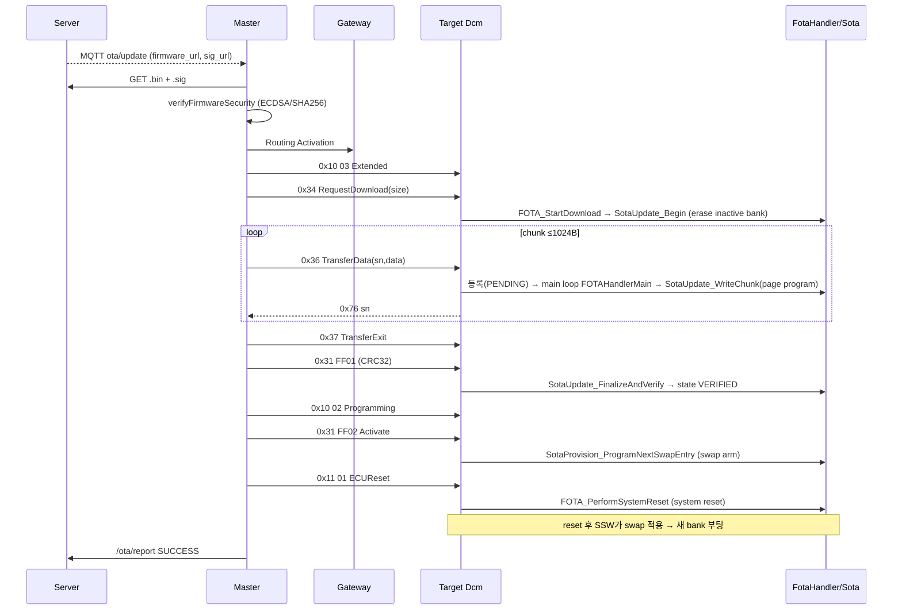
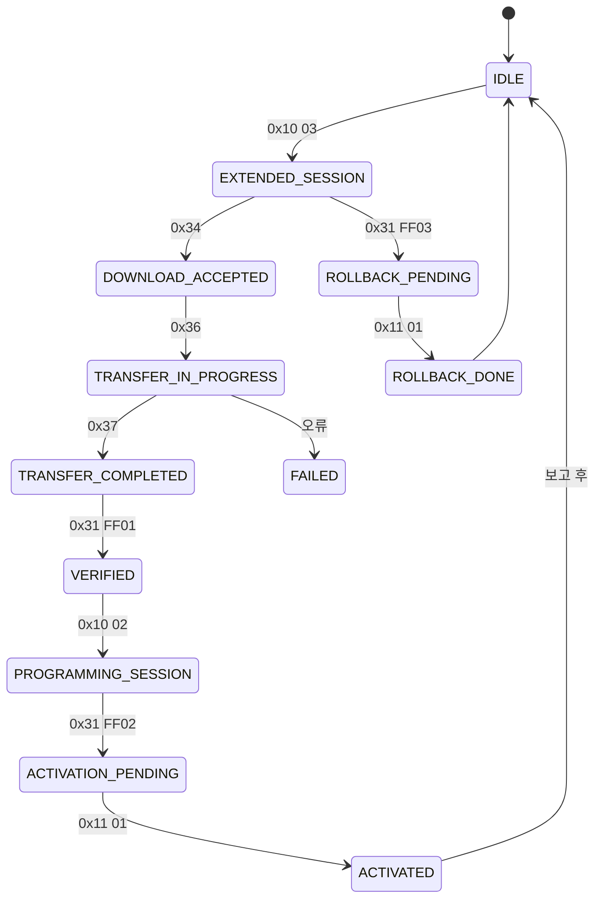
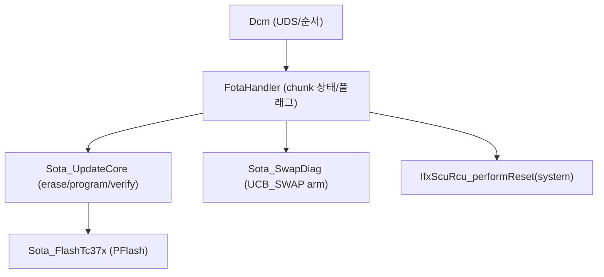
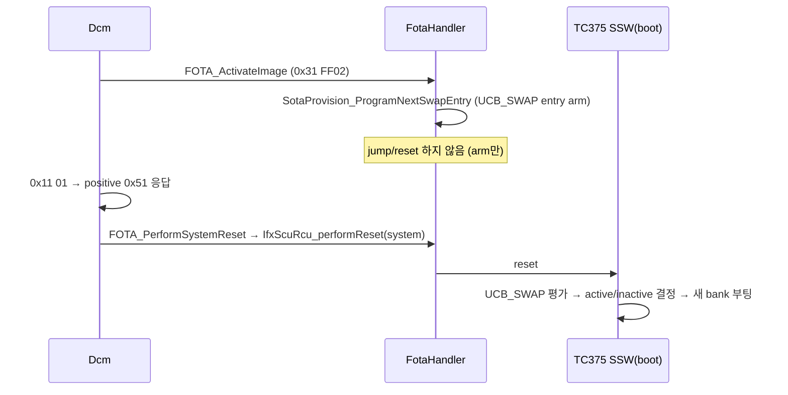
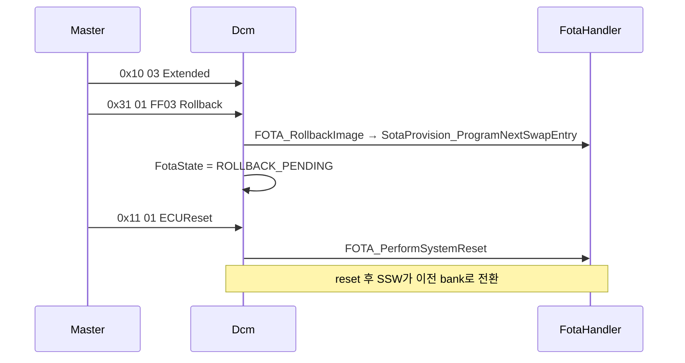

# 15. FOTA Update Flow

## 관련 문서

- [Wiki Home](./README.md)
- [System Architecture](./02_system_architecture.md)
- [DCM Diagnostic Services](./14_dcm_diagnostic_services.md)
- [Flash Programming](./16_flash_programming.md)
- [Reset / Boot / Bank Swap](./17_reset_boot_bank_swap.md)
- [RPI FOTA Master Architecture](./07_rpi_fota_master_architecture.md)

## 1. 목적

서버 업로드부터 Target ECU의 application reset/rollback까지 FOTA 단계를 노드별 책임과 함께 상세히 설명한다.

## 2. 범위

upload / download / transfer / transfer exit / verification / installation / activation / application reset / first boot / confirmation / rollback / reporting. Server↔Master↔Gateway↔Target 역할 분리.

## 3. 요약

- 이미지 전송은 RPI Master(Tester)가 DoIP로 시작, Gateway가 CAN으로 중계, Target Dcm이 처리.
- Target은 chunk를 받을 때마다 inactive PFlash bank에 즉시 program, 마지막에 CRC32 검증.
- activation은 UCB_SWAP entry를 arm만 하고, 실제 뱅크 전환은 system reset 이후 부트 시 적용.

## 4. 단계별 책임 표

| 단계 | 담당 노드 | 동작 | 근거 |
|---|---|---|---|
| Upload | Server | 대시보드가 HEX 업로드, `.sig` 생성 | `/upload` (server.c), `generate_sig_file()` |
| 알림 | Server | MQTT `ota/update` publish | `publish_update_notification()` |
| 다운로드(서버→마스터) | Master | `.bin`+`.sig` HTTP GET (이어받기) | `downloadFile()` |
| 서명 검증 | Master | ECDSA/SHA256 (`public.pem`) | `verifyFirmwareSecurity()` |
| Download(0x34) | Master→Target | image length 전달, inactive bank erase | `requestDownload()` / `FOTA_StartDownload` → `SotaUpdate_Begin` |
| Transfer(0x36) | Master→Target | 1024B chunk 반복, page program | `startOtaTransfer` loop / `SotaUpdate_WriteChunk` |
| Transfer Exit(0x37) | Master→Target | 전송 종료 | `exitTransfer()` |
| Verification(0x31 FF01) | Master→Target | CRC32 검증 | `verifyIntegrity()` / `SotaUpdate_FinalizeAndVerify` |
| (safe-state) | Master→Target | `0x10 02` programming 진입 | `changeDiagnosticSession(0x02)` |
| Activation(0x31 FF02) | Master→Target | UCB_SWAP entry arm | `requestBankSwap()` / `FOTA_ActivateImage` |
| Application Reset(0x11 01) | Master→Target | system reset | `requestEcuReset()` / `FOTA_PerformSystemReset` |
| First Boot | Target SSW | 새 active bank로 부팅 | TC375 SSW + UCB_SWAP `추정` |
| Confirmation | Target | 0x22 F180 상태 보고 → IDLE | `Dcm_HandleReadDataByIdentifier` |
| Rollback(0x31 FF03) | Master→Target | swap entry 재arm 후 reset | `requestRollback()` / `FOTA_RollbackImage` |
| Reporting | Master→Server | `/ota/report` 결과 전송 | `reportStatusToServer()` |

## 5. 전체 FOTA 시퀀스



## 6. FOTA 상태 머신 (Target Dcm 관점)



근거: [DCM Diagnostic Services](./14_dcm_diagnostic_services.md)의 상태 전이.

## 7. Dcm ↔ FOTA Handler ↔ Sota Core 상호작용



- chunk 처리: Dcm은 `DCM_WRITE_PENDING`을 받아 응답을 미루고, main loop의 `FOTAHandlerMain()`이 실제 flash program 수행 후 다음 `Dcm_MainFunction`에서 positive 응답.
- 근거: `FOTA_ProcessTransferDataWrite()` chunk state machine, `FOTAHandlerMain()` in `FotaHandler.c`.

## 8. activation / reset 시퀀스



> Application Reset(여기서는 UDS ECUReset로 트리거되는 **system reset**)과 CAN register의 "application reset value"는 별개다. 자세히 [Reset / Boot / Bank Swap](./17_reset_boot_bank_swap.md).

## 9. rollback 시퀀스



근거: `Dcm_HandleRollbackImageRoutine()`, `FOTA_RollbackImage()`. rollback은 "다음 UCB_SWAP entry 추가"로 구현되어, 현재가 새 image면 이전 물리 bank를 다시 가리킨다(주석).

## 10. verification 상세 (CRC)

- `SotaUpdate_FinalizeAndVerify(expectedCrc)`가 마지막 부분 page를 0xFF padding 후 program하고, inactive bank를 `crc32(0, inactiveBase, imageLength)`로 계산해 expected와 비교.
- 불일치 시 `SOTA_UPDATE_CRC_FAILED` → Dcm은 NRC 0x72 + FotaState FAILED.
- 근거: `SotaUpdate_FinalizeAndVerify()` in `Sota_UpdateCore.c`.

## 11. 코드 근거

```text
근거:
- Master: startOtaTransfer(), requestDownload/exitTransfer/verifyIntegrity/requestBankSwap/requestEcuReset/requestRollback() in ota_uds_engine.cpp
- Target Dcm: Dcm_Handle{RequestDownload,TransferData,RequestTransferExit,RoutineControl,EcuReset}() in Dcm.c
- FotaHandler: FOTA_StartDownload/ProcessTransferDataWrite/RequestTransferExit/ActivateImage/RollbackImage/PerformSystemReset() in FotaHandler.c
- Core: SotaUpdate_Begin/WriteChunk/FinalizeAndVerify() in Sota_UpdateCore.c
- Server: /upload, publish_update_notification() in server.c/mqtt_handler.c
```

## 12. 추정 / 확인 필요 사항

- "Installation"은 별도 단계가 아니라 transfer 중 page program으로 즉시 수행됨(streaming install) `추정`.
- First Boot/Confirmation은 SSW와 UCB_SWAP 평가에 의존하며, 코드상 명시적 "first boot confirm" 단계는 Dcm의 0x22 F180 보고로 대체됨 `확인 필요`.
- Target은 서명을 검증하지 않고 CRC32만 검증 (서명 검증은 Master 측).

## 13. 확인 필요 사항

- reset 후 새 image가 스스로 유효성 확인(자가 confirm)을 하는지 (watchdog 기반 자동 rollback 등) `확인 필요`.

## 다음에 읽을 문서

- [Flash Programming](./16_flash_programming.md)
- [Reset / Boot / Bank Swap](./17_reset_boot_bank_swap.md)
- [Error Handling and Recovery](./18_error_handling_and_recovery.md)

## 이 문서에서 남은 확인 필요 사항

| 항목 | 내용 | 확인 방법 |
|---|---|---|
| first boot confirm | 새 image 자가 검증/자동 롤백 | SSW/watchdog 동작 확인 |
| install 단계 | streaming program 여부 | `SotaUpdate_WriteChunk` page program 시점 |
