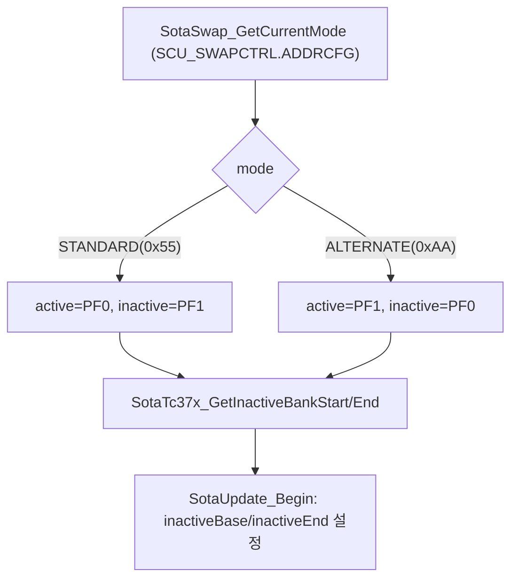
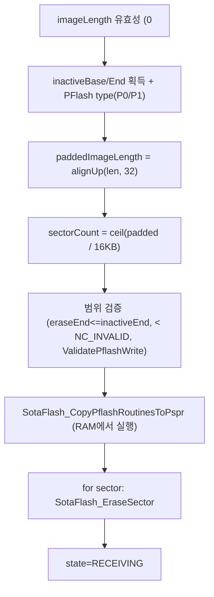
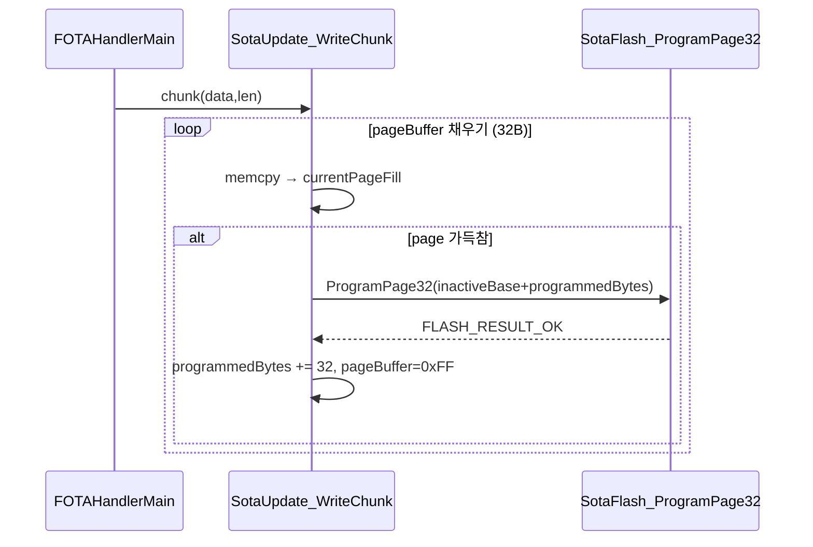
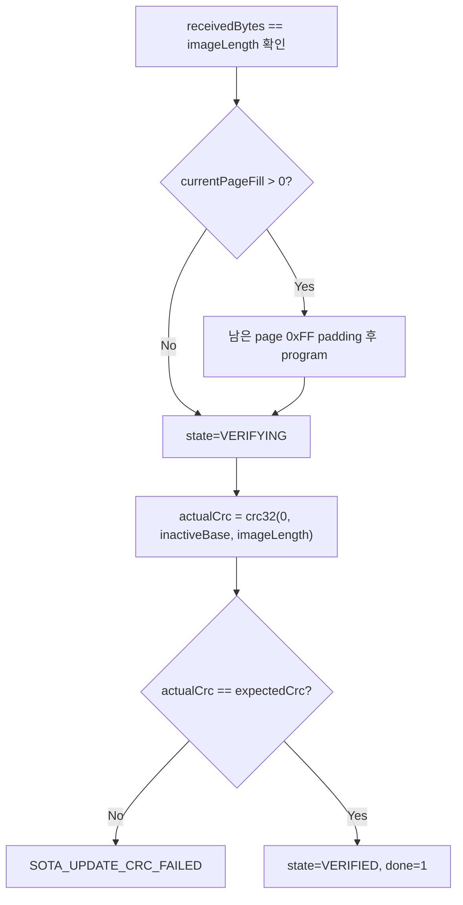

# 16. Flash Programming

## 관련 문서

- [Wiki Home](./README.md)
- [FOTA Update Flow](./15_fota_update_flow.md)
- [Reset / Boot / Bank Swap](./17_reset_boot_bank_swap.md)
- [DCM Diagnostic Services](./14_dcm_diagnostic_services.md)

## 1. 목적

Target ECU가 inactive PFlash bank를 erase하고 page 단위로 program한 뒤 CRC32로 검증하는 과정을 설명한다.

## 2. 범위

inactive bank 선택, erase range/sector erase, page write/offset, image length/padding, CRC 검증, Flash Driver API, error handling, TC375 PFlash 레이아웃.

## 3. 요약

이미지는 32바이트 page 단위로 inactive bank에 streaming program된다. `SotaUpdate_Begin`이 필요한 sector를 erase하고, `SotaUpdate_WriteChunk`가 page 채워질 때마다 program, `SotaUpdate_FinalizeAndVerify`가 CRC32 검증을 수행한다.

## 4. TC375 PFlash 레이아웃

| 항목 | 값 | 근거 |
|---|---|---|
| PF0 (non-cached) | `0xA0000000`–`0xA02FFFFF` | `TC37X_PF0_NC_START/END` |
| PF1 (non-cached) | `0xA0300000`–`0xA05FFFFF` | `TC37X_PF1_NC_START/END` |
| Bank size | `0x00300000` (3MB) | `TC37X_PFLASH_BANK_SIZE` |
| Sector size | `0x00004000` (16KB) | `TC37X_PFLASH_SECTOR_SIZE` |
| Page size | `32B` | `SOTA_UPDATE_PAGE_SIZE`, `IFXFLASH_PFLASH_PAGE_LENGTH==32` |
| 유효범위 상한 | `< 0xA0600000` | `TC37X_PFLASH_NC_INVALID_START` |

근거: `Sota_Tc37x_Config.h`.

## 5. inactive bank 선택 흐름



근거: `SotaTc37x_GetActiveBank()`/`GetInactiveBank()` in `Sota_Tc37x_Config.c`, `SotaSwap_GetCurrentMode()` in `Sota_SwapDiag.c`.

## 6. erase 흐름 (SotaUpdate_Begin)



근거: `SotaUpdate_Begin()` in `Sota_UpdateCore.c`; `SotaFlash_EraseSector()`, `SotaFlash_ValidatePflashWrite()`, `SotaFlash_CopyPflashRoutinesToPspr()` in `Sota_FlashTc37x.c`.

## 7. page write 흐름 (SotaUpdate_WriteChunk)



- 길이 초과 검사: `receivedBytes + len <= imageLength`.
- DMU 오류 기록: `MODULE_DMU.HF_ERRSR.U` (debug).
- 근거: `SotaUpdate_WriteChunk()`, `SotaUpdate_ProgramCurrentPage()` in `Sota_UpdateCore.c`.

## 8. verify 흐름 (CRC32)



근거: `SotaUpdate_FinalizeAndVerify()` in `Sota_UpdateCore.c`, `crc32()` in `crc32.c`.

## 9. Flash Driver API (Sota_FlashTc37x)

| API | 역할 | 근거 |
|---|---|---|
| `SotaFlash_EraseSector()` | sector(16KB) erase | header |
| `SotaFlash_ProgramPage32()` | 32B page program (TC37x) | `SOTA_UPDATE_PAGE_SIZE` |
| `SotaFlash_ProgramPage256/8()` | 다른 page 크기 | header |
| `SotaFlash_ProgramUcb()/ProgramUcbSwapEntry()/EraseUcb()/ReadUcb()` | UCB 조작 | [Reset/Boot/Bank Swap](./17_reset_boot_bank_swap.md) |
| `SotaFlash_CopyPflashRoutinesToPspr()` | flash 루틴을 PSPR(RAM)로 복사해 실행 | active bank 실행 충돌 방지 |
| `SotaFlash_ValidatePflashWrite()` | 쓰기 범위 유효성 | `FLASH_RESULT_*` |

## 10. error handling

| FlashResult | 의미 |
|---|---|
| `FLASH_RESULT_OK` | 정상 |
| `FLASH_RESULT_ACTIVE_BANK` / `ACTIVE_BANK_UNKNOWN` | active bank 쓰기 시도 차단 |
| `FLASH_RESULT_INVALID_PFLASH_RANGE` / `BANK_BOUNDARY` | 범위 오류 |
| `FLASH_RESULT_ENTER_PAGE_MODE_FAILED` / `DMU_ERROR` | HW 오류 |
| `FLASH_RESULT_UCB_WRITE_DISABLED` | UCB 쓰기 비활성 |

`SotaUpdate_*`는 실패 시 `SotaUpdate_SetError()`로 `SOTA_UPDATE_*` 결과를 설정하고 state=ERROR. Dcm은 이를 NRC 0x72로 변환.

## 11. 코드 근거

```text
근거:
- SotaUpdate_Begin/WriteChunk/ProgramCurrentPage/FinalizeAndVerify in Sota_UpdateCore.c
- SotaTc37x_GetInactiveBankStart/End, GetPFlashType in Sota_Tc37x_Config.c
- SotaFlash_EraseSector/ProgramPage32/CopyPflashRoutinesToPspr/ValidatePflashWrite in Sota_FlashTc37x.c (header)
- TC37X_PFLASH_* in Sota_Tc37x_Config.h
- crc32() in crc32.c
```

## 12. 추정 / 확인 필요 사항

- active bank로의 쓰기는 `FLASH_RESULT_ACTIVE_BANK`로 차단되며, 항상 inactive bank만 program `추정`(범위 검증 근거).
- DMU HF_ERRSR는 디버그 기록용이며 별도 에러 복구 로직 연결 여부 `확인 필요`.
- `SotaFlash_*`의 실제 iLLD `IfxFlash_*` 호출 세부는 `Sota_FlashTc37x.c` 본문 확인 필요.

## 다음에 읽을 문서

- [Reset / Boot / Bank Swap](./17_reset_boot_bank_swap.md)
- [Error Handling and Recovery](./18_error_handling_and_recovery.md)

## 이 문서에서 남은 확인 필요 사항

| 항목 | 내용 | 확인 방법 |
|---|---|---|
| 페이지 program 세부 | iLLD IfxFlash enterPageMode/loadPage/program 시퀀스 | `Sota_FlashTc37x.c` 본문 |
| DMU 에러 처리 | HF_ERRSR 기반 복구 | erase/program 후 분기 확인 |
