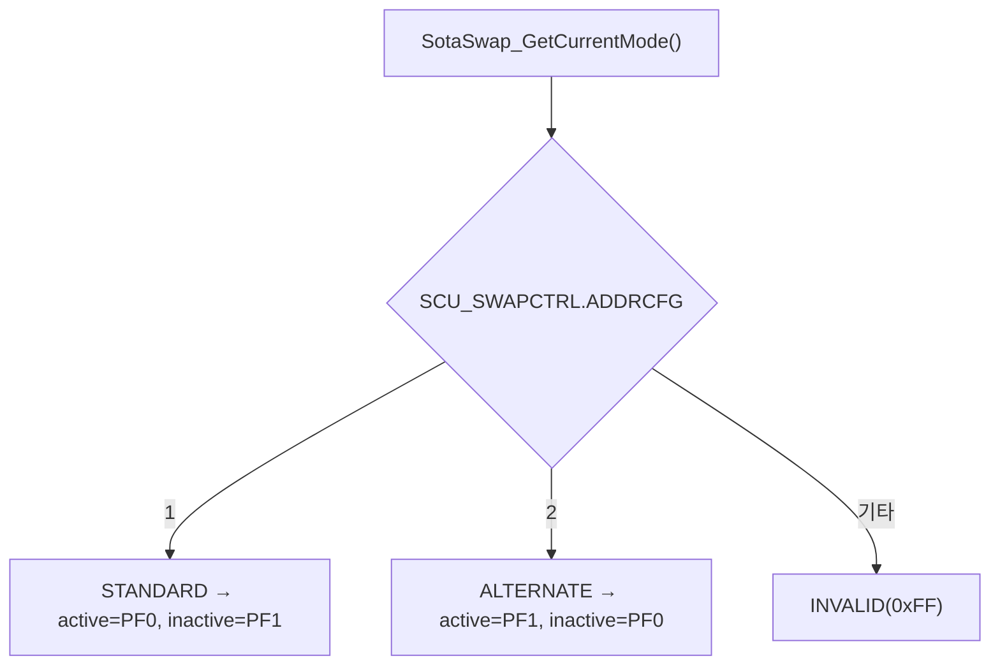
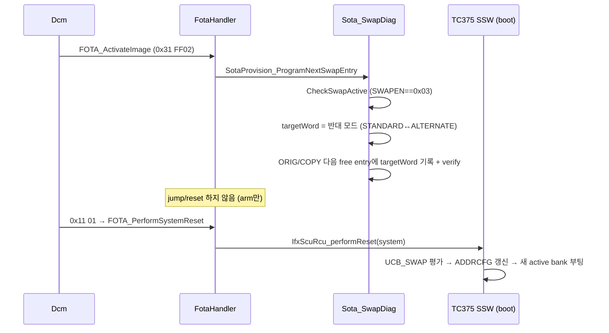
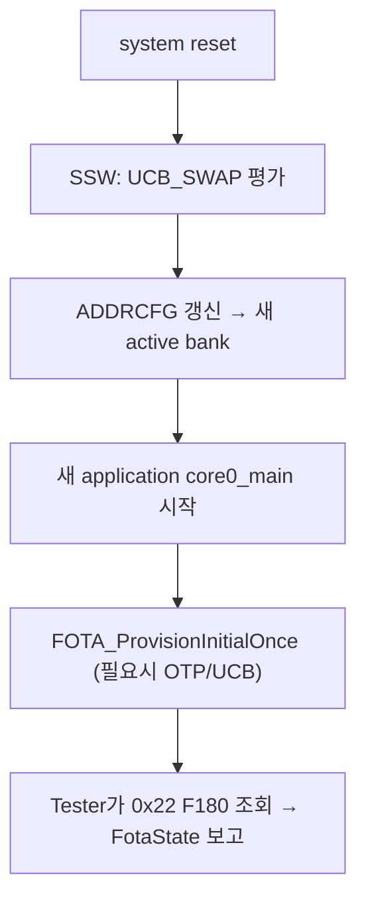
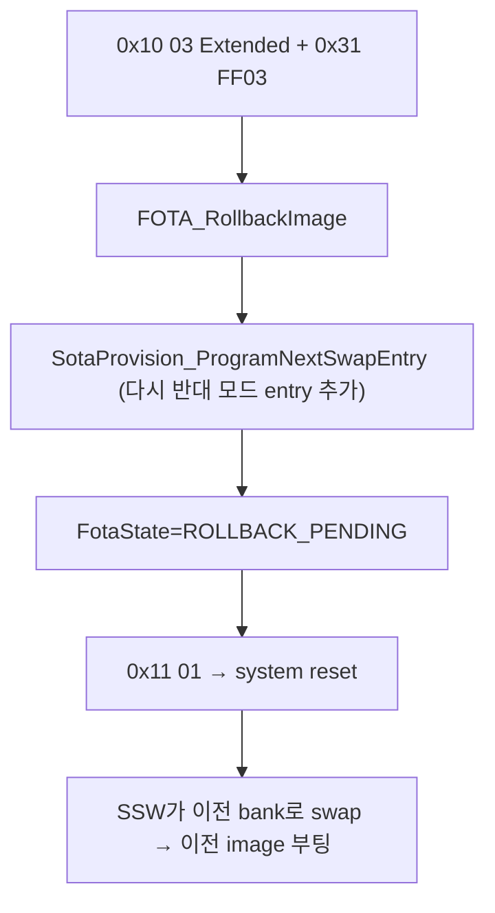

# 17. Reset / Boot / Bank Swap

## 관련 문서

- [Wiki Home](./README.md)
- [FOTA Update Flow](./15_fota_update_flow.md)
- [Flash Programming](./16_flash_programming.md)
- [Debugging Notes](./20_debugging_notes.md)

## 1. 목적

FOTA activation 이후 system reset → 부팅 → 뱅크 전환 → rollback이 TC375 UCB_SWAP/SSW 기반으로 어떻게 동작하는지 설명한다.

## 2. 범위

activation request, reset 전 저장 정보, active/inactive bank 결정, application reset(=UDS ECUReset 유발 system reset), peripheral/CPU reset 구분, first boot, rollback. **CAN register의 "application reset value"와 FOTA용 reset을 혼동하지 않는다.**

## 3. 요약

activation은 UCB_SWAP의 ORIG(23)/COPY(31) 양쪽에 **다음 entry로 반대 swap mode word**(STANDARD 0x55 ↔ ALTERNATE 0xAA)를 추가한다. reset 후 TC375 SSW가 UCB_SWAP을 평가해 address swap을 적용, active bank가 바뀐다.

## 4. 핵심 레지스터 / UCB

| 항목 | 값/위치 | 의미 |
|---|---|---|
| `SCU_SWAPCTRL.B.ADDRCFG` | 1=STANDARD, 2=ALTERNATE | 현재 swap mode 판독 |
| `DMU_HF_PROCONTP.B.SWAPEN` | `0x03` = SOTA 활성 | swap 기능 enable |
| `SCU_STMEM1/STMEM2` | swap cfg/boot addr | 부팅 진단 |
| UCB_SWAP ORIG / COPY | `23` / `31` | swap entry 저장 (이중화) |
| UCB_OTP ORIG / COPY | `32` / `40` | OTP provisioning |
| `SOTA_UCB_SWAP_STANDARD/ALTERNATE` | `0x55` / `0xAA` | swap mode word |
| `SOTA_TC37X_PROCONTP_SOTA_MASK` | `0x000F0000` | SWAPEN+CPU0/1DDIS |

근거: `Sota_SwapDiag.c`, `Sota_Tc37x_Config.h`, `Sota_FlashTc37x.h`.

## 5. active / inactive bank 결정



근거: `SotaSwap_GetCurrentMode()`, `SotaTc37x_GetActiveBank()/GetInactiveBank()`.

## 6. activation → application reset 시퀀스



근거: `SotaProvision_ProgramNextSwapEntry()` in `Sota_SwapDiag.c`; `FOTA_ActivateImage()`, `FOTA_PerformSystemReset()` in `FotaHandler.c`.

## 7. reset 전 저장 / reset 후 유지

| 데이터 | reset 전 | reset 후 |
|---|---|---|
| 새 image | inactive bank에 program + CRC verify 완료 | (swap 후) active bank가 됨 |
| swap 의도 | UCB_SWAP entry에 영속 기록 | SSW가 부팅 시 평가 |
| Dcm FotaState | RAM(ACTIVATION_PENDING/ACTIVATED) | 휘발 (reset 시 IDLE 재초기화) |

> Dcm의 FotaState는 RAM이므로 reset 후 사라진다. 영속되는 것은 **PFlash의 image와 UCB_SWAP entry**뿐이다. 근거: `Dcm_Init()`가 FotaState=IDLE로 초기화.

## 8. reset 종류 구분 (혼동 금지)

| reset 종류 | 트리거 | 본 프로젝트 사용 |
|---|---|---|
| Application Reset (FOTA) = **system reset** | UDS 0x11 01 → `IfxScuRcu_performReset(system)` | O (activation/rollback 후) |
| Peripheral module reset | iLLD 모듈별 | 본 FOTA 흐름과 무관 |
| CAN register "Application reset value" | CAN 커널 레지스터 기본값 | **FOTA reset과 별개** — 혼동 금지 |
| CPU halt / debug reset | ADS 디버거 | 디버깅용 ([Debugging Notes](./20_debugging_notes.md)) |
| Power-on reset | 전원 | - |

근거: `FOTA_PerformSystemReset()` → `IfxScuRcu_performReset(IfxScuRcu_ResetType_system, 0u)`.

## 9. first boot confirmation 흐름



- 코드상 명시적 "first boot self-confirm + 자동 rollback" 로직은 확인되지 않음 `확인 필요`. confirmation은 Master의 0x22 F180 조회/`/ota/report`로 대체.

## 10. rollback 결정 흐름



- rollback도 activation과 동일하게 "다음 swap entry 추가" 방식. 현재가 새 image면 다음 entry는 이전 물리 bank를 가리킨다. 근거: `FOTA_RollbackImage()` 주석, `SotaProvision_ProgramNextSwapEntry()`.

## 11. ADS attach-only로 active bank 관찰

- 디버거로 halt 후 PC(Program Counter) 주소가 `0xA00xxxxx`(PF0) / `0xA03xxxxx`(PF1) 영역인지로 현재 active bank를 추정 가능.
- `SotaSwap_MinDiag_Update()`가 `SCU_SWAPCTRL`, `DMU_HF_PROCONTP`, `STMEM1/2`, `bootAddr`, `currentMode`를 한 구조체로 덤프 → 디버깅 시 활용.
- 자세히 [Debugging Notes](./20_debugging_notes.md).

## 12. 코드 근거

```text
근거:
- SotaProvision_ProgramNextSwapEntry(), SotaSwap_GetCurrentMode(), SotaSwap_CheckSwapActive(), SotaSwap_MinDiag_Update() in Sota_SwapDiag.c
- SotaTc37x_GetActiveBank/GetInactiveBank in Sota_Tc37x_Config.c
- FOTA_ActivateImage/RollbackImage/PerformSystemReset in FotaHandler.c
- UCB_SWAP_ORIG_NO(23)/COPY_NO(31), UCB_OTP_ORIG_NO(32)/COPY_NO(40) in Sota_FlashTc37x.h
- SCU_SWAPCTRL.B.ADDRCFG, DMU_HF_PROCONTP.B.SWAPEN in Sota_SwapDiag.c
```

## 13. 추정 / 확인 필요 사항

- reset 후 SSW가 UCB_SWAP을 평가해 ADDRCFG를 바꾸는 것은 TC375 SOTA 표준 동작에 근거한 `추정` (코드 외부 SSW 동작).
- 자동 rollback(새 image 부팅 실패 시 watchdog) 메커니즘 `확인 필요`.
- swap entry가 모두 소진됐을 때(`NO_FREE_SWAP_ENTRY`)의 재초기화(`ReinitSwapEntry0Standard`) 운영 정책 `확인 필요`.

## 다음에 읽을 문서

- [Debugging Notes](./20_debugging_notes.md)
- [Error Handling and Recovery](./18_error_handling_and_recovery.md)

## 이 문서에서 남은 확인 필요 사항

| 항목 | 내용 | 확인 방법 |
|---|---|---|
| SSW 동작 | reset 후 UCB_SWAP 평가/ADDRCFG 갱신 | TC375 SSW/BMHD 문서 + 실측 |
| 자동 rollback | 부팅 실패 감지 | watchdog/confirm 로직 유무 |
| swap entry 고갈 | entry 재초기화 정책 | `SotaProvision_ReinitSwapEntry0Standard` 사용처 |
