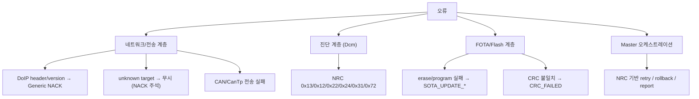
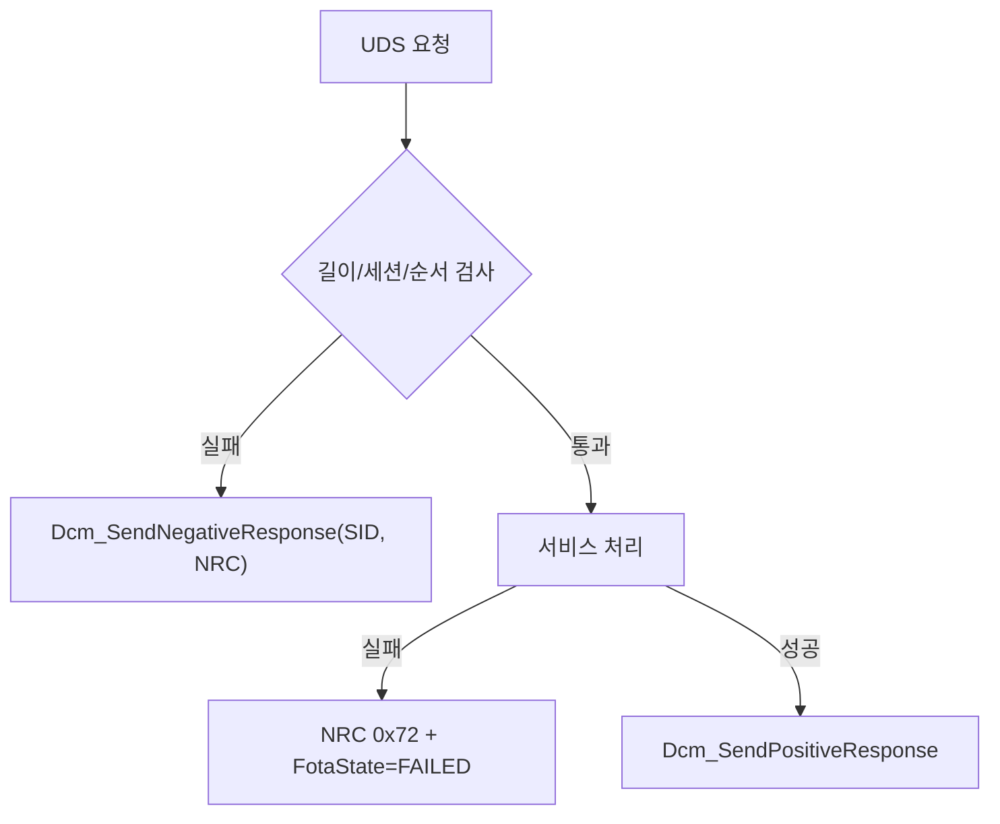
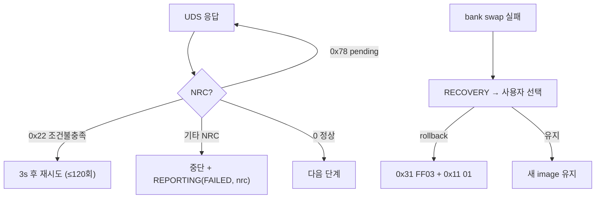

# 18. Error Handling and Recovery

## 관련 문서

- [Wiki Home](./README.md)
- [DoIP Gateway Routing](./10_doip_gateway_routing.md)
- [DCM Diagnostic Services](./14_dcm_diagnostic_services.md)
- [FOTA Update Flow](./15_fota_update_flow.md)
- [RPI FOTA Master Architecture](./07_rpi_fota_master_architecture.md)

## 1. 목적

각 계층의 오류 검출과 복구/거절 동작을 정리한다.

## 2. 범위

DoIP invalid packet, unknown target, socket timeout, CAN Tx 실패, CanTp timeout, sequence error, Dcm NRC, FOTA transfer/flash/verify/activation 오류, rollback, reporting. 구현/부분구현/확인필요를 구분한다.

## 3. 요약

오류는 계층별로 처리된다. DoIP는 Generic NACK(또는 무시), Dcm은 NRC, FOTA core는 `SOTA_UPDATE_*` 결과, Master는 NRC 기반 retry/rollback/report. 일부 ACK/NACK과 타임아웃은 단순화/미활성.

## 4. 오류 분류 다이어그램



## 5. 계층별 오류 처리 표

| 오류 | 계층 | 처리 | 상태 | 근거 |
|---|---|---|---|---|
| DoIP invalid header/version | DoIP | `DoIP_SendGenericNack(INVALID_HEADER)`, RxLength=0 | Implemented | `DoIP_ProcessRxBuffer()` |
| DoIP unknown payload type | DoIP | `Generic NACK(UNKNOWN_PAYLOAD_TYPE)` | Implemented | `DoIP_HandleMessage()` default |
| DoIP message too large | DoIP | `Generic NACK(MESSAGE_TOO_LARGE)` | Implemented | `DoIP_TpRxIndication()` |
| unknown target address | DoIP | return (Diagnostic NACK 주석 처리) | Partially | `DoIP_HandleDiagnosticMessage()` |
| socket timeout (Master) | Master | `recv_with_retry` 최대 20회(2s), `SO_RCVTIMEO 3s` | Implemented | `ota_uds_engine.cpp` |
| CAN Tx 실패 | Can/CanTp | TxConfirmation 결과 전파 (DCM route만) | Partially | `PduR_RouteTxConfirmation()` |
| Dcm 길이/순서/조건 오류 | Dcm | NRC 0x13/0x24/0x22 | Implemented | 각 핸들러 |
| TransferData BSC 불일치 | Dcm | NRC 0x24 + FotaState FAILED | Implemented | `Dcm_HandleTransferData()` |
| FOTA transfer write 실패 | FotaHandler | `DCM_WRITE_FAILED` → NRC 0x72 | Implemented | `FOTA_ProcessTransferDataWrite()` |
| flash erase/program 실패 | Sota core | `SOTA_UPDATE_ERASE/PROGRAM_FAILED`, state=ERROR | Implemented | `SotaUpdate_SetError()` |
| CRC verify 실패 | Sota core | `SOTA_UPDATE_CRC_FAILED` → NRC 0x72 | Implemented | `SotaUpdate_FinalizeAndVerify()` |
| activation 실패 | FotaHandler | NRC 0x72 + FotaState FAILED | Implemented | `Dcm_HandleActivateImageRoutine()` |
| 서명 검증 실패 (Master) | Master | AUTH_FAILED report, 중단 | Implemented | `verifyFirmwareSecurity()` |
| bank swap 실패 (Master) | Master | RECOVERY 상태 → 사용자 rollback 선택 | Implemented | `startOtaTransfer()` |

## 6. Diagnostic 오류 흐름 (Dcm NRC)



## 7. FOTA 오류 복구 흐름 (Master 관점)



근거: `checkUdsResponse()`(0x78→0), `startOtaTransfer()` retry/RECOVERY in `ota_uds_engine.cpp`.

## 8. reporting

- Master는 `reportStatusToServer(addr, ver, status, nrc)`로 DOWNLOADING/FLASHING/SUCCESS/FAILED/AUTH_FAILED를 `/ota/report`에 전송.
- 서버는 이를 받아 Flask 대시보드(`/api/log`)로 포워딩.
- 근거: `reportStatusToServer()` in `ota_comm.cpp`, `forward_report_to_dashboard()` in `server.c`.

## 9. 코드 근거

```text
근거:
- DoIP_SendGenericNack(), DoIP_ProcessRxBuffer() in DoIP.c
- Dcm_SendNegativeResponse(), 각 핸들러 NRC in Dcm.c
- SotaUpdate_SetError(), FinalizeAndVerify() in Sota_UpdateCore.c
- recv_with_retry(), checkUdsResponse(), startOtaTransfer() in ota_uds_engine.cpp
- verifyFirmwareSecurity() in ota_security.cpp
- reportStatusToServer() in ota_comm.cpp
```

## 10. 추정 / 확인 필요 사항

- CanTp 타임아웃(N_As/N_Bs/N_Cr)에 의한 자동 abort 동작 `확인 필요`.
- DoIP unknown target NACK 미전송으로 Master는 timeout/retry에 의존 `추정`.
- reset 후 부팅 실패에 대한 자동 rollback(watchdog) 부재 → 수동 rollback에 의존 `확인 필요`.
- Tx 실패(CAN bus-off 등)의 상위 전파/복구 정책 `확인 필요`.

## 11. 확인 필요 사항

- 전원 차단 등 전송 중단 후 재개(resume) 시 Target 상태 일관성 (Master는 `0x36` 처음부터 재전송 가정) `확인 필요`.

## 다음에 읽을 문서

- [Runtime Main Loops](./19_runtime_main_loops.md)
- [Open Issues](./22_open_issues.md)

## 이 문서에서 남은 확인 필요 사항

| 항목 | 내용 | 확인 방법 |
|---|---|---|
| CanTp 타임아웃 | 멀티프레임 중단 복구 | `CanTp.c` 타이머 |
| 부팅 실패 복구 | 자동 rollback | watchdog/SSW 동작 |
| 전송 재개 | 중단 후 재시작 일관성 | Target download 상태 재진입 |
