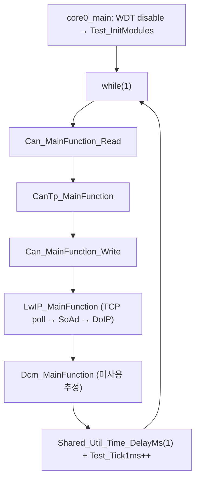
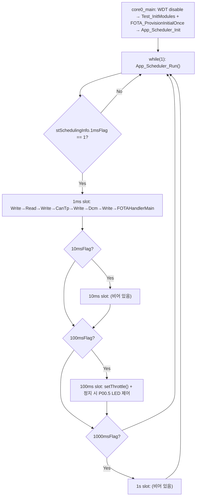
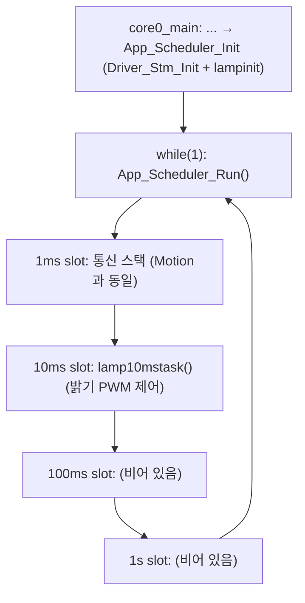
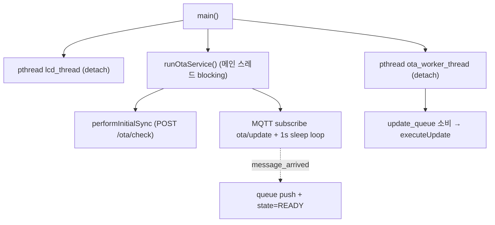
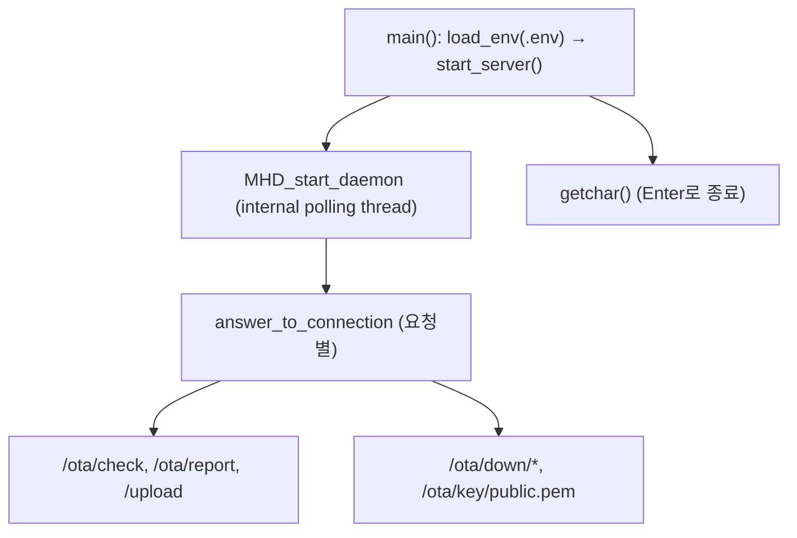

# 19. Runtime Main Loops

## 관련 문서

- [Wiki Home](./README.md)
- [Communication Stack Management](./09_communication_stack_management.md)
- [RPI FOTA Master Architecture](./07_rpi_fota_master_architecture.md)
- [Linux Server Architecture](./06_linux_server_architecture.md)

## 1. 목적

각 노드의 런타임 실행 모델(main loop / 스레드 / 폴링)을 정리한다.

## 2. 범위

Gateway/Motion/Lighting의 `core0_main` 루프, RPI Master 스레드 모델, Linux Server 실행 흐름, polling/callback 구분.

## 3. 요약

Gateway ECU는 1ms 주기 cooperative polling main loop(`while(1)` + `Shared_Util_Time_DelayMs(1)`). **Motion/Lighting ECU는 최근 변경으로 STM 1ms 인터럽트 기반 scheduler(`App_Scheduler`)로 전환**되었다 — `core0_main`의 `while(1)`은 `App_Scheduler_Run()`만 호출하고, 통신 스택 처리는 STM tick flag(`stSchedulingInfo`)에 의해 1ms/10ms/100ms/1s slot으로 구동된다. RPI Master는 pthread(LCD/worker) + MQTT 콜백. 서버는 libmicrohttpd 내부 폴링 스레드.

> 변경 전 Motion/Lighting은 Gateway와 동일하게 `Test_MainFunctions()` + `Shared_Util_Time_DelayMs(1)` cooperative loop였다. 현재 코드 기준으로는 STM compare interrupt가 scheduling flag를 세우고 main loop가 이를 폴링한다. 근거: `App_Scheduler_Run()` in `Apps/App_Scheduler.c`, `STM_Int0Handler()` in `Basics/Common/Driver_Stm.c`.

## 4. Gateway main loop



근거: `core0_main()`, `Test_MainFunctions()` in `Ecu_Gateway_TC375_LK/Cpu0_Main.c`.

## 5. Motion main loop (현재 코드 기준: STM scheduler)



- STM compare interrupt(`STM_Int0Handler`, 1ms, priority 0x30, TOS cpu0)가 `u32nuCounter1ms`를 증가시키고 1/10/100/1000 배수마다 각 flag를 1로 세운다.
- 1ms slot은 통신 스택을 처리하되 `Can_MainFunction_Write()`를 Read/CanTp/Dcm/FOTA 사이에 **여러 번 끼워 호출**한다(Tx 지연 최소화 추정).
- 100ms slot은 Motion 고유 application: joystick 입력 기반 throttle 계산(`setThrottle`)과 정지 판정(`isStopped`) 시 `MODULE_P00` pin 5 제어.

근거: `core0_main()` in `Ecu_Motion_TC375_LK/Cpu0_Main.c`; `App_Scheduler_Run()`/`App_Scheduler_Run_1ms()`/`App_Scheduler_Run_100ms()` in `Ecu_Motion_TC375_LK/Apps/App_Scheduler.c`; `STM_Int0Handler()` in `Ecu_Motion_TC375_LK/Basics/Common/Driver_Stm.c`; `setThrottle()`/`isStopped()` in `Apps/accel.c`.

## 6. Lighting main loop (현재 코드 기준: STM scheduler)

Lighting도 동일한 STM scheduler 골격을 쓰지만 **slot에 매핑된 application이 다르다**.



- Lighting의 application은 **10ms slot**에서 `lamp10mstask()`로 동작: 버튼 입력(`MODULE_P02` pin 0/1)에 따라 on/off를 정하고 밝기를 점증/점감하여 `PWM_setDutyCycle()` 호출(`AUTOMODE` 미정의 시 버튼 모드).
- Motion은 100ms throttle, Lighting은 10ms lamp — 두 ECU의 application slot이 서로 다르다.

근거: `core0_main()` in `Ecu_Lighting_TC375_LK/Cpu0_Main.c`; `App_Scheduler_Run_10ms()` in `Ecu_Lighting_TC375_LK/Apps/App_Scheduler.c`; `lamp10mstask()`/`lampinit()` in `Apps/App_Lamp.c`.

## 7. 폴링 vs callback vs interrupt

| 노드 | 모델 | 근거 |
|---|---|---|
| Gateway ECU | cooperative polling (1ms), CAN RX FIFO0 폴링 | `Can_MainFunction_Read`, `Test_MainFunctions()` (Gateway는 미변경) |
| Motion/Lighting ECU | STM 1ms compare interrupt가 flag set → main loop가 `App_Scheduler_Run()`로 폴링 (1/10/100/1000ms slot) | `STM_Int0Handler()`, `App_Scheduler_Run()` |
| Gateway DoIP | LwIP TCP callback(`tcp_recv`) → `DoIP_TpRxIndication` (LwIP_MainFunction 구동) | `SoAd.c` `tcp_recv` |
| RPI Master | pthread 3개(main service / lcd / worker) + MQTT 콜백 | `main.cpp`, `ota_callback` |
| Linux Server | libmicrohttpd `MHD_USE_INTERNAL_POLLING_THREAD` | `start_server()` |

## 8. RPI Master 실행 모델



근거: `main()` in `main.cpp`, `runOtaService()`/`ota_worker_thread()` in `ota_comm.cpp`.

## 9. Linux Server 실행 모델



근거: `main.c`, `start_server()` in `server.c`.

## 10. 코드 근거

```text
근거:
- core0_main(), Test_MainFunctions() in 각 ECU Cpu0_Main.c
- main(), runOtaService(), ota_worker_thread() in FOTA_Master_RPI4
- main(), start_server() in FOTA_Linux_Server/src
```

## 11. 추정 / 확인 필요 사항

- Cpu1_Main.c / Cpu2_Main.c(코어1/2)의 역할 `확인 필요` (core0만 통신/FOTA 담당 추정).
- Gateway의 `Shared_Util_Time_DelayMs(1)`은 busy/HW 타이머 기반인지 `확인 필요`.
- WDT를 disable하므로 watchdog 기반 자동 복구는 동작하지 않음 `추정`.
- Motion/Lighting scheduler에서 1ms slot이 길어지면(예: FOTA flash program) STM flag가 누적되어 10/100/1000ms slot 타이밍이 밀릴 수 있음 `추정` (flag는 1ms tick마다 set, slot은 1ms slot 실행 시 함께 검사).
- `App_Scheduler_Run_1ms()`가 `Can_MainFunction_Write()`를 4회 호출하는 의도(Tx latency 최소화 추정) `확인 필요`.

## 최근 코드 변경 반영 사항

| 변경 영역 | 반영 내용 | 코드 근거 |
|---|---|---|
| Motion/Lighting main loop | cooperative `Test_MainFunctions()`+`DelayMs(1)` → STM 인터럽트 기반 `App_Scheduler` 폴링 | `App_Scheduler_Run()` in `Apps/App_Scheduler.c`, `STM_Int0Handler()` in `Basics/Common/Driver_Stm.c`, `core0_main()` diff in `Cpu0_Main.c` |
| Motion application slot | 100ms slot에 throttle/motor 제어 추가 | `App_Scheduler_Run_100ms()`, `setThrottle()`/`isStopped()` in `Apps/accel.c` |
| Lighting application slot | 10ms slot에 lamp 밝기 제어 추가 | `App_Scheduler_Run_10ms()`, `lamp10mstask()` in `Apps/App_Lamp.c` |
| Gateway main loop | 변경 없음(여전히 cooperative loop) | `Cpu0_Main.c`가 diff에 미포함 |

## 다음에 읽을 문서

- [Debugging Notes](./20_debugging_notes.md)
- [Reset / Boot / Bank Swap](./17_reset_boot_bank_swap.md)
- [Application Change Log](./23_application_change_log.md)

## 이 문서에서 남은 확인 필요 사항

| 항목 | 내용 | 확인 방법 |
|---|---|---|
| 멀티코어 | Cpu1/Cpu2 역할 | `Cpu1_Main.c`, `Cpu2_Main.c` 확인 |
| 시간 지연 | DelayMs 구현 | `Time.h`/`Shared_Util_Time_DelayMs` |
