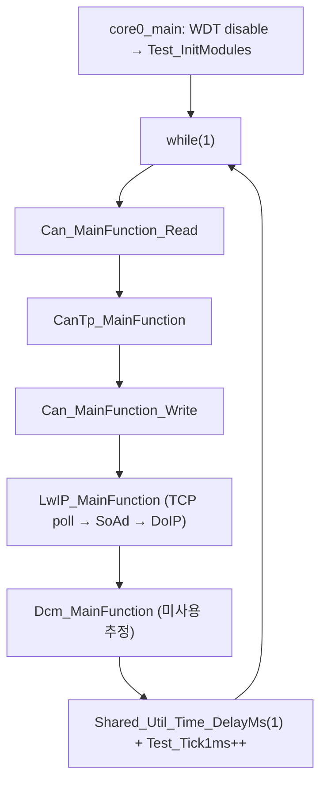
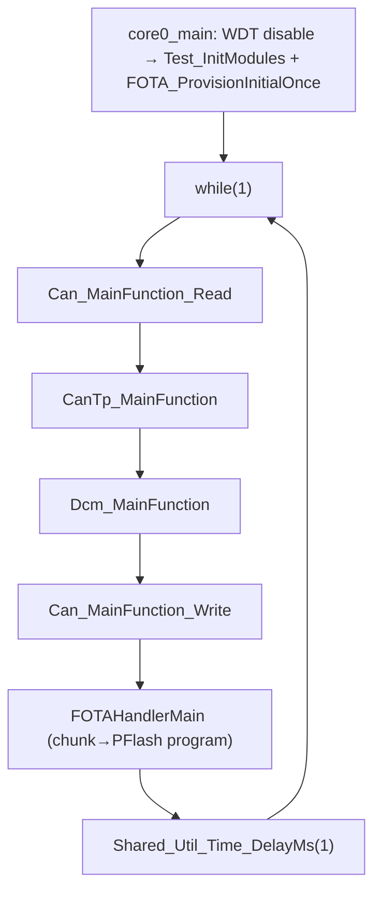
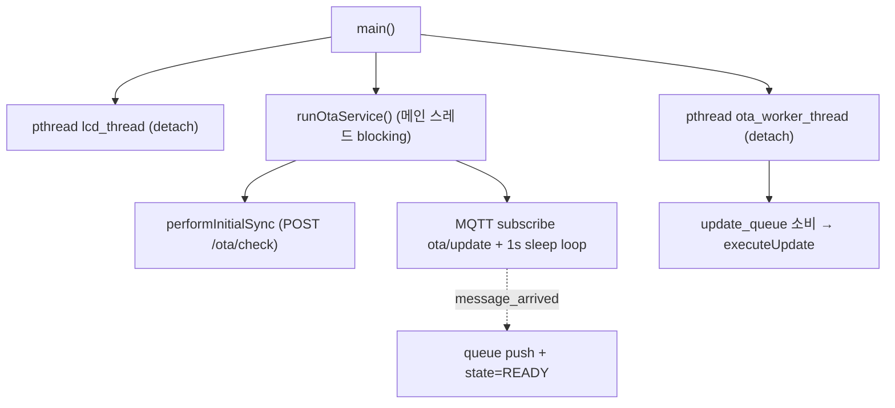
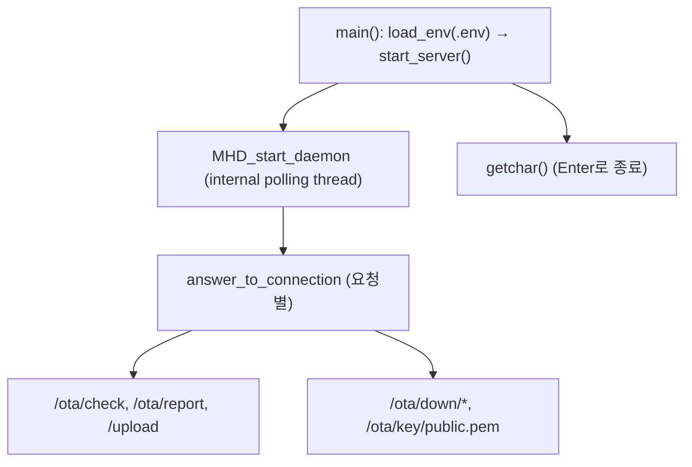

# 19. Runtime Main Loops

## 관련 문서

- [Wiki Home](./README.md)
- [Communication Stack Management](./09_communication_stack_management.md)
- [RPI FOTA Master Architecture](./07_rpi_fota_master_architecture.md)
- [Linux Server Architecture](./06_linux_server_architecture.md)

## 1. 목적

각 노드의 런타임 실행 모델(main loop / 스레드 / 폴링)을 정리한다.

## 2. 범위

Gateway/Motion/Lighting의 `core0_main` 루프, RPI Master 스레드 모델, Linux Server 실행 흐름, polling/callback 구분.

## 3. 요약

TC375 ECU는 1ms 주기 cooperative polling main loop(`while(1)` + `Shared_Util_Time_DelayMs(1)`). RPI Master는 pthread(LCD/worker) + MQTT 콜백. 서버는 libmicrohttpd 내부 폴링 스레드.

## 4. Gateway main loop



근거: `core0_main()`, `Test_MainFunctions()` in `Ecu_Gateway_TC375_LK/Cpu0_Main.c`.

## 5. Motion main loop



근거: `core0_main()`, `Test_MainFunctions()` in `Ecu_Motion_TC375_LK/Cpu0_Main.c`.

## 6. Lighting main loop

Motion과 동일(배너만 다름). 근거: `Ecu_Lighting_TC375_LK/Cpu0_Main.c` (`diff`상 배너 1줄 차이).

## 7. 폴링 vs callback vs interrupt

| 노드 | 모델 | 근거 |
|---|---|---|
| TC375 ECU | cooperative polling (1ms), CAN RX FIFO0 폴링 | `Can_MainFunction_Read` |
| Gateway DoIP | LwIP TCP callback(`tcp_recv`) → `DoIP_TpRxIndication` (LwIP_MainFunction 구동) | `SoAd.c` `tcp_recv` |
| RPI Master | pthread 3개(main service / lcd / worker) + MQTT 콜백 | `main.cpp`, `ota_callback` |
| Linux Server | libmicrohttpd `MHD_USE_INTERNAL_POLLING_THREAD` | `start_server()` |

## 8. RPI Master 실행 모델



근거: `main()` in `main.cpp`, `runOtaService()`/`ota_worker_thread()` in `ota_comm.cpp`.

## 9. Linux Server 실행 모델



근거: `main.c`, `start_server()` in `server.c`.

## 10. 코드 근거

```text
근거:
- core0_main(), Test_MainFunctions() in 각 ECU Cpu0_Main.c
- main(), runOtaService(), ota_worker_thread() in FOTA_Master_RPI4
- main(), start_server() in FOTA_Linux_Server/src
```

## 11. 추정 / 확인 필요 사항

- Cpu1_Main.c / Cpu2_Main.c(코어1/2)의 역할 `확인 필요` (core0만 통신/FOTA 담당 추정).
- `Shared_Util_Time_DelayMs(1)`은 busy/HW 타이머 기반인지 `확인 필요`.
- WDT를 disable하므로 watchdog 기반 자동 복구는 동작하지 않음 `추정`.

## 다음에 읽을 문서

- [Debugging Notes](./20_debugging_notes.md)
- [Reset / Boot / Bank Swap](./17_reset_boot_bank_swap.md)

## 이 문서에서 남은 확인 필요 사항

| 항목 | 내용 | 확인 방법 |
|---|---|---|
| 멀티코어 | Cpu1/Cpu2 역할 | `Cpu1_Main.c`, `Cpu2_Main.c` 확인 |
| 시간 지연 | DelayMs 구현 | `Time.h`/`Shared_Util_Time_DelayMs` |
