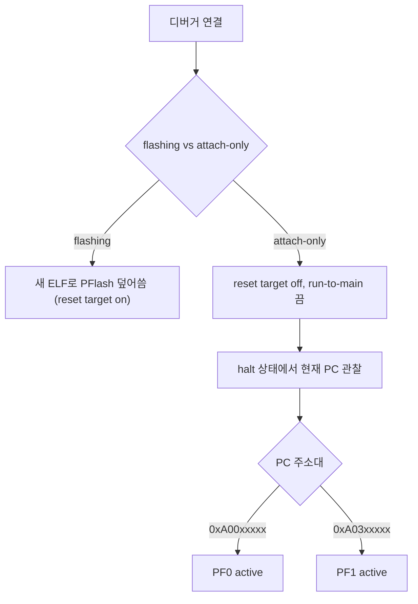
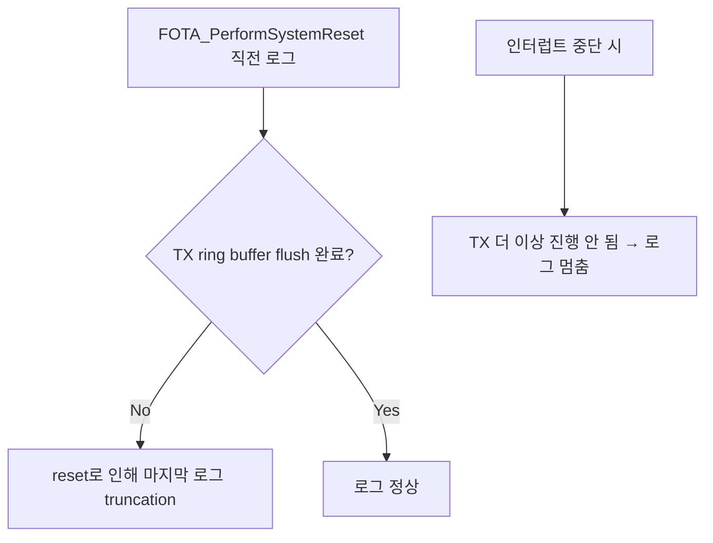
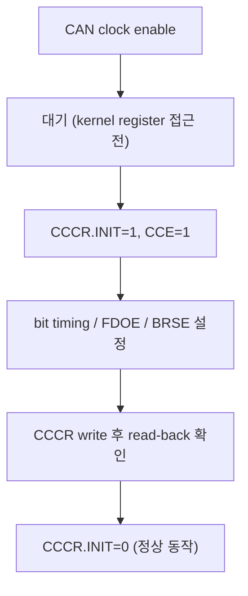
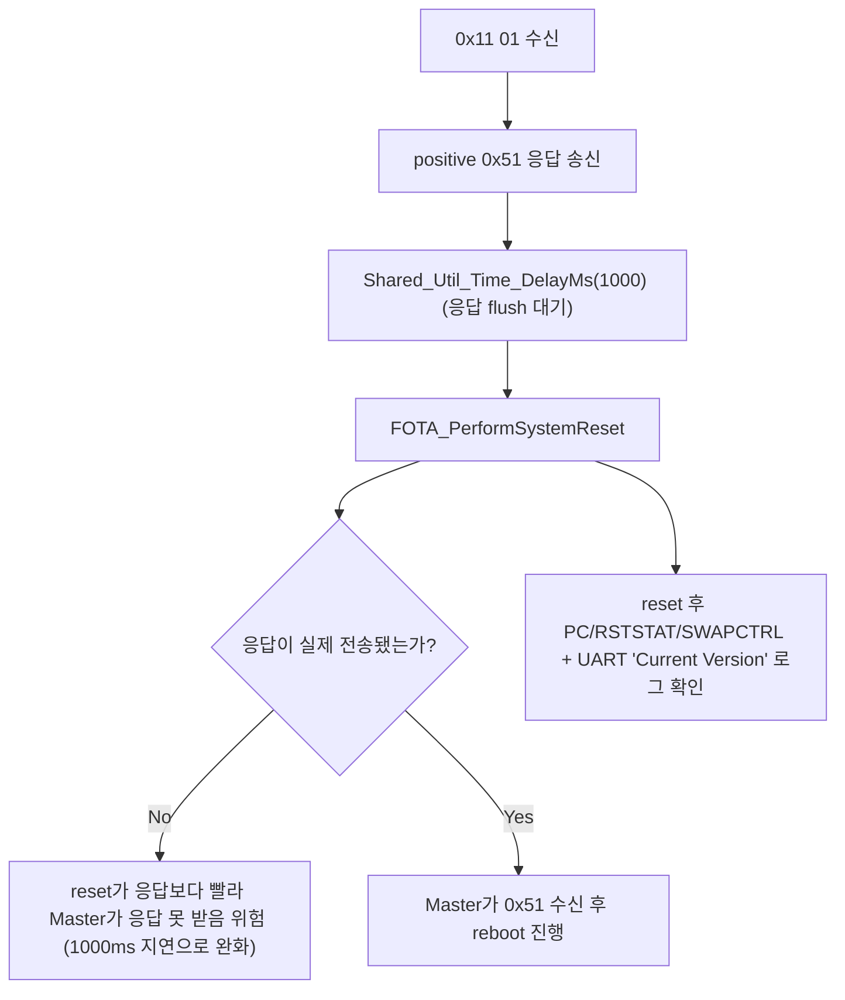

# 20. Debugging Notes

## 관련 문서

- [Wiki Home](./README.md)
- [Reset / Boot / Bank Swap](./17_reset_boot_bank_swap.md)
- [CAN Stack](./11_can_stack.md)
- [Runtime Main Loops](./19_runtime_main_loops.md)

## 1. 목적

ADS 디버거, UART 로그, CAN 레지스터, FOTA reset 관련 디버깅 시 주의점을 정리한다. **코드로 확인된 사실과 일반 디버깅 지침을 구분한다.**

## 2. 범위

ADS flashing vs attach-only, current PC 관찰, ELF/bank 불일치, UART 로그 손실, CAN 레지스터 점검, reset 전후 확인 포인트.

## 3. 요약

뱅크 스왑 환경에서는 ELF 심볼과 실제 active bank 주소가 어긋날 수 있어 attach-only 디버깅과 PC 주소 확인이 중요하다. 비동기 UART는 reset 직전 로그가 잘릴 수 있다.

## 4. ADS attach-only 흐름



- attach-only(리셋/플래싱 없이 붙기)는 FOTA로 이미 들어간 image의 실제 동작을 관찰할 때 유용.
- `SotaSwap_MinDiag_Update()`로 `SCU_SWAPCTRL`, `DMU_HF_PROCONTP`, `STMEM1/2`, `bootAddr`, `currentMode`를 한 번에 덤프해 active bank 확인. 근거: `Sota_SwapDiag.c`.

## 5. ELF / bank 주소 불일치 위험

| 위험 | 설명 |
|---|---|
| ELF symbol mismatch | 디버거가 로드한 ELF가 현재 active bank의 image와 다르면 소스/심볼이 어긋남 |
| bank A/B address mismatch | PF0용 빌드 심볼을 PF1 active 상태에서 보면 PC/변수 주소가 안 맞음 |
| 해결 | 현재 active bank(PF0/PF1)에 맞는 ELF를 로드, 또는 PC 주소대로 bank 판별 |

(일반 디버깅 지침 — 코드 직접 근거 아님, TC375 SOTA 환경 특성.)

## 6. 비동기 UART 로그 손실

- 본 프로젝트는 UART 로그를 광범위하게 사용(`UART_Printf`, `*_DEBUG_PRINTF`). 근거: `Cpu0_Main.c`, `Debug_Log.h` 매크로.
- 비동기 인터럽트 기반 UART라면 다음 위험:



- 권장: reset 전 blocking flush, panic 시 polling UART 사용 (일반 지침 `확인 필요` — 현재 코드의 UART 구현 방식 미확인).
- **변경**: `Dcm_HandleEcuReset()`가 응답 송신 후 `Shared_Util_Time_DelayMs(1000)`를 두고 reset하도록 바뀌어, reset 직전 응답/로그 truncation 위험이 완화되었다. 다만 1000ms blocking delay 동안 UART TX가 인터럽트 기반이면 진행되지만 main loop는 멈추므로, delay 구현(busy/타이머)에 따라 효과가 달라짐 `확인 필요`. 근거: `Dcm_HandleEcuReset()` diff in `Dcm.c`.

## 7. CAN 레지스터 디버그

- 현재 CAN 드라이버는 iLLD `IfxCan` API로 추상화되어 직접 CCCR을 다루지 않음 `추정`(`Can_Init()`가 IfxCan node config 사용).
- 그럼에도 저수준 점검 시 확인할 CAN0 Node0 레지스터:

| 레지스터 비트 | 의미 |
|---|---|
| `CCCR.INIT` | 초기화 모드 (config 변경 가능) |
| `CCCR.CCE` | Configuration Change Enable |
| `CCCR.MON` | Bus Monitoring |
| `CCCR.TEST` / `ASM` | 테스트/제한 모드 |
| `CCCR.DAR` | Automatic Retransmission Disable |
| `CCCR.FDOE` / `BRSE` | CAN FD / Bit Rate Switch enable |



(일반 MCMCAN 점검 지침. 본 프로젝트는 iLLD가 이 시퀀스를 수행 `추정`.) "CAN register application reset value"는 FOTA의 Application Reset과 **무관**하다 — [Reset/Boot/Bank Swap](./17_reset_boot_bank_swap.md) 참고.

## 8. reset 디버깅 흐름 (FOTA)



- `Dcm_HandleEcuReset()`는 `Dcm_SendPositiveResponse()` **후** `Shared_Util_Time_DelayMs(1000)`를 두고 `FOTA_PerformSystemReset()`를 호출(변경). reset 전 응답 송출 시간을 확보하지만, blocking delay가 송출 완료를 100% 보장하는지는 구현 의존 `확인 필요`.
- reset 후 부팅 ECU가 UART로 `[Motion/Lighting ECU] Current Version: A`를 출력하므로, 어느 image가 부팅됐는지 로그로 1차 확인 가능(변경). 근거: `core0_main()` diff in `Cpu0_Main.c`.

## 9. FOTA 디버깅 체크포인트

| 체크포인트 | 확인 항목 | 근거 |
|---|---|---|
| download | `SotaUpdateDebug_t` (inactiveBase/eraseResult/dmuErr) | `FOTA_DebugPrintUpdateContext()` |
| transfer | programmedBytes/receivedBytes/currentPageFill | `SotaUpdate_UpdateProgressDebug()` |
| verify | actualCrc vs expectedCrc | `SotaUpdate_FinalizeAndVerify()` |
| activate | lastSwapEntryIndex/lastSwapTargetModeWord | `FOTA_ActivateImage()` 로그 |
| boot | SWAPCTRL.ADDRCFG / PC 주소 | `SotaSwap_MinDiag_Update()` |

## 10. 코드 근거

```text
근거:
- SotaSwap_MinDiag_Update(), SotaSwap_GetCurrentMode() in Sota_SwapDiag.c
- FOTA_DebugPrintUpdateContext() in FotaHandler.c
- SotaUpdate_GetDebug(), SotaUpdateDebug_t in Sota_UpdateCore.c/.h
- Dcm_HandleEcuReset() (응답 후 reset) in Dcm.c
- UART_Printf / *_DEBUG_PRINTF in Cpu0_Main.c / Debug_Log.h
```

## 11. 추정 / 확인 필요 사항

- UART가 인터럽트 기반인지 polling인지 → 로그 truncation 분석에 필요 `확인 필요`.
- CCCR read-back/clock-wait 시퀀스가 iLLD 내부에서 처리되는지 `확인 필요`.
- 0x11 reset 시 1000ms blocking delay가 응답 송출 완료를 보장하는지 `확인 필요`.
- **변경**: Motion/Lighting은 STM compare interrupt(`STM_Int0Handler`, priority 0x30)가 scheduling flag를 세워야 main loop slot이 돈다. **STM 인터럽트가 막히면 통신/진단/FOTA 처리 전체가 멈춘다** → reset/halt 디버깅 시 STM 인터럽트 활성 여부 확인 필요 `확인 필요`. 근거: `App_Scheduler_Run()` in `Apps/App_Scheduler.c`, `STM_Int0Handler()` in `Basics/Common/Driver_Stm.c`.

## 12. 최근 코드 변경 반영 사항

| 변경 영역 | 반영 내용 | 코드 근거 |
|---|---|---|
| FOTA 디버그 로그 기본값 | Motion/Lighting `DEBUG_FOTA_ENABLE` `1U`→`0U` (기본 비활성) | `Utils/Debug_Cfg.h` diff |
| reset 타이밍 | 응답 후 `Shared_Util_Time_DelayMs(1000)` 추가 | `Dcm_HandleEcuReset()` diff |
| 부팅 버전 로그 | `Current Version: A` UART 출력 추가 | `core0_main()` diff |
| 스케줄링 의존성 | main loop가 STM 인터럽트 flag에 의존(인터럽트 정지 시 전체 정지) | `App_Scheduler_Run()`, `STM_Int0Handler()` |

> `DEBUG_FOTA_ENABLE=0`이므로 FOTA 단계별 디버그 로그는 기본적으로 출력되지 않는다. FOTA 디버깅 시 이 매크로를 다시 `1U`로 빌드해야 한다(소스 수정 필요 — 본 위키는 수정하지 않음).

## 다음에 읽을 문서

- [Reset / Boot / Bank Swap](./17_reset_boot_bank_swap.md)
- [Open Issues](./22_open_issues.md)
- [Application Change Log](./23_application_change_log.md)

## 이 문서에서 남은 확인 필요 사항

| 항목 | 내용 | 확인 방법 |
|---|---|---|
| UART 구현 | 인터럽트/polling, flush 방식 | `UART.c`/`UART.h` 확인 |
| reset 타이밍 | 응답 송출 vs reset 순서 | `Dcm_HandleEcuReset` + CanTp 송신 완료 추적 |
| CAN 저수준 | CCCR 시퀀스 | `Can_Init()` IfxCan 내부 |
