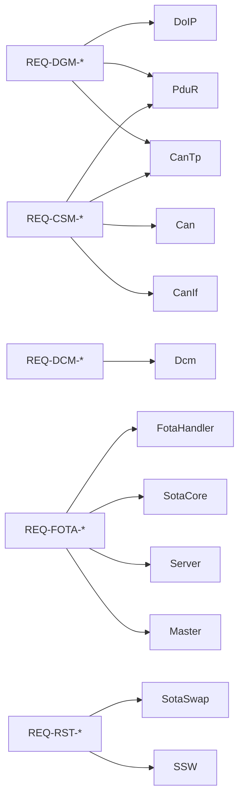
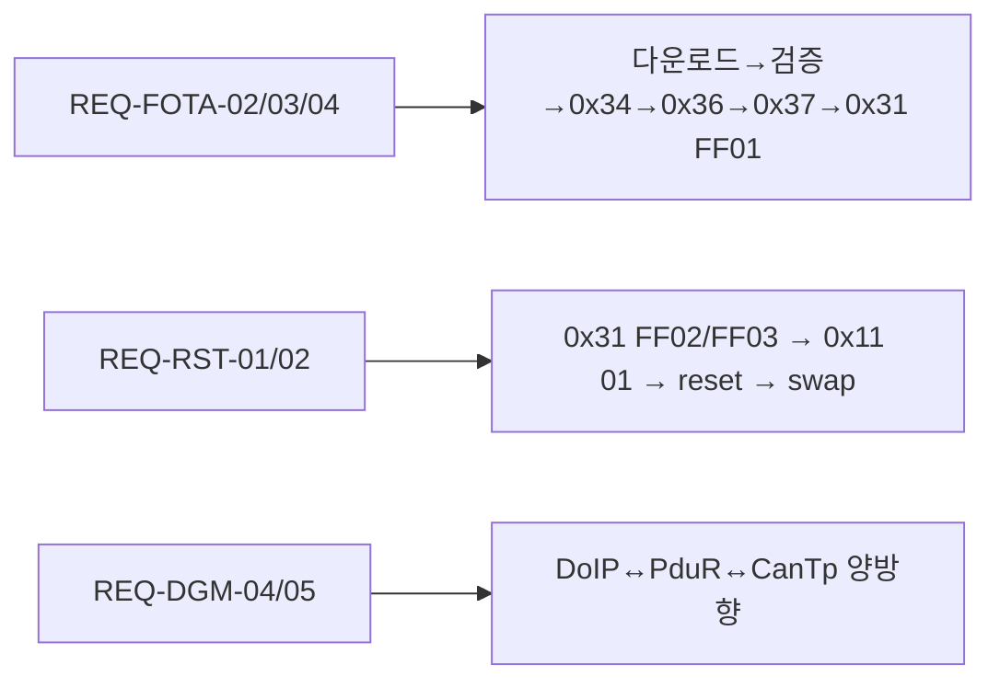

# 21. Requirements Traceability

## 관련 문서

- [Wiki Home](./README.md)
- [Diagnostic Gateway Management](./08_diagnostic_gateway_management.md)
- [FOTA Update Flow](./15_fota_update_flow.md)
- [Open Issues](./22_open_issues.md)

## 1. 목적

시스템 요구사항을 모듈/런타임 흐름/코드 근거에 연결하고 구현 상태를 추적한다.

## 2. 범위

Diagnostic Gateway Management, Communication Stack Management, FOTA, Reset/Recovery 요구사항. 요구사항은 외부 관찰 가능 동작 중심으로 기술한다.

## 3. Status 정의

- **Implemented**: 코드로 동작 확인
- **Partially Implemented**: 일부만 구현/주석 처리/조건 제한
- **Not Implemented**: 미구현
- **확인 필요 / 추정**: 코드 외부 동작 또는 미검증

## 4. 요구사항 추적 표

| Requirement ID | Description | Related Module | Related Flow | Evidence | Status | Notes |
|---|---|---|---|---|---|---|
| REQ-DGM-01 | Gateway는 DoIP TCP 수신 시 DoIP 처리로 전달한다 | SoAd/DoIP | [10](./10_doip_gateway_routing.md) | `DoIP_TpRxIndication()` | Implemented | |
| REQ-DGM-02 | Gateway는 Routing Activation에 응답한다 | DoIP | [10](./10_doip_gateway_routing.md) | `DoIP_HandleRoutingActivation()` | Implemented | 항상 SUCCESS |
| REQ-DGM-03 | Gateway는 TargetAddress로 대상 ECU를 식별한다 | DoIP | [08](./08_diagnostic_gateway_management.md) | `DoIP_FindRxPduConfigByTargetAddress()` | Implemented | 0x1234/0x5678 |
| REQ-DGM-04 | Gateway는 대상별로 CAN 경로로 진단 요청을 전달한다 | DoIP→PduR→CanTp | [13](./13_pdur_routing.md) | `PduR_RoutingPathConfig[]` | Implemented | |
| REQ-DGM-05 | Gateway는 Target 응답을 DoIP로 래핑해 Tester에 전달한다 | CanTp→PduR→DoIP | [10](./10_doip_gateway_routing.md) | `DoIP_TpTransmit()` | Implemented | |
| REQ-DGM-06 | Gateway는 미등록 대상 요청을 라우팅하지 않는다 | DoIP | [08](./08_diagnostic_gateway_management.md) | RxConfig==NULL return | Implemented | NACK 주석 |
| REQ-DGM-07 | Gateway는 자체 진단을 수행하지 않는다 | DoIP/PduR | [02](./02_system_architecture.md) | Dcm route 미등록 | 확인 필요 | 정책 |
| REQ-CSM-01 | 시스템은 CAN FD(64B)로 진단 PDU를 전송한다 | Can | [11](./11_can_stack.md) | `CAN_MAX_DATA_PAYLOAD(64)` | Implemented | |
| REQ-CSM-02 | 시스템은 멀티프레임 UDS를 세그먼트/재조립한다 | CanTp | [12](./12_cantp_transport.md) | SF/FF/CF/FC handler | Implemented | |
| REQ-CSM-03 | 라우팅은 PDU ID 기반으로 수행한다 | PduR | [13](./13_pdur_routing.md) | `PduR_FindRoutingPath()` | Implemented | |
| REQ-CSM-04 | Tx confirmation을 상위로 전파한다 | PduR | [09](./09_communication_stack_management.md) | `PduR_RouteTxConfirmation()` | Partially | DCM route만 |
| REQ-DCM-01 | Target은 세션 제어(0x10)를 지원한다 | Dcm | [14](./14_dcm_diagnostic_services.md) | `Dcm_HandleDiagnosticSessionControl()` | Implemented | default/extended/programming |
| REQ-DCM-02 | Target은 RequestDownload(0x34)를 처리한다 | Dcm/FOTA | [14](./14_dcm_diagnostic_services.md) | `Dcm_HandleRequestDownload()` | Implemented | EXTENDED 필요 |
| REQ-DCM-03 | Target은 TransferData(0x36)를 비동기 처리한다 | Dcm/FOTA | [14](./14_dcm_diagnostic_services.md) | pending state machine | Implemented | |
| REQ-DCM-04 | Target은 RoutineControl(0x31)로 verify/activate/rollback을 수행한다 | Dcm/FOTA | [15](./15_fota_update_flow.md) | RID FF01/FF02/FF03 | Implemented | 임의 RID |
| REQ-DCM-05 | Target은 ECUReset(0x11)으로 system reset한다 | Dcm/FOTA | [17](./17_reset_boot_bank_swap.md) | `FOTA_PerformSystemReset()` | Implemented | hardReset만 |
| REQ-DCM-06 | Target은 FOTA 상태를 0x22 F180으로 보고한다 | Dcm | [14](./14_dcm_diagnostic_services.md) | `DCM_DID_FOTA_STATUS` | Implemented | |
| REQ-FOTA-01 | 서버는 이미지/서명을 보관·배포한다 | Server | [06](./06_linux_server_architecture.md) | `/upload`, `generate_sig_file()` | Implemented | |
| REQ-FOTA-02 | Master는 이미지 서명을 검증한다 | Master | [07](./07_rpi_fota_master_architecture.md) | `verifyFirmwareSecurity()` | Implemented | ECDSA/SHA256 |
| REQ-FOTA-03 | Target은 image를 inactive bank에 program한다 | Sota core | [16](./16_flash_programming.md) | `SotaUpdate_WriteChunk()` | Implemented | 32B page |
| REQ-FOTA-04 | Target은 CRC32로 image 무결성을 검증한다 | Sota core | [16](./16_flash_programming.md) | `SotaUpdate_FinalizeAndVerify()` | Implemented | |
| REQ-FOTA-05 | Target은 서명/해시 서명을 검증한다 | - | - | (없음) | Not Implemented | CRC32만 |
| REQ-FOTA-06 | Target은 bank swap을 arm한다 | Sota swap | [17](./17_reset_boot_bank_swap.md) | `SotaProvision_ProgramNextSwapEntry()` | Implemented | UCB_SWAP |
| REQ-RST-01 | activation 후 system reset으로 새 bank 부팅 | FOTA/SSW | [17](./17_reset_boot_bank_swap.md) | `IfxScuRcu_performReset(system)` | Implemented | SSW 평가는 추정 |
| REQ-RST-02 | rollback으로 이전 bank로 복귀한다 | Sota swap | [17](./17_reset_boot_bank_swap.md) | `FOTA_RollbackImage()` | Implemented | swap entry 재arm |
| REQ-RST-03 | 부팅 실패 시 자동 rollback한다 | - | - | (미확인) | 확인 필요 | watchdog? |
| REQ-RPT-01 | Master는 결과를 서버에 보고한다 | Master/Server | [18](./18_error_handling_and_recovery.md) | `reportStatusToServer()` | Implemented | |

## 5. requirement → module trace



## 6. requirement → runtime flow trace



## 7. 코드 근거

```text
근거:
- 표의 각 Evidence 컬럼 함수/매크로 (DoIP.c, PduR.c, Dcm.c, FotaHandler.c, Sota_UpdateCore.c, Sota_SwapDiag.c, ota_*.cpp, server.c)
```

## 8. 추정 / 확인 필요 사항

- REQ-DGM-07(자체 진단 미수행)은 정책 결정 `확인 필요`.
- REQ-RST-01의 SSW 평가/부팅은 코드 외부 동작 `추정`.
- REQ-RST-03(자동 rollback) 미확인.

## 다음에 읽을 문서

- [Open Issues](./22_open_issues.md)
- [FOTA Update Flow](./15_fota_update_flow.md)

## 이 문서에서 남은 확인 필요 사항

| 항목 | 내용 | 확인 방법 |
|---|---|---|
| 공식 요구사항 출처 | 본 표의 REQ-ID는 코드에서 역산한 것 | 실제 요구사항 명세 대조 |
| 자동 rollback | REQ-RST-03 구현 여부 | watchdog/SSW |
