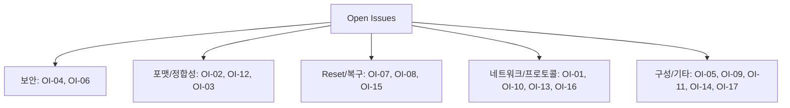

# 22. Open Issues

## 관련 문서

- [Wiki Home](./README.md)
- [Requirements Traceability](./21_requirements_traceability.md)
- [Error Handling and Recovery](./18_error_handling_and_recovery.md)
- [DoIP Gateway Routing](./10_doip_gateway_routing.md)

## 1. 목적

미확정 설계, 요구사항 대비 미구현, 확인이 필요한 구현을 한 곳에 모은다.

## 2. 범위

전체 시스템에 걸친 open issue. 각 항목은 영향과 확인 방법을 함께 기록한다.

## 3. Open Issues 표

| Issue ID | Category | Description | Impact | Evidence | Suggested Action | Priority |
|---|---|---|---|---|---|---|
| OI-01 | DoIP | Diagnostic Positive/Negative ACK가 주석 처리되어 전송되지 않음 | Master는 timeout/retry에 의존 | `DoIP_HandleDiagnosticMessage()` 주석 | ACK/NACK 정책 확정 후 활성화 | Medium |
| OI-02 | 파일 포맷 | 서버는 `.hex` 경로 제공, Master는 `.bin`으로 저장/플래싱 | 포맷 불일치 시 잘못된 image 플래싱 위험 | `server.c` 업로드 경로 vs `ota_comm.cpp` 파일명 | 업로드 파일 내용(binary?) 확정, 명명 통일 | High |
| OI-03 | FOTA | RequestDownload memoryAddress(Master 0x80000000)를 Target이 미사용 | 주소 의미 모호 | `Dcm_HandleRequestDownload`는 주소 파싱하나 FOTA 미전달 | 주소 사용/검증 정책 명시 | Low |
| OI-04 | 보안 | Target은 서명 검증 없이 CRC32만 검증 | 변조 image가 CRC만 맞으면 통과 | `Sota_UpdateCore.c`(CRC), Target 서명 코드 부재 | Target 서명 검증 추가 검토 | High |
| OI-05 | Gateway | Gateway local DCM route 미등록(자체 진단 불가) | Gateway 자체 진단 불가 | `PduR_Cfg.c` Dcm route 없음, `Cpu0_Main`은 Dcm init | 정책 확정(필요시 route 추가) | Low |
| OI-06 | DoIP | Routing Activation이 activation type/auth 미검사, 항상 SUCCESS | 보안/표준성 약함 | `DoIP_HandleRoutingActivation()` | 검증 로직 추가 검토 | Medium |
| OI-07 | Reset | 부팅 실패 시 자동 rollback(watchdog) 메커니즘 미확인 | 새 image 부팅 실패 시 복구 불가 가능성 | 코드상 자동 confirm 부재 | watchdog/SSW 기반 confirm 설계 | High |
| OI-08 | Reset 타이밍 | 0x11 reset 시 응답(0x51) 송출 완료 전 reset 위험 | Master가 응답 못 받을 수 있음 | `Dcm_HandleEcuReset()` 응답 후 즉시 reset | 송신 완료 후 reset 보장 | Medium |
| OI-09 | UART | 비동기 UART로 reset 직전 로그 truncation 가능 | 디버깅 로그 손실 | `FOTA_PerformSystemReset` 즉시 reset | reset 전 blocking flush | Low |
| OI-10 | CanTp | N_As/N_Bs/N_Cr 타임아웃 처리 미확인 | 멀티프레임 중단 시 hang 가능 | `CanTp.c` 타이머 미관측 | 타임아웃/abort 구현 확인 | Medium |
| OI-11 | 멀티코어 | Cpu1_Main/Cpu2_Main 역할 미확인 | core1/2 활용 불명확 | 파일 미분석 | 역할 문서화 | Low |
| OI-12 | CRC 정합성 | Master CRC32(poly 0xEDB88320) vs Target `crc32.c` 일치 여부 | 불일치 시 verify 실패 | 양측 알고리즘 | 다항식/reflect 비교 | High |
| OI-13 | MQTT broker | 서버 publish(`localhost:1883`) vs Master subscribe(`192.168.203.16:1883`) | 동일 broker 가정 | `mqtt_handler.h` vs `ota_comm.cpp` | 배포 구성 확정 | Low |
| OI-14 | safe-state | Master `0x10 02` 재시도(safe-state)와 Target 조건(VERIFIED)이 다름 | 의미 불일치 | `startOtaTransfer` vs `Dcm_HandleDiagnosticSessionControl` | 차량 상태 조건 구현/명시 | Medium |
| OI-15 | swap entry 고갈 | UCB_SWAP entry 소진 시 재초기화 운영 정책 | 반복 FOTA 시 한계 | `SotaProvision_NO_FREE_SWAP_ENTRY`, `ReinitSwapEntry0Standard` | 재초기화 트리거 정책 | Medium |
| OI-16 | 다중 연결 | DoIP `DoIP_Runtime` 단일 connection 가정 | 동시 다중 Tester 불가 | `SoAd.c` 단일 `ConnectionPcb` | 다중 연결 필요성 검토 | Low |
| OI-17 | test main | `Tests/*` mock main과 production `Cpu0_Main` 빌드 포함 관계 | 혼동 위험 | `Ecu_Gateway_TC375_LK/Tests/` | 빌드 소스 명확화 | Low |

## 4. 분류별 요약



## 5. 우선 처리 권고 (High)

1. **OI-02 파일 포맷**: 서버 `.hex` vs Master `.bin` 정합성 — 실제 업로드 파일이 무엇인지 즉시 확정.
2. **OI-04 Target 서명 검증**: 현재 CRC32만으로는 변조 방어 불가.
3. **OI-07 자동 rollback**: 부팅 실패 복구 경로 부재.
4. **OI-12 CRC 정합성**: Master/Target CRC32 알고리즘 일치 검증.

## 6. 코드 근거

```text
근거:
- DoIP_HandleDiagnosticMessage(), DoIP_HandleRoutingActivation() in DoIP.c
- Dcm_HandleEcuReset(), Dcm_HandleRequestDownload(), Dcm_HandleDiagnosticSessionControl() in Dcm.c
- SotaUpdate_FinalizeAndVerify() in Sota_UpdateCore.c
- SotaProvision_ProgramNextSwapEntry() in Sota_SwapDiag.c
- server.c 업로드 경로, ota_comm.cpp 다운로드 파일명, ota_uds_engine.cpp calculateChunkCRC32
- mqtt_handler.h MQTT_ADDRESS vs ota_comm.cpp MQTT_ADDRESS
```

## 7. 다음에 읽을 문서

- [Requirements Traceability](./21_requirements_traceability.md)
- [FOTA Update Flow](./15_fota_update_flow.md)

## 8. 이 문서에서 남은 확인 필요 사항

| 항목 | 내용 | 확인 방법 |
|---|---|---|
| High 이슈 4건 | OI-02/04/07/12 우선 검증 | 위 Suggested Action |
| 요구사항 명세 | open issue 우선순위는 코드 기반 추정 | 공식 요구사항/이해관계자 확인 |
