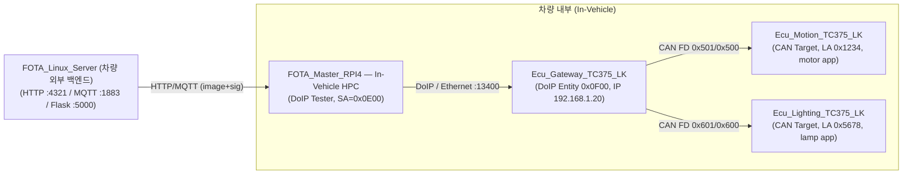
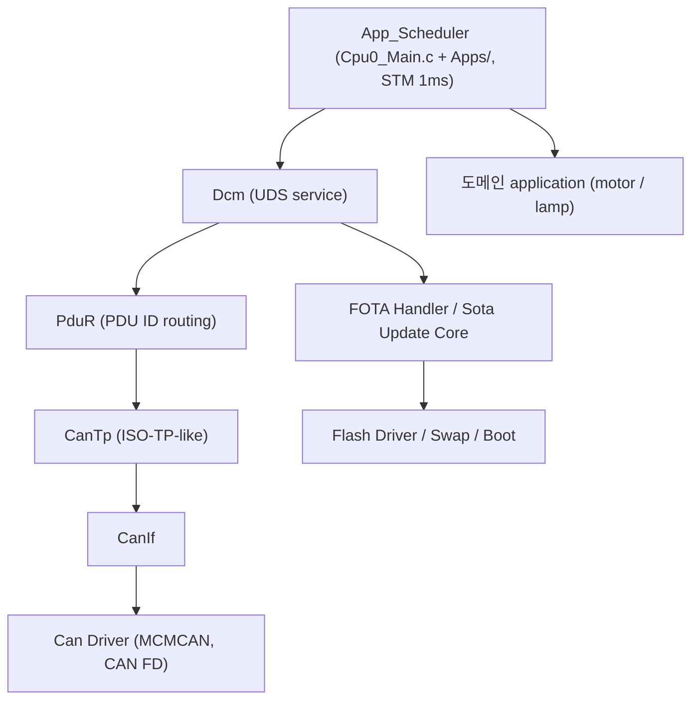
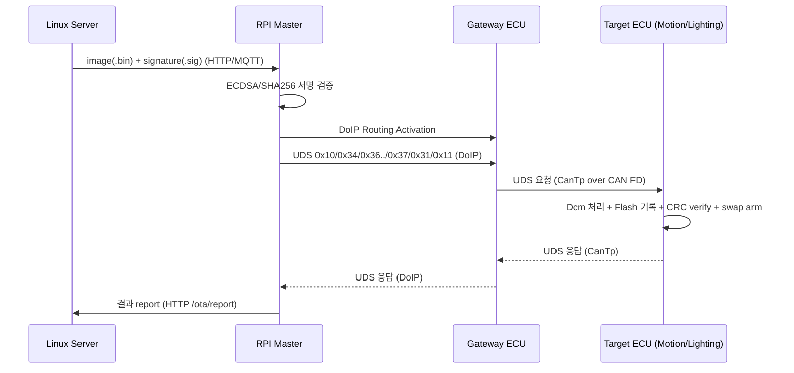

# FOTA Reprogramming Developer Wiki

이 위키는 `kdt-fibonacci/fota-reprogramming` 저장소의 구조, 런타임 흐름, 코드 근거, 디버깅 방법을 정리한 개발자용 문서 모음이다.

> 본 프로젝트는 **AUTOSAR-like / AUTOSAR-inspired 학습용 구현**이다. 표준 구조를 참고한 단순화 구현이며, 상용 수준이나 ISO/AUTOSAR 완전 준수를 의미하지 않는다. 모든 설명은 **현재 코드 기준**이며, 직접 근거가 없는 추론은 `추정`, 모호한 부분은 `확인 필요`로 표시한다.

---

## 1. 이 위키의 목적

- 처음 보는 개발자가 시스템 전체 구조와 데이터 흐름을 빠르게 파악할 수 있게 한다.
- 면접/PT 준비자가 책임 분리(누가 무엇을 소유하는가)를 근거와 함께 설명할 수 있게 한다.
- 유지보수/디버깅 담당자가 실제 함수·파일·레지스터 수준의 흐름을 추적할 수 있게 한다.

## 2. 전체 시스템 한 장 요약

> `FOTA_Master_RPI4`는 차량 내부 High Performance Computer(In-Vehicle HPC)로, 외부 백엔드 서버와 차량 내부 진단 도메인의 경계에 위치한다(배치는 프로젝트 기준).

근거:
- 서버 주소/포트: `CHECK_URL`,`MQTT_ADDRESS` in `FOTA_Master_RPI4/ota_comm.cpp`, `start_server()` in `FOTA_Linux_Server/src/server.c`
- Tester SA, DoIP 포트: `RPI_SA`,`DOIP_PORT` in `FOTA_Master_RPI4/ota_uds_engine.cpp`
- Gateway IP: `IP4_ADDR(&default_ipaddr, 192,168,1,20)` in `Ecu_Gateway_TC375_LK/Libraries/Ethernet/lwip/port/src/Ifx_Lwip.c`
- Logical Address: `DOIP_LOGICAL_ADDRESS_*` in `Ecu_Gateway_TC375_LK/Basics/ComStack/DoIP/DoIP_Cfg.h`
- CAN ID: `Can_Cfg.h` in 각 ECU `Basics/ComStack/Can/`

## 3. AUTOSAR-like 계층 (Target ECU 기준)

> Motion/Lighting의 진입점은 최근 변경으로 STM 1ms 인터럽트 기반 `App_Scheduler`이다(이전 cooperative `Test_MainFunctions()`에서 전환). Gateway는 여전히 cooperative loop. 자세히 [Application Change Log](./23_application_change_log.md), [Runtime Main Loops](./19_runtime_main_loops.md).

## 4. 전체 문서 목록

| # | 문서 | 내용 |
|---|---|---|
| 00 | [Project Overview](./00_project_overview.md) | 프로젝트 목적, 시스템 구성, FOTA 개념 |
| 01 | [Repository Structure](./01_repository_structure.md) | 저장소 구조, 폴더 책임, vendor/test 구분 |
| 02 | [System Architecture](./02_system_architecture.md) | 시스템 context, 계층, 진단/FOTA 경로 |
| 03 | [Gateway ECU Architecture](./03_gateway_ecu_architecture.md) | DoIP↔CanTp 게이트웨이 라우팅 |
| 04 | [Motion ECU Architecture](./04_motion_ecu_architecture.md) | Motion Target ECU 구조 |
| 05 | [Lighting ECU Architecture](./05_lighting_ecu_architecture.md) | Lighting Target ECU 구조 |
| 06 | [Linux Server Architecture](./06_linux_server_architecture.md) | FOTA 서버, 이미지 보관/서명 |
| 07 | [RPI FOTA Master Architecture](./07_rpi_fota_master_architecture.md) | RPI Master, DoIP tester |
| 08 | [Diagnostic Gateway Management](./08_diagnostic_gateway_management.md) | 진단 게이트웨이 요구사항/구현 |
| 09 | [Communication Stack Management](./09_communication_stack_management.md) | ComStack 계층 관리 |
| 10 | [DoIP Gateway Routing](./10_doip_gateway_routing.md) | DoIP 파싱/주소→PDU ID 변환 |
| 11 | [CAN Stack](./11_can_stack.md) | Can/CanIf/CanTp/CAN FD |
| 12 | [CanTp Transport](./12_cantp_transport.md) | ISO-TP-like 전송 계층 |
| 13 | [PduR Routing](./13_pdur_routing.md) | PDU ID 기반 라우팅 |
| 14 | [DCM Diagnostic Services](./14_dcm_diagnostic_services.md) | UDS 서비스 처리 |
| 15 | [FOTA Update Flow](./15_fota_update_flow.md) | FOTA 전체 단계 |
| 16 | [Flash Programming](./16_flash_programming.md) | PFlash erase/write/verify |
| 17 | [Reset / Boot / Bank Swap](./17_reset_boot_bank_swap.md) | reset/부팅/뱅크 스왑 |
| 18 | [Error Handling and Recovery](./18_error_handling_and_recovery.md) | 오류 처리/복구 |
| 19 | [Runtime Main Loops](./19_runtime_main_loops.md) | 각 노드 main loop |
| 20 | [Debugging Notes](./20_debugging_notes.md) | ADS/UART/CAN 디버깅 |
| 21 | [Requirements Traceability](./21_requirements_traceability.md) | 요구사항 추적성 |
| 22 | [Open Issues](./22_open_issues.md) | 미확정/확인 필요 사항 |
| 23 | [Application Change Log](./23_application_change_log.md) | 초기 위키 이후 app layer 변경 추적 |
| 23 | [Gateway Com Stack API/Type Specification](./23_gateway_com_stack_spec.md) | Gateway ComStack enum/struct/header/function 명세 |

## 5. 역할별 추천 읽기 순서

### 처음 보는 사람
1. [Project Overview](./00_project_overview.md)
2. [Repository Structure](./01_repository_structure.md)
3. [System Architecture](./02_system_architecture.md)
4. [Gateway ECU Architecture](./03_gateway_ecu_architecture.md)
5. [FOTA Update Flow](./15_fota_update_flow.md)

### 통신 스택을 보는 사람
1. [Communication Stack Management](./09_communication_stack_management.md)
2. [CAN Stack](./11_can_stack.md)
3. [CanTp Transport](./12_cantp_transport.md)
4. [PduR Routing](./13_pdur_routing.md)
5. [DoIP Gateway Routing](./10_doip_gateway_routing.md)
6. [Gateway Com Stack API/Type Specification](./23_gateway_com_stack_spec.md)

### FOTA를 보는 사람
1. [FOTA Update Flow](./15_fota_update_flow.md)
2. [Flash Programming](./16_flash_programming.md)
3. [Reset / Boot / Bank Swap](./17_reset_boot_bank_swap.md)
4. [Error Handling and Recovery](./18_error_handling_and_recovery.md)

### 디버깅하는 사람
1. [Debugging Notes](./20_debugging_notes.md)
2. [Runtime Main Loops](./19_runtime_main_loops.md)
3. [Reset / Boot / Bank Swap](./17_reset_boot_bank_swap.md)
4. [Open Issues](./22_open_issues.md)

### 최근 변경을 확인하는 사람
1. [Application Change Log](./23_application_change_log.md)
2. [Runtime Main Loops](./19_runtime_main_loops.md)
3. [Motion ECU Architecture](./04_motion_ecu_architecture.md)
4. [Lighting ECU Architecture](./05_lighting_ecu_architecture.md)

### 면접 / PT 준비
1. [Project Overview](./00_project_overview.md)
2. [System Architecture](./02_system_architecture.md)
3. [FOTA Update Flow](./15_fota_update_flow.md)
4. [Requirements Traceability](./21_requirements_traceability.md)
5. [Debugging Notes](./20_debugging_notes.md)

## 6. 핵심 런타임 흐름 (요약 시퀀스)

자세한 단계는 [FOTA Update Flow](./15_fota_update_flow.md) 참고.

## 7. 확인 필요 / Open Issues

미확정 설계, 요구사항 대비 미구현, 확인이 필요한 구현은 [Open Issues](./22_open_issues.md)에 모아 두었다.

대표적 항목:
- DoIP Diagnostic Positive/Negative ACK는 코드상 주석 처리되어 실제 전송되지 않음 (`DoIP.c`)
- 서버는 `.hex` 경로로 펌웨어를 제공하지만 Master는 `.bin`으로 저장/플래싱 → 파일 포맷 정합성 `확인 필요`
- RequestDownload의 `memoryAddress`(Master는 `0x80000000`)를 Target이 사용하지 않고 inactive bank를 자체 계산 `추정`
